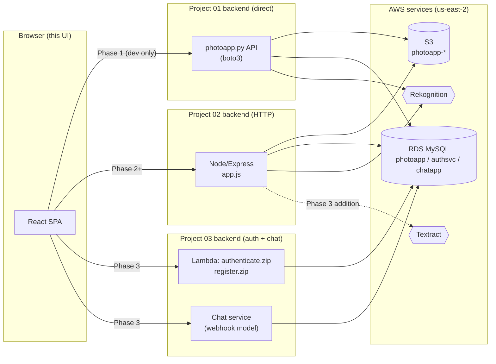
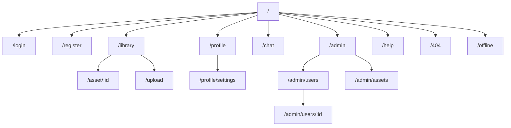

# MBAi 460 PhotoApp — UI Design Requirements

**Version:** 0.1 (draft)
**Last updated:** 2026-04-20
**Owner:** Andrew Tapple (MBAi 460, Spring 2026, Group 1)
**Status:** Draft for review
**Brand placeholder:** "MBAi 460" (replace before any non-class use)

---

## 0. Document metadata

| Field | Value |
|---|---|
| Document | `UI-Design-Requirements.md` |
| Scope | End-to-end UI covering Project 01, Project 02, and Project 03 |
| Type | Prescriptive product + technical requirements |
| Target file location | Workspace root (not committed to repo) |
| Output format | Markdown |
| Approving stakeholder | Andrew |
| Source materials | `project01-part01.pdf`, `project01-part02.pdf`, `MBAi460-Group1-main/` |

### Source file references

Citations below use repo-relative paths. Every functional claim in this document should trace back to one of these files:

- `projects/project01/README.md` — P01 scope
- `projects/project01/client/photoapp.py` — P01 API surface (confirmed by direct read)
- `projects/project01/create-photoapp.sql` — canonical schema: `users`, `assets`
- `projects/project02/package.json` — Node 24+, Express 5, AWS SDK v3, MySQL2
- `projects/project02/server/app.js` — Express entrypoint, routes for `/`, `/ping`, `/users`
- `projects/project02/server/api_get_ping.js`, `api_get_users.js`, `helper.js` — Node API handlers
- `projects/project03/create-authsvc.sql` — auth service schema: `users`, `tokens`
- `projects/project03/create-chatapp.sql` — chat service schema: `registered` (webhook model)
- `projects/project03/client/client.py` — reference client for auth + webhook chat
- `projects/project03/authenticate.zip`, `register.zip` — Lambda handlers (not unpacked in this doc)
- `project01-part01.pdf` (26 pages) — AWS infra setup (IAM, S3, RDS, Rekognition)
- `project01-part02.pdf` (28 pages) — photoapp.py API contract

---

## 1. Executive summary

The MBAi 460 class project builds a cloud-native PhotoApp in three phases. By the end of Project 03 the system has a database-backed asset store (S3 + RDS), a Node/Express web service, a token-based auth service running on Lambda, and a webhook-based chat feature. None of the three projects as shipped include a graphical interface — every client is a Python CLI.

This document specifies the UI layer that consumes those backends. It is written as a prescriptive requirements document: technical decisions are made and defended inline rather than deferred to a future meeting. The UI is a single-page web application, styled after the Claude console (console.anthropic.com), with a login page as the zero-state screen. "MBAi 460" is used as the brand placeholder throughout.

Scope is intentionally wider than images alone. The UI treats uploads as **assets** (per the assignment's own framing — "think of the images as assets, which could vary from law documents to large financial datasets"). This admits at least two asset classes: photos analyzed via Amazon Rekognition (labels, confidence), and documents / handwritten notes analyzed via Amazon Textract (OCR, form extraction). The data model and UI flows are built for both from day one.

The document is structured as:

1. Glossary and vision (sections 2–4)
2. Users and journeys (sections 5–6)
3. System context and information architecture (sections 7–8)
4. Screen-by-screen specifications (section 9)
5. Numbered functional requirements (section 10)
6. Visual design system (sections 11–12)
7. Technical requirements (section 13)
8. Non-functional / acceptance (section 14)
9. Phased roadmap (section 15)
10. Risks and open questions (section 16)
11. Appendices (section 17)

### Out of scope

- Native mobile apps (iOS/Android). The responsive web app covers mobile; a native build is a future phase.
- A server-side rendered marketing site. The UI is a single SPA behind the login screen.
- Billing, payments, subscriptions. The class project is not monetized.
- Full design-system token generation for Figma. This doc specifies tokens in code; a Figma library would be a follow-on artifact.
- Production-grade incident response runbooks. Referenced briefly; not authored here.

---

## 2. Glossary

| Term | Definition |
|---|---|
| **Asset** | Any user-uploaded file. Two classes in v1: photo (jpg/png) and document (pdf, heic, scanned jpg, handwritten note jpg). |
| **Rekognition** | AWS computer vision service. Used for photo label detection + confidence scoring. |
| **Textract** | AWS document OCR service. Used for typed text, handwritten notes, and form extraction. New in this UI spec; not present in P01–P03 backends. |
| **S3** | AWS object storage. The PhotoApp bucket stores all uploaded asset bytes. Region: us-east-2. |
| **RDS** | AWS managed MySQL. Holds the `photoapp`, `authsvc`, and `chatapp` databases. |
| **photoapp.py** | The Python API module from Project 01, Part 02. Defines client-side functions that talk directly to S3/RDS/Rekognition. |
| **Auth service** | Project 03 Lambda-backed service. Handles register (`register.zip`) and authenticate (`authenticate.zip`). Issues bearer tokens. |
| **Token** | Opaque string returned by the auth service. Sent in the `Authentication` request header on subsequent API calls (per `projects/project03/client/client.py`). |
| **Webhook chat** | Project 03 chat model. Clients register two callback URLs (`displaynamehook`, `messagehook`); the chat service calls those URLs to deliver messages. Not a websocket. |
| **Zero-state** | The first screen an unauthenticated visitor sees. For this UI, the login screen. |
| **Claude console** | Reference UI: console.anthropic.com. Influences layout, spacing, typography, and color only — no code or assets reused. |

---

## 3. Product vision

### 3.1 Problem statement

The PhotoApp backbone as specified by the course gives students a working cloud architecture, but anyone wanting to use it today must either run the Python CLI or write their own UI. That blocks non-developer users (the peers, graders, and guest reviewers who actually evaluate the work) from interacting with the system.

A thin, well-designed web UI on top of the existing backbone makes the work demonstrable in a browser, gives the class project a polished final form, and creates a surface where the three projects' capabilities compose naturally: authenticate once (P03), upload and browse assets (P01/P02), analyze them with AWS AI (P01 + Textract extension), and chat about them (P03).

### 3.2 Product principles

1. **Asset-first, not image-first.** The vocabulary is "assets." A photo is one kind of asset; a scanned handwritten note is another. The UI, API responses, and terminology do not assume "image."
2. **Login is the front door.** Every route requires a valid token except `/login` and `/register`. Deep links redirect to login and bounce back on success.
3. **Latency honesty.** Cloud round-trips (S3 → Rekognition → RDS) are not instant. The UI always shows progress, never silent waits. No spinners longer than 2s without a message explaining what is happening.
4. **Quiet by default.** Dense, readable layouts. Cream background, generous whitespace, single accent color. No gradients, no drop shadows on everything, no animation for its own sake. Matches the Claude console.
5. **Recoverable errors.** Every failed call has a retry path, a clear error message, and a copy-to-clipboard correlation ID for support.
6. **Keyboard-first.** Every primary action (upload, search, navigate, submit message) has a keyboard shortcut. Discoverable via `?` help overlay.
7. **Accessible as baseline.** WCAG 2.1 AA is not a post-launch goal; it is pre-launch hard gate.

### 3.3 Scope boundary by phase

The UI is one product that degrades gracefully as backend phases come online. A single codebase targets the P03 final state; features that require backends not yet stood up show a clear "Coming soon" placeholder or short-circuit to the P01 direct-API path behind a feature flag.

| Phase | Backend reached | UI capabilities enabled |
|---|---|---|
| Phase 1 | Project 01 `photoapp.py` | Upload, gallery, asset detail, Rekognition labels, mock auth |
| Phase 2 | Project 02 Node server | Same as Phase 1, but via HTTP to Express instead of direct boto |
| Phase 3 | Project 03 auth + chat | Real auth/register, token-scoped asset ownership, chat, Textract OCR |

---

## 4. User personas

Personas are inferred from the assignment structure (individual work in P01, teams of ≤4 in P02, collaborative chat in P03) and the SQL schemas. These are the minimum viable personas for v1; more nuanced personas should be added after a small round of user research in Phase 2.

### 4.1 Primary: Student end user ("Pooja")

- MBAi cohort member. Has an AWS account from Lab 00.
- Uploads 5–50 photos per session for class demos.
- Wants: fast upload, clear labels, easy sharing by link.
- Does not care about: infrastructure details, IAM policies, bucket names.
- Key needs: login in <5s, upload in <10s for a 5MB file, see labels within 3s of upload completion.

### 4.2 Primary: Note-taker ("Emanuele")  *(new in v1, per scope extension)*

- Same underlying user type but uses the UI for a different asset class.
- Uploads scanned handwritten lecture notes (jpg/pdf) or typed transcripts.
- Wants the UI to OCR the content (via AWS Textract), return searchable text, and save both the original asset and the extracted text.
- Key needs: high-fidelity OCR for handwriting, ability to copy extracted text, download extracted text as `.txt` or `.md`.

### 4.3 Secondary: Admin / staff ("Staff TA")

- Teaching staff or grader.
- Wants to see all users and all assets across the deployment.
- Key needs: read-only user list, asset browser with filters, ability to inspect metadata without being able to modify user data.
- Authorization: in v1, gated by username allowlist held in the auth service. Full RBAC is Phase 3+.

### 4.4 Tertiary: Guest reviewer ("Prof. Hummel")

- Visits a shared asset URL to view content without creating an account.
- Read-only. Cannot upload, delete, or chat.
- Key needs: link opens the asset detail page directly, with a banner explaining guest mode.

---

## 5. Primary user journeys

User journeys are written as linear narratives; branch points and error paths are called out inline. Each journey links to the screens (section 9) and functional requirements (section 10) that implement it.

### 5.1 J1 — First-time user onboarding

1. User visits `/`. No token present. → redirect to `/login`.
2. User clicks "Create account" → `/register`.
3. Fills username, password (min 8 chars), given name, family name. Submits.
4. On success, auto-signs in, redirects to `/library` with an empty-state illustration and a "Upload your first asset" CTA.
5. User clicks the CTA, drags a file from desktop to drop zone.
6. UI shows upload progress. On completion, calls Rekognition (if photo) or Textract (if document). Shows analysis results inline.
7. User lands on the asset detail page (`/asset/{id}`) showing the asset, labels/text, and metadata.

Related screens: Login (§9.1), Register (§9.2), Library (§9.4), Upload (§9.7), Asset detail (§9.5/§9.6).

### 5.2 J2 — Returning user session

1. User visits `/`. Token in memory is expired. → redirect to `/login`.
2. Username pre-filled from browser storage (not the token). Password entered.
3. On success, lands on `/library` with the last-viewed filter restored.
4. User clicks into an asset, edits its display name inline, navigates back.
5. User logs out from the avatar menu. Token is cleared. Redirect to `/login`.

Related FRs: FR-AUTH-1, FR-AUTH-5, FR-ASSET-4.

### 5.3 J3 — Analyze a handwritten note

1. User is logged in. Clicks "Upload" in top nav.
2. Drops a `.jpg` scan of a handwritten note.
3. UI classifies the file (document vs photo) based on content-type and — optionally — a cheap Rekognition "DetectText" heuristic. Classifies as document.
4. Posts to Textract `AnalyzeDocument` with `FEATURES=["FORMS"]`.
5. Streams progress; on completion shows the extracted text in a side-by-side view with the original scan.
6. User clicks "Copy text" or "Download .md" to extract.
7. Asset is stored in S3; the extracted text is stored as a sibling object with suffix `.textract.json` and a flattened `.textract.txt`.

Related screens: Upload (§9.7), Asset detail — document (§9.6).
Related FRs: FR-AI-3, FR-AI-4.

### 5.4 J4 — Browse and search the library

1. User on `/library`. Gallery view shows asset thumbnails in a responsive grid.
2. Toggles to list view. Gets a dense table (name, type, date, size, labels).
3. Types in the search box: `beach`. UI filters client-side on any asset whose Rekognition labels include "beach" (case-insensitive) or whose extracted OCR text contains "beach".
4. Adds a date range filter. Results narrow.
5. Selects three assets with shift-click, clicks "Download zip." A job starts; a toast confirms. When ready, the zip downloads.

Related FRs: FR-ASSET-7, FR-ASSET-8, FR-ASSET-9.

### 5.5 J5 — Chat with another class member

1. User is logged in. Clicks the chat icon in the top nav.
2. Sees the list of registered chat participants (from `chatapp.registered`).
3. Sends a message. UI posts to the chat service. Delivery is asynchronous — message appears as "Sent" then "Delivered" after the webhook round-trip completes.
4. Receives messages as they arrive via a browser-compatible adapter (see §13.5 for why webhooks-to-browser requires a shim).

Related FRs: FR-CHAT-1 through FR-CHAT-5.
Related risk: R-3 (webhook model for a browser).

### 5.6 J6 — Admin audit

1. Staff user signs in. Avatar menu shows an "Admin" item (only visible if user is in the staff allowlist).
2. Clicks "Admin" → `/admin/users` showing all rows from `users` with asset counts joined in.
3. Clicks a user → sees all their assets. Read-only.
4. Exports the user's asset list as CSV.

Related screens: Admin users (§9.12), Admin assets (§9.13).
Related FRs: FR-ADMIN-1 through FR-ADMIN-4.

---

## 6. System context

### 6.1 Architecture the UI must integrate with



### 6.2 UI ↔ backend integration rules

1. **The browser never talks directly to `photoapp.py`.** The `photoapp.py` module is a Python library, not a network service. Phase 1's "direct" line in the diagram means the UI runs against a minimal local Python web wrapper around `photoapp.py` used for development only. Production path is always through the Node server.
2. **The browser never holds AWS credentials.** All AWS API calls go through the Node server. The Node server holds the `photoapp-config.ini` profile (per `projects/project02/server/app.js` line 49).
3. **S3 uploads use presigned PUT URLs in Phase 3.** The current P02 backend accepts a base64-encoded body in a JSON POST (see `express.json({ strict: false, limit: "50mb" })` in `app.js` line 31). That works for class assets but is a scaling liability; see FR-SYS-3 for the migration path.
4. **Auth token flows in the `Authentication` HTTP header.** Not `Authorization`. This matches the header used in `projects/project03/client/client.py` lines 93, 159, 222. The UI uses the same header name to stay compatible with the existing service.
5. **Textract is a UI-driven addition.** The current P01–P03 backends do not call Textract. This spec assumes the Node server will grow a `POST /assets/:id/ocr` endpoint that wraps Textract. UI code ships with the call site feature-flagged off until that endpoint exists.

### 6.3 Known API endpoints (from code)

Confirmed in the repo today:

| Method | Path | File | Notes |
|---|---|---|---|
| GET | `/` | `projects/project02/server/app.js` | Returns status + uptime |
| GET | `/ping` | `projects/project02/server/api_get_ping.js` | Health check; returns M=bucket count, N=users count |
| GET | `/users` | `projects/project02/server/api_get_users.js` | Returns all rows from `users` |
| POST | `/auth` | `projects/project03/client/client.py` line 286 | Login; returns token |
| PUT | `/register` | `projects/project03/client/client.py` line 104 | Register chat callbacks |
| DELETE | `/register` | `projects/project03/client/client.py` line 226 | Deregister chat callbacks |
| POST | `/message` | `projects/project03/client/client.py` line 168 | Send chat message |

### 6.4 Endpoints the UI requires (to be added to the Node server)

These are not yet in the repo. The UI spec requires them; the Node server owner (us) must build them. Listed here so that UI work and server work move in lockstep.

| Method | Path | Purpose | Maps to `photoapp.py` |
|---|---|---|---|
| GET | `/assets` | List assets, paginated | `bucket()` |
| GET | `/assets/:id` | Get one asset by id | `image(assetid)` |
| POST | `/assets` | Upload asset (Phase 2: base64 JSON; Phase 3: presigned URL handshake) | `upload(...)` |
| DELETE | `/assets/:id` | Delete asset | (new) |
| GET | `/assets/:id/download` | Return asset bytes or presigned GET URL | `download(assetid)` |
| POST | `/assets/:id/labels` | Run Rekognition and persist labels | (new) |
| POST | `/assets/:id/ocr` | Run Textract and persist extracted text | (new) |
| POST | `/users` | Create user (register) | (new; hits authsvc) |
| GET | `/me` | Return current user from token | (new) |
| POST | `/logout` | Invalidate token | (new) |
| GET | `/chat/participants` | List from `chatapp.registered` | (new) |
| GET | `/chat/messages?since=…` | Poll messages since timestamp | (new; see R-3) |

These endpoints drive the functional requirements in section 10.

---

## 7. Information architecture

### 7.1 Sitemap



### 7.2 Route table

| Route | Auth | Description |
|---|---|---|
| `/` | none | Redirects: authenticated → `/library`; anonymous → `/login` |
| `/login` | none | Zero-state screen. Username + password. |
| `/register` | none | Account creation. |
| `/library` | required | Gallery + list toggle of the user's assets. Default landing. |
| `/asset/:id` | required (owner or staff) | Asset detail with labels or OCR. Shareable by link if asset is marked public. |
| `/upload` | required | Standalone upload page (drop zone is also available as a modal from `/library`). |
| `/profile` | required | Current user info. |
| `/profile/settings` | required | Username change, password change, delete account. |
| `/chat` | required | Webhook-model chat viewer. |
| `/admin` | required + staff allowlist | Admin home. |
| `/admin/users` | staff | All users. |
| `/admin/users/:id` | staff | One user with assets. |
| `/admin/assets` | staff | Cross-user asset browser. |
| `/help` | none | Keyboard shortcuts, FAQ, support. |
| `/404` | any | Not found. |
| `/offline` | any | Shown when the UI detects loss of network. |

### 7.3 Navigation pattern

Inspired by the Claude console:

- **Top bar (64px):** Wordmark on the left, search in the center (⌘K), avatar menu on the right. Visible on all routes except `/login` and `/register`.
- **Left rail (collapsible, 240px expanded / 56px collapsed):** Primary sections — Library, Upload, Chat, Admin (conditional), Help. Icons from Lucide. Collapses to icon-only on <1024px and hides behind a hamburger on <768px.
- **Main content (max-width 1280px, centered):** Padded by 24px on ≥1024px, 16px on tablet, 12px on mobile.
- **No footer on authenticated routes.** Version, status link, and legal go in the avatar menu.

---

## 8. Visual reference — Claude console parallels

The Claude console sets the visual pace. Concrete parallels this UI adopts:

| Claude console trait | Application in this UI |
|---|---|
| Cream/paper background (`#F0EEE6`-ish) | Primary canvas color. Replaces stark white. |
| Single coral accent color | Used on primary CTAs, focus rings, active nav. No gradients. |
| High-contrast text (near-black on cream) | Body text stays at WCAG AAA. |
| Serif display font, sans body | Serif on section headers only (H1/H2); sans (Inter) everywhere else. |
| Narrow content column | Max 72–80ch for reading surfaces. Grid views use full width. |
| Sparse iconography | Lucide icons at 20px in rail, 16px inline. |
| Subtle rounded corners | 8px default, 12px for modals, 4px for badges. |
| Very little shadow | Shadow only on floating elements (modal, dropdown). |
| Keyboard-first | Command palette (⌘K), shortcut help (`?`), Esc closes modals. |

This UI is stylistically inspired by but **not a copy of** the Claude console. No assets are reused. No branding from Anthropic appears in the product. "MBAi 460" is the wordmark until replaced.

---

## 9. Core screens

Every screen follows this spec template:

> **Purpose** — one sentence.
> **Who sees it** — persona.
> **Preconditions** — auth, data, or entry state.
> **Layout** — written wireframe (with ASCII where helpful).
> **Components** — reusable parts used.
> **Data** — what the screen reads/writes and which endpoints it calls.
> **States** — loading, empty, error, and any feature-specific states.
> **Interactions** — user actions and their outcomes.
> **Acceptance criteria** — testable conditions for "done."

### 9.1 Login — Zero-state (primary screen)

**Purpose.** Let an existing user enter credentials and receive an auth token.

**Who sees it.** Any unauthenticated visitor. First screen for 100% of non-logged-in sessions.

**Preconditions.** None. The route `/login` is always accessible.

**Layout.**

```
+------------------------------------------------------------+
|                                                            |
|                        MBAi 460                            |  ← wordmark, serif, 40px
|                  Cloud PhotoApp (Spring 2026)              |  ← subhead, 16px, muted
|                                                            |
|       +---------------------------------------------+      |
|       |  Sign in                                    |      |  ← card, cream-2, 12px radius
|       |                                             |      |
|       |  Username                                   |      |
|       |  [__________________________________]       |      |
|       |                                             |      |
|       |  Password                                   |      |
|       |  [__________________________________] [👁]   |      |
|       |                                             |      |
|       |  Session length (min) — optional            |      |
|       |  [___] (blank = server default)             |      |
|       |                                             |      |
|       |  [ Sign in ] (coral)                        |      |
|       |                                             |      |
|       |  New here? Create an account →              |      |
|       +---------------------------------------------+      |
|                                                            |
|                 v0.1  ·  Status  ·  Help                   |
+------------------------------------------------------------+
```

**Components.** `Wordmark`, `AuthCard`, `TextField`, `PasswordField`, `NumberField`, `Button` (primary), `Link`.

**Data.** Submits `POST /auth` with `{username, password, duration?}`. On 200, stores token in memory + a refresh flag in session storage. On 400/401/500, shows an inline error with the message from the response body.

**States.**
- Default: empty fields, button disabled until both username and password have ≥1 char.
- Submitting: button shows spinner, inputs locked.
- Error: inline red banner above the card, text from the auth service.
- Locked out: if 5+ failures in the last 60s from this browser, show a "Try again in Xs" countdown.

**Interactions.**
- Enter on password field submits.
- Tab order: username → password → duration → sign in → register link.
- Autocomplete: `autocomplete="username"` and `"current-password"` attributes set.
- Password show/hide: icon toggles visibility.

**Acceptance criteria.**
- L1. On a valid credential, a token is returned and the user lands on `/library` in <2s on a warm connection.
- L2. Invalid credentials never navigate away from `/login`.
- L3. The duration field accepts 1–1440 (min), validates client-side, and is sent as the `duration` param only if non-empty (matching `client.py` behavior).
- L4. The full screen passes axe with zero violations.
- L5. Keyboard-only operation reaches "Sign in" in ≤3 tabs from page load.

### 9.2 Register

**Purpose.** Create a new user in `authsvc.users` (and, by extension, `photoapp.users`).

**Preconditions.** None; anonymous route.

**Layout.** Single-card form, same wordmark header as login. Fields: username, password, confirm password, given name, family name. Agree-to-terms checkbox (placeholder).

**Data.** `POST /users` (new endpoint). Server must:
1. Hash password (bcrypt — match the `$2y$10$…` format seen in the seed SQL).
2. Insert into `authsvc.users` and `photoapp.users` in one transaction.
3. Return a token immediately (auto-sign-in) to avoid a double round trip.

**States.** Default, submitting, error (e.g., `username already exists`), success (brief toast, then redirect to `/library`).

**Acceptance criteria.**
- R1. Username uniqueness is enforced at the API; UI shows the server's error verbatim.
- R2. Password rules: min 8 chars, at least one digit, one non-alphanumeric. Shown as live checklist beneath the password field.
- R3. Auto-sign-in works: user lands on `/library` with no extra login step.

### 9.3 Forgot password *(placeholder)*

**Status.** Not implemented in v1. The current `authsvc` schema has no reset flow. The UI includes a "Forgot password?" link on login that opens a modal explaining that password reset is not available and to contact staff. This is called out in §16 as an open question.

### 9.4 Library (Dashboard)

**Purpose.** Primary landing page for authenticated users. Browse, search, and act on the user's assets.

**Preconditions.** User logged in.

**Layout.**

```
+-----------------------------------------------------------------+
| MBAi 460   [ ⌘K search assets, labels, notes… ]        [🔔][AV] |
+------+----------------------------------------------------------+
| 🖼 L  |  Library                                                 |
| ⬆ U  |  [ Upload ] [ Select ] [ Filter: type, date, labels ]    |
| 💬 C |                                                          |
| ⚙ A  |  [Grid] [List]  •  Sort: Newest ▾                        |
| ❔ ? |                                                          |
|      |  ┌────┐ ┌────┐ ┌────┐ ┌────┐ ┌────┐                      |
|      |  │ 🖼 │ │ 🖼 │ │ 📄 │ │ 🖼 │ │ 📄 │                      |
|      |  └────┘ └────┘ └────┘ └────┘ └────┘                      |
|      |  name1  name2  scan1  name3  scan2                       |
|      |  labels labels ocr    labels ocr                         |
|      |                                                          |
|      |  (pagination / infinite scroll)                          |
+------+----------------------------------------------------------+
```

**Components.** `TopBar`, `LeftRail`, `SearchInput`, `ViewToggle`, `FilterBar`, `AssetCard`, `AssetRow`, `Pagination`, `EmptyState`.

**Data.**
- `GET /assets?limit=50&cursor=<>&type=<>&from=<>&to=<>` — returns page of assets owned by the current user (or all, if staff and `?all=true`).
- Each asset card holds: thumbnail URL (signed), `localname`, `assetid`, `bucketkey`, `type` (photo/document), `labels[]` (up to 3), `ocr_excerpt` (up to 80 chars).
- Client-side filter on labels and OCR text when cached; server-side search for queries longer than cached window.

**States.**
- Loading: 12 skeleton cards.
- Empty: illustration + "No assets yet. Upload your first asset to begin." with a primary CTA.
- Error: banner with retry.
- Partial: when the request partially succeeds (some pages load, later pages 500), show loaded pages and an inline "Could not load more. Retry." banner at the bottom.

**Interactions.**
- Click asset → `/asset/:id`.
- Shift-click multiple → batch actions appear (`Download zip`, `Delete`, `Move to…`).
- ⌘K opens global search. `/` focuses inline search.
- "u" key opens the upload modal.
- Right-click on an asset opens a context menu with rename, delete, copy link.

**Acceptance.**
- LIB1. First paint with ≤50 assets in <2s on a 4G connection.
- LIB2. Grid view is responsive: 2 cols <480px, 3 cols 480–768, 4 cols 768–1024, 5 cols ≥1024.
- LIB3. Labels show a max of 3 per card with "+N more" pill if exceeded.

### 9.5 Asset detail — Photo

**Purpose.** View a photo, its Rekognition labels, and its metadata. Perform actions.

**Layout.** Two-pane desktop layout.

```
+----------------------------------------------------------------+
| ← Library     |   04sailing.jpg                    [⋯ Actions] |
+---------------+------------------------------------------------+
|                                                                |
|    [  PHOTO  ]          |   Labels (12)                        |
|                         |   ● Boat          97%                |
|                         |   ● Water         96%                |
|                         |   ● Outdoors      93%                |
|                         |   ● Sail          89%                |
|                         |   ● Sailing       86%                |
|                         |   …                                  |
|                         |                                      |
|                         |   Metadata                           |
|                         |   Uploaded  2026-04-18 09:12         |
|                         |   Type      image/jpeg               |
|                         |   Size      132 KB                   |
|                         |   Bucket    photoapp-...             |
|                         |   Key       ...2f9d.jpg              |
|                         |   Asset ID  1042                     |
|                         |                                      |
|                         |   [Download] [Re-analyze] [Delete]   |
|                         |                                      |
+---------------+------------------------------------------------+
```

**Data.**
- `GET /assets/:id` → asset metadata + labels.
- `GET /assets/:id/download` → bytes or presigned URL.
- `POST /assets/:id/labels` → re-run Rekognition.
- `DELETE /assets/:id` → delete (with confirmation dialog).

**States.**
- Loading labels: shimmer on label list with "Analyzing…".
- No labels yet: "This asset has not been analyzed. [Analyze now]".
- Deletion confirmation: modal with asset name + "Type the name to confirm" for irreversible action.

**Acceptance.**
- A1. If the asset does not belong to the current user and the user is not staff, the route returns 404 UI (not 403, to avoid revealing existence).
- A2. Re-analyze is idempotent from the user's perspective; the UI shows a toast "Re-analysis complete" and refreshes labels.
- A3. Download works for assets up to 50 MB without browser memory pressure (streamed).

### 9.6 Asset detail — Document / handwritten note (Textract)

**Purpose.** View a document asset, the extracted OCR text, and the confidence per block.

**Layout.** Split view, image on the left, text on the right, with synchronized highlighting.

```
+----------------------------------------------------------------+
| ← Library     |   lecture-notes-04.jpg              [⋯ Actions]|
+---------------+------------------------------------------------+
|                                                                |
|    [  SCAN  ]           |   Extracted text         Copy  [⬇]   |
|                         |                                      |
|    (pan/zoom)           |   "Week 4 — Cloud-native             |
|                         |    architectures                     |
|                         |    1. Stateless services…"           |
|                         |                                      |
|                         |   [Low-confidence lines highlighted  |
|                         |    in a subtle orange underline]     |
|                         |                                      |
|                         |   Block confidence: avg 87%          |
|                         |   Words: 312   Lines: 47             |
|                         |                                      |
|                         |   [Re-run OCR] [Download .md]        |
|                         |                                      |
+---------------+------------------------------------------------+
```

**Data.**
- `GET /assets/:id` includes a `textract_status` field (`none` | `pending` | `done` | `error`) and, if done, a `textract_text` excerpt + `textract_key` (S3 path to full JSON).
- `POST /assets/:id/ocr` triggers Textract.

**Textract call model.**
- The Node server calls `textract:AnalyzeDocument` with `FEATURES=["FORMS"]` for handwritten forms or `DetectDocumentText` for pure handwriting/typed text.
- Textract is region-locked like Rekognition; stay on us-east-2.
- Cost notes: `DetectDocumentText` is cheaper than `AnalyzeDocument`; the UI tells the server which to use based on user selection ("Just text" vs "Forms + tables") on the upload screen.

**Interactions.**
- Clicking a word in the text panel highlights its bounding box on the image.
- Clicking a bounding box on the image highlights the corresponding text block.
- "Download .md" exports the flattened text as a Markdown file with H1 being the asset's `localname`.

**Acceptance.**
- D1. OCR must start within 500ms of user click; UI shows progress.
- D2. For typical handwritten notes (~300 words) OCR returns in <30s; otherwise the UI shows a backgrounded state and continues to poll.
- D3. Text can be copied whole or by paragraph. Copy button uses the Clipboard API with a visible toast on success.

### 9.7 Upload

**Purpose.** Upload one or many assets, classify them, kick off analysis.

**Layout.** Large central drop zone, optional asset-class picker.

```
+----------------------------------------------------------------+
|  Upload                                                        |
|                                                                |
|  +--------------------------------------------------------+    |
|  |                                                        |    |
|  |              📥  Drop files here                        |    |
|  |          or  [ Browse files ]                           |    |
|  |          Accepted: .jpg .png .pdf .heic                 |    |
|  |          Max 50 MB per file                             |    |
|  +--------------------------------------------------------+    |
|                                                                |
|  Classify as:  ( ) Photo   ( ) Document   (•) Auto-detect      |
|                                                                |
|  OCR options (documents only)                                  |
|  [ ] Extract forms & tables (AnalyzeDocument)                  |
|  [•] Just text (DetectDocumentText)                             |
|                                                                |
|  Queue (3)                                                     |
|  ✓ 01degu.jpg           uploaded · photo · 12 labels           |
|  ◐ 02scan.jpg           uploading… 58%                         |
|  ⏸  03notes.pdf         waiting                                |
+----------------------------------------------------------------+
```

**Data.**
- `POST /assets` (Phase 2 base64 JSON; Phase 3 presigned PUT).
- After upload, `POST /assets/:id/labels` or `POST /assets/:id/ocr` based on classification.

**States.**
- Idle, dragging, uploading (per-file), analyzing, done, error.
- Auto-classify uses `content-type` as the primary signal. Ambiguous cases fall through to the first 10 KB being sent to Rekognition `DetectText` as a cheap check; if text density is high, classify as document.

**Acceptance.**
- U1. Drag-and-drop works for up to 20 concurrent files.
- U2. Per-file retry is exposed on failure; retries do not re-upload already-uploaded files.
- U3. The file picker does not block while existing uploads are in progress.

### 9.8 Search

**Purpose.** Fast fuzzy search across asset names, labels, and OCR text.

**Layout.** Command-palette style, opened by ⌘K.

**Data.** Phase 1: client-side over cached library. Phase 3: server-side `GET /search?q=` that queries RDS and fuzzy-matches labels/OCR.

**Acceptance.**
- S1. Opens in <100ms after ⌘K.
- S2. Results update live as the user types, debounced at 150ms.
- S3. Keyboard-only operable — arrow keys move selection, Enter opens.

### 9.9 Profile

**Purpose.** Show current user (from `GET /me`) and quick stats.

**Layout.** Simple two-column card. Left: avatar + name + username. Right: stats (total assets, total size, last upload, account created).

**Acceptance.**
- P1. Data is freshly fetched on mount; stale cache ≤30s allowed on subsequent visits.

### 9.10 Account settings

**Purpose.** Change password, change display name, delete account.

**Security.** Password change requires current password + new password. Delete account requires typing "delete my account" exactly.

**Acceptance.**
- PS1. Delete endpoint cascades: user's tokens, assets, and chat registration. UI warns that this is irreversible.

### 9.11 Chat

**Purpose.** Send and receive text messages to other logged-in users of the chat service.

**Layout.**

```
+----------------------------------------------------------------+
| Chat                                                           |
+-------------------+--------------------------------------------+
| Participants (3)  |  # general                                 |
| ● Pooja           |                                            |
| ● Emanuele        |  [10:02] Pooja: morning                    |
| ○ Li (offline)    |  [10:03] Me:    morning!                   |
|                   |  [10:05] Emanuele: who's got the slides?   |
|                   |                                            |
|                   |  [ type a message…                    ↵ ]  |
+-------------------+--------------------------------------------+
```

**Data.** Webhook model from `chatapp.registered` (see §10 FR-CHAT). For a browser, the UI cannot host its own webhook URL reliably. Two options are called out:

- **Option A — Long polling adapter.** The UI registers a server-side shim URL instead of its own. The shim holds messages in an RDS queue; the UI polls `GET /chat/messages?since=…`.
- **Option B — Server-sent events adapter.** Same shim, but delivers via SSE (`text/event-stream`) on a held connection. Lower latency, single direction.

Recommendation: **Option B**. Lower latency, single connection, works over HTTP/1.1 without websockets. See §16 R-3.

**Acceptance.**
- C1. Messages appear in <2s from send to display for other participants.
- C2. The UI shows delivery state per message (Sending → Sent → Delivered).
- C3. If the SSE connection drops, the UI reconnects with exponential backoff (1s → 30s max, jitter) and replays since the last seen message ID.

### 9.12 Admin — Users

**Purpose.** Staff-only table of all users with asset counts.

**Layout.** Dense table. Columns: userid, username, given name, family name, asset count, last upload.

**Data.** `GET /admin/users` — joins `users` + `(SELECT userid, COUNT(*) FROM assets GROUP BY userid)`.

**Acceptance.**
- AU1. Pagination at 100/page; cursor-based.
- AU2. Only visible to users in the staff allowlist.
- AU3. CSV export.

### 9.13 Admin — Assets

**Purpose.** Staff-only view across all users' assets.

**Layout.** Same library layout with an added `owner` column.

**Acceptance.**
- AA1. Filters: owner, type, date, labels. All server-side.

### 9.14 Help / keyboard shortcuts

**Purpose.** One place to find every shortcut.

**Layout.** Modal overlay triggered by `?`. Sections: Global, Library, Asset, Chat.

**Acceptance.**
- H1. Dismissable by Esc or clicking outside.
- H2. Accessible with screen reader (role=dialog, aria-label, focus trap).

### 9.15 404 / error / offline

- 404: wordmark + "This page went swimming." (asset-appropriate copy) + link home.
- Error (uncaught React error): ErrorBoundary shows "Something broke on our side. We've been notified." + correlation ID + retry.
- Offline (`navigator.onLine === false`): subtle top banner, cached library still browsable, disables upload and send.

---

## 10. Functional requirements (numbered)

Requirements are numbered so they can be traced in test plans. Each FR has one of three priorities: **MUST** (blocker for v1), **SHOULD** (strong preference, can slip one phase), **MAY** (nice-to-have, defer freely).

### 10.1 Authentication (FR-AUTH)

| ID | Priority | Requirement |
|---|---|---|
| FR-AUTH-1 | MUST | The UI shall send username + password to `POST /auth` and receive a token on success. |
| FR-AUTH-2 | MUST | The UI shall use the `Authentication` HTTP header (not `Authorization`) on every authenticated request. |
| FR-AUTH-3 | MUST | The UI shall redirect any unauthenticated request for a gated route to `/login`, preserving the originally requested URL in a `?next=` query param. |
| FR-AUTH-4 | MUST | On a 401 response from any API call, the UI shall clear the token, redirect to `/login?next=<current>`, and show a "Your session expired" banner. |
| FR-AUTH-5 | MUST | The UI shall expose a "Sign out" action in the avatar menu that calls `POST /logout` and, regardless of response, clears local token state and redirects to `/login`. |
| FR-AUTH-6 | SHOULD | The UI shall accept a session-duration parameter (1–1440 minutes) on login, matching `client.py` behavior. |
| FR-AUTH-7 | SHOULD | The UI shall support account registration with client-side validation before calling `POST /users`. |
| FR-AUTH-8 | MAY | The UI may support "Remember username" via browser storage (not the token). |
| FR-AUTH-9 | MAY | The UI may show a captcha after N failed attempts. Deferred to Phase 3+. |

### 10.2 Assets (FR-ASSET)

| ID | Priority | Requirement |
|---|---|---|
| FR-ASSET-1 | MUST | The UI shall upload an asset to the server via `POST /assets`. |
| FR-ASSET-2 | MUST | The UI shall list the current user's assets via `GET /assets`, with paging, sorting, and filtering. |
| FR-ASSET-3 | MUST | The UI shall show an asset detail screen at `/asset/:id` reading from `GET /assets/:id`. |
| FR-ASSET-4 | MUST | The UI shall allow renaming an asset's `localname` inline; persist via `PATCH /assets/:id` (new endpoint). |
| FR-ASSET-5 | MUST | The UI shall allow deleting an asset via `DELETE /assets/:id`, guarded by a confirmation dialog. |
| FR-ASSET-6 | MUST | The UI shall download an asset via `GET /assets/:id/download`, using a streaming approach for files >5MB. |
| FR-ASSET-7 | SHOULD | The UI shall support multi-select and batch actions (download zip, delete). |
| FR-ASSET-8 | SHOULD | The UI shall provide client-side search across loaded assets' `localname`, labels, and OCR excerpts. |
| FR-ASSET-9 | SHOULD | The UI shall provide server-side search when the query cannot be satisfied from the cached window. |
| FR-ASSET-10 | MAY | The UI may provide folders / tags; deferred past v1. |

### 10.3 AI analysis (FR-AI)

| ID | Priority | Requirement |
|---|---|---|
| FR-AI-1 | MUST | The UI shall automatically classify a new asset as photo or document based on content-type and an optional Rekognition text-density heuristic. |
| FR-AI-2 | MUST | For photo assets, the UI shall request Rekognition labels via `POST /assets/:id/labels` and display labels with confidence on the asset detail page. |
| FR-AI-3 | MUST | For document assets, the UI shall request Textract OCR via `POST /assets/:id/ocr` and display the extracted text on the asset detail page. |
| FR-AI-4 | MUST | The UI shall allow the user to choose Textract mode: `DetectDocumentText` (just text) or `AnalyzeDocument` (forms & tables). |
| FR-AI-5 | SHOULD | The UI shall visually link bounding boxes on the asset image to the corresponding text blocks. |
| FR-AI-6 | SHOULD | The UI shall allow the user to manually re-run analysis; server is responsible for idempotency and cost guards. |
| FR-AI-7 | SHOULD | The UI shall cache label and OCR results client-side for the session. |
| FR-AI-8 | MAY | The UI may offer translation of OCR output; deferred. |

### 10.4 Chat (FR-CHAT)

| ID | Priority | Requirement |
|---|---|---|
| FR-CHAT-1 | MUST | The UI shall list chat participants from `GET /chat/participants`. |
| FR-CHAT-2 | MUST | The UI shall send a message via `POST /chat/message` with the `Authentication` header set to the session token. |
| FR-CHAT-3 | MUST | The UI shall receive messages via an SSE stream at `GET /chat/stream` (new endpoint). The webhook-based model on the server persists behind this shim. |
| FR-CHAT-4 | MUST | The UI shall show message state: Sending, Sent, Delivered, Failed. |
| FR-CHAT-5 | SHOULD | The UI shall auto-reconnect on stream drop with exponential backoff and replay from the last seen message ID. |
| FR-CHAT-6 | SHOULD | The UI shall expose a "Deregister from chat" action that calls `DELETE /chat/register`. |
| FR-CHAT-7 | MAY | The UI may support direct messages to one participant (v1 is one shared room). |
| FR-CHAT-8 | MAY | The UI may support file attachments in chat; deferred. |

### 10.5 Admin (FR-ADMIN)

| ID | Priority | Requirement |
|---|---|---|
| FR-ADMIN-1 | MUST | The UI shall show Admin routes only to users in the staff allowlist (delivered via `GET /me`'s `roles` field). |
| FR-ADMIN-2 | MUST | The UI shall show a user list at `/admin/users` with server-side pagination. |
| FR-ADMIN-3 | SHOULD | The UI shall allow exporting the current user list view as CSV. |
| FR-ADMIN-4 | SHOULD | The UI shall show a cross-user asset browser at `/admin/assets`. |

### 10.6 Profile (FR-PROFILE)

| ID | Priority | Requirement |
|---|---|---|
| FR-PROFILE-1 | MUST | The UI shall show current user data from `GET /me`. |
| FR-PROFILE-2 | MUST | The UI shall allow password change via `POST /me/password` with current + new + confirm. |
| FR-PROFILE-3 | SHOULD | The UI shall allow display-name change via `PATCH /me`. |
| FR-PROFILE-4 | MAY | The UI may allow avatar upload; deferred. |

### 10.7 System (FR-SYS)

| ID | Priority | Requirement |
|---|---|---|
| FR-SYS-1 | MUST | The UI shall health-check the backend on first load via `GET /ping`; if the service is down, render `/offline` and a prominent banner. |
| FR-SYS-2 | MUST | The UI shall include a correlation ID in every request (`X-Correlation-Id`, ULID) and display that ID on any error screen. |
| FR-SYS-3 | SHOULD | The UI shall migrate off base64 JSON uploads to presigned URL uploads by end of Phase 3. |
| FR-SYS-4 | SHOULD | The UI shall support a dark mode. Default is system preference. |
| FR-SYS-5 | MAY | The UI may add a telemetry hook (`posthog` or `cloudwatch rum`) behind an opt-in consent banner. |

---

## 11. Visual design system

The design system is specified here as tokens + rules. No code is committed in this doc; instead, section 17 Appendix B lists concrete token values for direct copy into Tailwind config or CSS variables.

### 11.1 Brand

- Wordmark: "MBAi 460", serif, letter-spacing -0.02em, weight 500.
- Subhead (login only): "Cloud PhotoApp · Spring 2026", sans, weight 400.
- Placeholder only. Do not ship with this to a non-class audience.

### 11.2 Color palette (Anthropic/Claude-inspired)

Named tokens. Hex values listed in Appendix B §17.2.

- `--color-paper` — primary background (cream).
- `--color-paper-2` — cards, elevated surfaces (slightly darker cream).
- `--color-paper-3` — rail/sidebar background.
- `--color-ink` — primary text, near-black.
- `--color-ink-2` — secondary text, muted.
- `--color-ink-3` — placeholder, disabled.
- `--color-line` — hairlines, borders.
- `--color-accent` — Claude coral. Primary CTA background, focus ring, active nav, link hover.
- `--color-accent-fg` — text on accent backgrounds.
- `--color-accent-2` — hover state of accent (slightly darker).
- `--color-success` — confirmations, done states.
- `--color-warn` — low-confidence labels, degraded health.
- `--color-error` — destructive actions, form errors.
- `--color-info` — notice banners.

No gradients. No more than one accent color in a single view. Backgrounds stay cream even in dark mode: dark mode inverts to a warm near-black (`#1C1B18`) rather than cold gray.

### 11.3 Typography

Primary stack balances warmth with legibility and avoids paying for licensed fonts:

- Sans (body, UI): `"Inter", "Söhne", system-ui, -apple-system, "Segoe UI", sans-serif`.
- Serif (display, H1/H2 on auth + marketing pages): `"Tiempos Text", "Source Serif 4", "Georgia", serif`.
- Mono (correlation IDs, metadata, code): `"JetBrains Mono", "SF Mono", Menlo, Consolas, monospace`.

**Rationale.** Inter is close enough to Söhne for a free-tier alternative. Source Serif 4 is free and maps cleanly to Tiempos if brand later chooses licensed fonts. JetBrains Mono is free and sharper than system monospace at small sizes.

Sizes (modular scale, ratio 1.25):

| Token | px | Use |
|---|---|---|
| `--fs-xs` | 12 | Badge, caption |
| `--fs-sm` | 14 | Body dense (tables, labels) |
| `--fs-base` | 16 | Body default |
| `--fs-md` | 18 | Subhead |
| `--fs-lg` | 20 | H3 |
| `--fs-xl` | 24 | H2 |
| `--fs-2xl` | 30 | H1 on content pages |
| `--fs-3xl` | 40 | Wordmark on auth |

Weights: 400 (body), 500 (labels, H3), 600 (H1–H2). No weight below 400. Italic sparingly.

Line heights: 1.5 for body, 1.25 for headings.

### 11.4 Spacing, radii, shadow, motion

Spacing token scale (4px grid): 2, 4, 8, 12, 16, 20, 24, 32, 40, 48, 64, 80, 96, 128.

Radii:
- `--r-xs` 4px (badges, chips)
- `--r-sm` 6px (inputs, buttons)
- `--r-md` 8px (default, cards)
- `--r-lg` 12px (modals, large cards)
- `--r-full` 9999px (pills, avatars)

Shadows (rarely used — Claude console uses almost none):
- `--shadow-1` 0 1px 0 rgba(0,0,0,0.04) — hairline lift
- `--shadow-2` 0 8px 24px rgba(0,0,0,0.06) — popovers, modals
- `--shadow-3` 0 16px 40px rgba(0,0,0,0.08) — command palette

Motion:
- Default easing: `cubic-bezier(0.2, 0.8, 0.2, 1)`.
- Durations: `--motion-fast` 120ms (hover states), `--motion-base` 180ms (dropdowns), `--motion-slow` 280ms (modals).
- Respect `prefers-reduced-motion: reduce` — disable enter/exit animations, keep instant transitions.

### 11.5 Layout

- Max content width: 1280px (Library, Admin). 720px (Asset detail, Profile). 480px (Auth cards).
- Breakpoints: 480, 768, 1024, 1280, 1440.
- Top bar: 64px.
- Left rail: 240px expanded, 56px collapsed, hidden on <768px behind a hamburger.

### 11.6 Iconography

- Library: Lucide (MIT license).
- Sizes: 16, 20, 24. 20 is the default in navigation.
- Color: `--color-ink-2` default, `--color-accent` on active.
- Icons never appear without an accessible label — either visible text alongside or `aria-label`.

### 11.7 Component inventory

Required components for v1:

| Component | Notes |
|---|---|
| Button (primary, secondary, ghost, destructive) | One accent color; destructive uses `--color-error`. |
| Text field | With label, helper, error, prefix/suffix icon slots. |
| Password field | With show/hide toggle. |
| Number field | With increment/decrement buttons. |
| Textarea | Auto-resizing up to 40vh. |
| Select / Combobox | Keyboard-operable, typeahead. |
| Checkbox, Radio | Custom but accessible. |
| Toggle (switch) | For settings. |
| Badge / Pill | For labels, confidence %. |
| Tag / Chip | For filters, selected items. |
| Card | `--color-paper-2` background, `--r-md` radius, hairline border. |
| Toast | 4s default, ESC dismisses. |
| Modal / Dialog | Focus trap, ESC closes, click outside closes (destructive requires button). |
| Popover | For tooltips, menus. Offset 8px from anchor. |
| Dropdown menu | Keyboard nav. |
| Tabs | Rail or bar variant. |
| Table | With column sort, row select, keyboard nav. |
| Pagination | Cursor-based primary; page-number variant for admin. |
| Drop zone | Drag-and-drop with paste support. |
| Image viewer | Pan/zoom for asset detail. |
| Code block | For correlation IDs, metadata. |
| Command palette | ⌘K, full-text. |
| Skeleton loader | Placeholder for async content. |
| Empty state | Illustration + copy + CTA. |
| Error boundary surface | Correlation ID + retry. |
| Banner / Alert | Top-of-page notices; four tones. |

Where possible, use **shadcn/ui** primitives (Radix under the hood) and restyle with the tokens above. Rationale: shadcn ships accessible primitives that match the minimal, functional aesthetic; we own the code rather than depending on a versioned package.

### 11.8 Voice & tone

- **Concise.** UI copy is shorter than it feels natural to write.
- **Specific.** "Could not load assets" → "Could not load your assets from the server. Retry?" Better yet, cite the HTTP status or service.
- **Human on errors.** Not "An unexpected error occurred." Instead: "Upload failed on file 3 of 5. Let's try again." + retry button.
- **No exclamation points** except in time-sensitive success toasts ("Upload complete!"). One per session max.
- **No emoji in product copy.** (Except the upload drop-zone glyph, which is a single ⬆.)

### 11.9 Illustration

Empty states get a simple line-art illustration in `--color-accent` at 20% opacity. No mascots. No illustrations of people until the brand is locked.

---

## 12. Wireframe specs (per screen, consolidated)

See §9 for per-screen layouts. This section notes the cross-cutting layout rules not already specified.

### 12.1 Page chrome

Every authenticated page has:

1. Top bar with wordmark (link to `/library`), global search (⌘K trigger), notifications bell (Phase 3), avatar menu.
2. Left rail with nav items.
3. Main content area with a page title row (title + primary action).
4. Optional page-level banner slot at the top of the content area.

Unauthenticated pages (`/login`, `/register`, `/404`, `/offline`) have only the wordmark centered on a blank cream canvas.

### 12.2 Page title row

```
+--------------------------------------------------+
| Library                               [ Upload ] |
|                                                  |
+--------------------------------------------------+
```

Title in `--fs-2xl` serif. Primary action right-aligned as a solid accent button. No breadcrumbs in v1 (shallow hierarchy).

### 12.3 Table patterns

- Sticky header on scroll.
- Row hover: `--color-paper-3` background.
- Row selected: `--color-accent` at 8% alpha background, left border in `--color-accent`.
- Column widths: flex-1 for text, fixed for dates/sizes/actions.
- Empty row: `—` (em-dash) for null values.

### 12.4 Form patterns

- Labels above fields, not floating.
- Required fields marked `*`. Optional fields unmarked.
- Error messaging directly below the offending field, in `--color-error`.
- Inline field-level errors first; form-level banner only if the server returned a global error.
- Submit button is always at the bottom, aligned with field column.

### 12.5 Dialog patterns

- Use dialogs only for:
  - Confirmation of irreversible actions.
  - Short, multi-field inputs that would be out of place on the current page.
- Never for long scrolling content (use a dedicated route).
- Focus returns to the trigger element on close.

---

## 13. Technical requirements

### 13.1 Stack (prescribed)

- **Language:** TypeScript 5.x, strict mode on.
- **Framework:** React 18 (with `useId`, `useTransition`, automatic batching).
- **Build:** Vite 5+.
- **Router:** React Router 6 (file-based routing via a small `routes.ts` map; no RemixRouter, no Next.js).
- **Server state:** TanStack Query v5.
- **Client state:** Zustand for global UI state (sidebar collapsed, theme, command palette open).
- **Styling:** Tailwind CSS 3 with custom tokens (see Appendix B). Component primitives from shadcn/ui.
- **Forms:** React Hook Form + Zod for schema validation.
- **HTTP:** `fetch` wrapper (see §13.3), no axios.
- **Tests:** Vitest (unit), React Testing Library (component), Playwright (E2E), axe-core (a11y), Percy or Chromatic (visual regression, optional).
- **Lint/format:** ESLint with TypeScript, Prettier.
- **Package manager:** pnpm. Lockfile committed.
- **Node:** 20.x in CI, to match project02's Node 24 runtime target (the test harness can be on a slightly older LTS).

**Rationale for not using Next.js.** The UI is behind auth and is a pure SPA; SSR buys nothing. Vite is faster in dev, simpler to deploy to S3 + CloudFront, and avoids Next.js's opinionation about server components, which adds complexity when the backend is a separate Node server.

### 13.2 Project layout

```
ui/
├─ public/
├─ src/
│  ├─ app/                     # route components
│  │  ├─ login.tsx
│  │  ├─ register.tsx
│  │  ├─ library.tsx
│  │  ├─ asset-detail.tsx
│  │  ├─ upload.tsx
│  │  ├─ chat.tsx
│  │  ├─ profile.tsx
│  │  └─ admin/
│  ├─ components/              # reusable components
│  ├─ features/                # feature modules (one per domain)
│  │  ├─ auth/
│  │  ├─ assets/
│  │  ├─ ai/
│  │  └─ chat/
│  ├─ api/                     # API client, typed endpoints
│  ├─ lib/                     # utilities, hooks
│  ├─ styles/
│  │  └─ tokens.css
│  ├─ tests/                   # cross-cutting tests
│  └─ main.tsx
├─ e2e/                        # Playwright
├─ index.html
├─ vite.config.ts
├─ tailwind.config.ts
├─ tsconfig.json
└─ package.json
```

### 13.3 API client

- Single `apiFetch()` wrapper handles base URL, correlation ID, `Authentication` header injection, timeout, retry, and 401 → redirect.
- Typed endpoint surface in `src/api/endpoints.ts` — each endpoint is a function that takes typed params and returns a typed Zod-validated response.
- TanStack Query wraps each endpoint in a hook (`useGetAssets`, `useUploadAsset`, etc.).
- No raw `fetch` calls anywhere else.
- Retry: up to 2 times, 200ms base delay with jitter, only on 5xx and network errors. Never retry non-idempotent methods automatically.

### 13.4 Auth handling

- Token is kept in memory only. Not in `localStorage` (XSS risk).
- A non-HTTP-only "refresh" cookie is *not* used in v1; the session duration is honored per the `duration` param at login.
- On 401 from any API call, the query client clears its cache, the auth store clears the token, and the router redirects to `/login?next=<current>`.
- `GET /me` is called on app mount if a token is present; on failure, the token is cleared.

### 13.5 File uploads

Two phases:

- **Phase 2 (current):** Upload is a `POST /assets` with JSON body `{ filename, content_base64, owner_userid }`. Works today against the Express `express.json({ limit: "50mb" })` parser. Fine for class demo scale.
- **Phase 3:** Replace with a two-step flow:
  1. UI calls `POST /assets/init` with metadata (filename, size, type) → server returns a presigned S3 PUT URL and an `assetid` placeholder.
  2. UI `PUT`s the bytes directly to S3 using the presigned URL.
  3. UI calls `POST /assets/:id/finalize` to trigger the DB insert and kick off analysis.

Chunked uploads for >100MB are deferred past v1.

### 13.6 Textract integration

- New server endpoint: `POST /assets/:id/ocr` with body `{ mode: "text" | "forms" }`.
- Server calls `textract:DetectDocumentText` or `textract:AnalyzeDocument` as requested.
- Large scans: use `textract:StartDocumentTextDetection` (async) for pages count > 1; poll job status server-side; UI gets a job id and polls `GET /assets/:id/ocr-status`.
- Store result as JSON at `s3://<bucket>/ocr/<bucketkey>.textract.json` and a flattened text at `…textract.txt`. Index the flattened text in RDS for search.

Cost guard: server enforces a per-user OCR rate limit (default 20/hour) and a per-asset cap of 3 re-runs/day. UI surfaces these as friendly errors.

### 13.7 Accessibility

- **WCAG 2.1 AA** as hard gate. axe-core CI check on every screen.
- Color contrast: minimum 4.5:1 for text, 3:1 for UI components and large text. The Anthropic cream palette meets this; verified for every token pair in Appendix B.
- Focus visible on every interactive element, using `--color-accent` at 2px + 2px offset.
- Keyboard: no trap except intentional focus traps in modals; Tab order matches visual order; all actions reachable without a mouse.
- Screen reader: proper landmarks (`header`, `nav`, `main`, `aside`, `footer`); dialogs have `role="dialog"` + labelled headings; async updates use `aria-live="polite"` (or `assertive` for errors).
- Reduced motion respected.
- No reliance on color alone to convey state (shape + text + color).

### 13.8 Performance budgets

| Metric | Budget |
|---|---|
| LCP on `/login` | < 1.5s on 4G |
| LCP on `/library` with 50 assets | < 2.5s on 4G |
| INP | < 200ms p75 |
| CLS | < 0.1 |
| Initial JS bundle (gzipped) | < 200 KB |
| Per-route lazy chunks (gzipped) | < 80 KB each |
| Image thumbnail target size | < 50 KB @ 400px |

Monitoring via CloudWatch RUM or a self-hosted collector; budgets fail the CI on regression.

### 13.9 Browser and device support

- Evergreen: last 2 versions of Chrome, Edge, Firefox, Safari.
- Mobile: iOS Safari 15+, Chrome Android 100+.
- Minimum viewport: 360px.
- No IE11. No unsupported Safari < 15.

### 13.10 Security

- CSP: `default-src 'self'; img-src 'self' data: https://*.amazonaws.com; connect-src 'self' https://<api-host> https://*.amazonaws.com; script-src 'self'; style-src 'self' 'unsafe-inline'; frame-ancestors 'none'; base-uri 'self';`
- `X-Frame-Options: DENY`, `Referrer-Policy: strict-origin-when-cross-origin`, `X-Content-Type-Options: nosniff`.
- All API calls over HTTPS; HSTS at the CloudFront distribution level.
- Tokens: never logged, never stored in URL, never in `localStorage`.
- XSS: React's default escaping; no `dangerouslySetInnerHTML` without sanitizer (we use `dompurify` for any user-generated HTML, e.g., Markdown-rendered notes).
- CSRF: moot while tokens live in memory (no cookie-based auth). If a cookie adapter ships, add CSRF tokens.
- S3 access: UI never uses bucket URLs directly for user assets; always presigned GET URLs with 15-minute expiry.
- Dependency scanning: `pnpm audit` in CI; Dependabot on high/critical advisories.

### 13.11 Deployment

- Build artifact is a static bundle.
- Hosted on S3 + CloudFront in us-east-1 (front-door region; edge-replicated globally).
- CloudFront origin points at the S3 bucket; single behavior for the SPA with fallback to `/index.html` for client-side routing.
- API is at `https://api.mbai460.example/`; the UI bundle is at `https://app.mbai460.example/`.
- CI pipeline: GitHub Actions → build → test → axe → upload to S3 → invalidate CloudFront distribution.
- Environments: `local`, `dev`, `staging`, `prod`. Env vars injected at build time via `.env.<env>`.

### 13.12 Observability

- **Client logs:** structured via a small `logger` wrapper; DEBUG in dev, INFO+ in prod.
- **RUM:** CloudWatch RUM for Web Vitals. Sampling at 100% in staging, 10% in prod.
- **Error reporting:** Sentry (or self-hosted GlitchTip) with source maps. PII-scrubbing on request/response payloads (strip password, token, OCR text unless user opts in).
- **Correlation IDs:** generated client-side (ULID), passed on every request via `X-Correlation-Id`, echoed on error surfaces.
- **Synthetic checks:** a scheduled Playwright test runs the login + upload + view cycle every 5 minutes in prod.

### 13.13 Internationalization

- English only for v1.
- Copy is wrapped in a `t('key')` helper from day one so a translation pass is a pure data change.
- Date/time: `Intl.DateTimeFormat`. Tolerate multiple locales at render time.

### 13.14 Feature flags

- Flag service: simple JSON manifest fetched at app boot (`/flags.json`) for v1. No third-party SDK.
- Flags: `textract_enabled`, `chat_enabled`, `admin_enabled`, `presigned_uploads`, `dark_mode`.
- Flags are evaluated at the React root; components check flags synchronously.

---

## 14. Non-functional and acceptance criteria

### 14.1 Success metrics

| Metric | Target | Rationale |
|---|---|---|
| Time to first successful upload after register | p75 < 90s | Onboarding stickiness |
| Upload success rate | ≥ 99% of attempts | Reliability signal |
| Rekognition label success rate | ≥ 97% | Service health |
| Textract OCR success rate | ≥ 95% on supported types | New capability, slightly lower tolerance |
| Search-to-click | p75 < 6s | Search quality |
| Weekly active users (class-scale) | 100% of enrolled | Adoption |
| Error rate (any screen) | < 1% of sessions see an uncaught error | Code quality |

### 14.2 Testing strategy

**Unit (Vitest):**
- Pure functions, reducers, Zod schemas, API client.
- Target: 80% line coverage on `src/lib`, `src/api`, and `src/features/*/logic/`.

**Component (React Testing Library):**
- Every component with any branching logic.
- Every form validates as expected.
- Every screen renders empty/loading/error/success states.

**E2E (Playwright):**
- Happy-path J1–J6 from §5.
- Login failure paths.
- Upload + re-analyze.
- Chat send + receive (against a mock SSE server in test).
- Admin deny-list (non-staff visiting `/admin` gets 404).

**Accessibility (axe-core):**
- Runs against every route in CI. Zero violations required.

**Visual regression (optional but recommended):**
- Playwright screenshot diff, or Chromatic/Percy.
- Login, library (grid & list), asset detail (photo & doc), chat.

**Manual QA checklist (before each release):**
- Screen reader run (VoiceOver and NVDA) through login + library.
- Mobile device check (one iOS, one Android).
- Keyboard-only run through all primary actions.
- Offline toggle → graceful degradation.

### 14.3 Error taxonomy

| Code | Category | User-facing copy | Recovery |
|---|---|---|---|
| `E_AUTH_INVALID` | 401 on login | "Incorrect username or password." | Retry |
| `E_AUTH_EXPIRED` | 401 mid-session | "Your session expired. Sign in again." | Redirect to login |
| `E_AUTH_LOCKED` | Rate-limited | "Too many attempts. Try again in Xs." | Wait |
| `E_UPLOAD_SIZE` | File >50MB | "That file is larger than 50 MB. Please reduce and retry." | Manual |
| `E_UPLOAD_TYPE` | Unsupported type | "We support JPG, PNG, PDF, and HEIC. Convert and retry." | Manual |
| `E_UPLOAD_FAILED` | Network/server | "Upload failed. Retry?" | Retry button |
| `E_AI_LIMIT` | Rate limit on Rekognition/Textract | "You've hit the analysis limit for this hour." | Wait |
| `E_AI_FAILED` | Service error | "Analysis could not complete. We've logged it; ID: <id>." | Retry + correlation |
| `E_PERMISSION` | 403 | "You don't have access to this asset." | Navigate away |
| `E_NOT_FOUND` | 404 | "We couldn't find that." | Link home |
| `E_NETWORK` | No connection | "You're offline. Some features are limited." | Auto-recover on reconnect |
| `E_UNKNOWN` | Anything else | "Something went wrong. Please try again." + correlation id | Retry |

### 14.4 Edge cases catalog

- Zero-asset library (empty state).
- One asset (no pagination required).
- Exactly 50 assets (boundary of first page).
- 10,000 assets (paging, virtual scroll).
- Slow connection (upload progress stays smooth; no silent pauses).
- Flaky connection (mid-upload resume).
- Asset with special characters in `localname` (quotes, emoji, RTL text).
- Very long label list (confidence table scrolls inside the right pane).
- Very long OCR output (hundreds of KB of text; virtualize the text view).
- Duplicate uploads (same SHA256): server dedupes; UI notifies "This asset already exists in your library" and links to the existing one.
- Rekognition returns no labels for a photo.
- Textract returns empty text for an unreadable scan.
- User deletes their own account while actions are in-flight.
- Two tabs open, one logs out → other tab detects 401 and redirects.
- Clock skew > 5 min (token `expiration_utc` drift): treat as expired preemptively.
- Staff demotes themselves (removed from allowlist while viewing admin): next admin request 403s → redirect to `/library`.

### 14.5 SLOs

| SLO | Target | Window |
|---|---|---|
| UI availability (can load `/login`) | 99.5% | 30 days |
| API p95 latency (GET /assets, 50 results) | < 800 ms | 7 days |
| Upload success rate | 99% | 7 days |
| First meaningful paint on `/login` | < 1.5s p75 | 7 days |

---

## 15. Implementation roadmap

### 15.1 Phase 0 — Foundation (week 0)

- Repo scaffold: Vite + TS + Tailwind + shadcn + ESLint + Prettier + Vitest + Playwright + axe-core.
- Token files committed (colors, typography, spacing) in `src/styles/tokens.css`.
- Routing skeleton with public and private route shells.
- Login screen shell with mock auth (local Zustand store; no server).
- CI with build + lint + test + a11y gates.

**Exit criteria.** `/login` renders, passes axe, deployed to a staging URL.

### 15.2 Phase 1 — P01-aligned UI (weeks 1–2)

- Real upload against the Phase 1 dev wrapper.
- Library grid + list toggle, with mock data.
- Asset detail (photo) with Rekognition labels.
- Basic admin page behind a dev-only flag.

**Exit criteria.** J1, J2, J4 complete end to end against a local dev backend.

### 15.3 Phase 2 — P02 server integration (weeks 3–4)

- Swap API client to point at Node/Express.
- Add presigned URL upload path (FR-SYS-3) — optional; base64 still accepted.
- Wire `GET /users` for admin.
- Implement profile + account settings.

**Exit criteria.** All FR-ASSET MUST items pass against the Node server; axe clean on every route.

### 15.4 Phase 3 — P03 auth and features (weeks 5–7)

- Replace mock auth with `/auth` and `/users` against the Lambda-backed authsvc.
- Implement chat adapter (SSE shim server + UI).
- Implement Textract flow (new server endpoint + UI screens).
- Admin polish: staff allowlist wiring, CSV export.

**Exit criteria.** All MUST FRs passing. J3, J5, J6 end to end.

### 15.5 Phase 4 — Hardening (week 8)

- Performance pass (bundle analysis, image optimization, route-level code splitting).
- Accessibility audit with external reviewer.
- Security review (CSP, dependency audit, pen-test checklist).
- Usability round with 3–5 students.

**Exit criteria.** All success metrics green; open issues triaged; doc v1.0 published.

---

## 16. Open questions and risks

### 16.1 Open questions (need stakeholder input)

| # | Question | Impact if unanswered |
|---|---|---|
| OQ-1 | Who holds the AWS account the UI will deploy to, and what is the budget envelope for Textract calls? | Blocks Phase 3 start |
| OQ-2 | Is there a class-approved logo/wordmark, or do we stay with "MBAi 460" through the final submission? | Low — placeholder is fine |
| OQ-3 | Does the auth service plan to add a password-reset flow, or is staff-mediated reset the final state? | Affects FR-AUTH-7 scope |
| OQ-4 | Should the UI support multiple tenants (e.g., Spring 2026 vs. Fall 2026 cohorts)? | Architectural — single-tenant assumed for v1 |
| OQ-5 | Who is responsible for the staff allowlist source of truth? | Blocks FR-ADMIN-1 |
| OQ-6 | Are we allowed to call Textract from the course AWS account? It's not in the assignment. | Blocks FR-AI-3/4 |
| OQ-7 | Is a guest-read flow (J tertiary, "Prof. Hummel") required or deferrable? | Low — defer to v1.1 |

### 16.2 Risks

| ID | Risk | Likelihood | Impact | Mitigation |
|---|---|---|---|---|
| R-1 | Public S3 bucket (per P01 setup) leaks user assets by default | H | H | UI uses presigned URLs; server never returns bucket URLs. Recommend bucket be made private during P02+ development. |
| R-2 | Token in memory is lost on refresh, forcing frequent re-login | H | M | Accept in v1 — simpler security story. Add a "Keep me signed in" option with cookie-based refresh token in v1.1. |
| R-3 | Chat webhook model does not translate to browsers | H | M | Introduce a server-side SSE shim (§9.11). Document clearly for future maintainers. |
| R-4 | 50 MB base64 JSON upload limit breaks at small scale | M | M | Migrate to presigned URL uploads in Phase 3 (FR-SYS-3). |
| R-5 | Rekognition/Textract rate limits or regional outages | M | L | Per-user rate limit + clear error state + retry. |
| R-6 | Staff allowlist stored in code means staff changes require redeploy | H | L | Move to a config row in `authsvc` in Phase 3. |
| R-7 | No WAF in front of the API → credential stuffing on `/auth` is possible | M | M | CloudFront WAF rule + 5-attempts-per-IP rate limit at the API. |
| R-8 | Handwritten OCR quality varies widely; user expectations may be too high | M | L | UI sets expectations ("best effort"), shows confidence, lets user edit extracted text. |
| R-9 | UI and backend teams drift on API contracts | M | M | Versioned OpenAPI doc checked in; UI generates a typed client from it. |
| R-10 | Free-tier fonts (Inter, Source Serif) drift from Claude console feel | L | L | Accept. If brand later licenses Söhne/Tiempos, swap via tokens. |

### 16.3 Things I don't know and won't guess

- Whether the instructor has a rubric for a UI deliverable. If so, provide it and I'll align.
- Real user research data. Personas here are inferred.
- Whether Anthropic licensing permits the Claude-console-inspired visual direction in this academic context. Broadly yes for inspiration, but explicitly do not reuse assets, logos, or copy. Confirm with staff if external publication is planned.
- Exact cost thresholds for Textract/Rekognition in the class AWS account. Numbers in this doc are guardrails, not budgets.

---

## 17. Appendices

### 17.1 Appendix A — API endpoint inventory

Confirmed from repo code:

| Method | Path | Source file |
|---|---|---|
| GET | `/` | `projects/project02/server/app.js` |
| GET | `/ping` | `projects/project02/server/api_get_ping.js` |
| GET | `/users` | `projects/project02/server/api_get_users.js` |
| POST | `/auth` | `projects/project03/client/client.py` (consumer) |
| PUT | `/register` | `projects/project03/client/client.py` (consumer) |
| DELETE | `/register` | `projects/project03/client/client.py` (consumer) |
| POST | `/message` | `projects/project03/client/client.py` (consumer) |

Required to add for the UI (section 6.4 tabulates the full list):

```
GET    /me
POST   /logout
POST   /users                         # register
GET    /assets                        # list
GET    /assets/:id                    # detail
POST   /assets                        # upload (Phase 2)
POST   /assets/init                   # presign upload step 1 (Phase 3)
POST   /assets/:id/finalize           # presign upload step 2 (Phase 3)
PATCH  /assets/:id                    # rename
DELETE /assets/:id                    # delete
GET    /assets/:id/download           # download
POST   /assets/:id/labels             # Rekognition
POST   /assets/:id/ocr                # Textract
GET    /assets/:id/ocr-status         # Textract async poll
GET    /chat/participants
POST   /chat/message
GET    /chat/stream                   # SSE
DELETE /chat/register
GET    /admin/users                   # staff only
GET    /admin/users/:id
GET    /admin/assets
GET    /search?q=
GET    /flags.json                    # feature flags
```

### 17.2 Appendix B — Design tokens (concrete values)

These are draft values inspired by the Claude console palette. All pairs verified to meet WCAG 2.1 AA (≥ 4.5:1) for body text. Replace before non-class use.

**Light theme (default).**

```css
:root {
  /* Color — paper (backgrounds) */
  --color-paper:       #F0EEE6;   /* canvas */
  --color-paper-2:     #E8E6DE;   /* card */
  --color-paper-3:     #DEDBCF;   /* rail */

  /* Color — ink (text) */
  --color-ink:         #1E1E1C;   /* primary text */
  --color-ink-2:       #57534E;   /* secondary */
  --color-ink-3:       #8A857E;   /* placeholder */

  /* Color — lines */
  --color-line:        #D3CFC3;
  --color-line-strong: #B6B1A3;

  /* Color — accent (Claude coral family) */
  --color-accent:      #CC785C;
  --color-accent-2:    #B5654B;   /* hover */
  --color-accent-fg:   #FFFFFF;

  /* Color — semantic */
  --color-success:     #2F7D60;
  --color-warn:        #B06B1F;
  --color-error:       #B84545;
  --color-info:        #3F6EAF;

  /* Typography */
  --font-sans:   "Inter", "Söhne", system-ui, -apple-system, "Segoe UI", sans-serif;
  --font-serif:  "Tiempos Text", "Source Serif 4", Georgia, serif;
  --font-mono:   "JetBrains Mono", "SF Mono", Menlo, Consolas, monospace;

  --fs-xs:    12px;
  --fs-sm:    14px;
  --fs-base:  16px;
  --fs-md:    18px;
  --fs-lg:    20px;
  --fs-xl:    24px;
  --fs-2xl:   30px;
  --fs-3xl:   40px;

  --lh-body:  1.5;
  --lh-head:  1.25;

  /* Spacing */
  --sp-1:  4px;   --sp-2:  8px;  --sp-3: 12px;  --sp-4: 16px;
  --sp-5: 20px;   --sp-6: 24px;  --sp-8: 32px;  --sp-10: 40px;
  --sp-12: 48px;  --sp-16: 64px; --sp-20: 80px; --sp-24: 96px;

  /* Radii */
  --r-xs: 4px; --r-sm: 6px; --r-md: 8px; --r-lg: 12px; --r-full: 9999px;

  /* Shadows */
  --shadow-1: 0 1px 0 rgba(0,0,0,0.04);
  --shadow-2: 0 8px 24px rgba(0,0,0,0.06);
  --shadow-3: 0 16px 40px rgba(0,0,0,0.08);

  /* Motion */
  --motion-fast: 120ms;
  --motion-base: 180ms;
  --motion-slow: 280ms;
  --motion-ease: cubic-bezier(0.2, 0.8, 0.2, 1);
}
```

**Dark theme (opt-in).**

```css
:root[data-theme="dark"] {
  --color-paper:       #1C1B18;
  --color-paper-2:     #242320;
  --color-paper-3:     #2C2B27;
  --color-ink:         #EDEBE4;
  --color-ink-2:       #B5B0A3;
  --color-ink-3:       #7A7468;
  --color-line:        #3A3832;
  --color-line-strong: #5A574E;
  --color-accent:      #E18B6E;
  --color-accent-2:    #D17A5D;
  --color-accent-fg:   #1C1B18;
  --color-success:     #4BA281;
  --color-warn:        #D6933F;
  --color-error:       #D76D6D;
  --color-info:        #6B95D1;
}
```

### 17.3 Appendix C — UI action ↔ `photoapp.py` function mapping

This mapping is the "Rosetta stone" for the Phase 1 dev path where the UI could run directly against a Python wrapper. In Phase 2+, each column becomes a Node endpoint instead.

| UI action | photoapp.py function | Future HTTP endpoint |
|---|---|---|
| App boot — health check | `get_ping()` | `GET /ping` |
| Library grid — list assets | `bucket(startafter)` / `assets()` | `GET /assets` |
| Library grid — show owner | `users()` | `GET /users` (admin), `GET /me` (user) |
| Asset detail — fetch | `image(assetid)` | `GET /assets/:id` |
| Upload flow — write file | `upload(filename, userid)` | `POST /assets` or presigned PUT |
| Download action | `download(assetid)` | `GET /assets/:id/download` |
| Run Rekognition on demand | (new; wrap `get_rekognition()` + `detect_labels`) | `POST /assets/:id/labels` |
| Run Textract on demand | (new; wrap Textract client) | `POST /assets/:id/ocr` |
| Delete action | (new; delete from S3 + RDS) | `DELETE /assets/:id` |

### 17.4 Appendix D — Glossary of keyboard shortcuts

| Shortcut | Action |
|---|---|
| ⌘K / Ctrl-K | Open command palette / search |
| / | Focus inline search |
| u | Open upload modal (from library) |
| ? | Show keyboard-shortcut help |
| Esc | Close modal / overlay |
| ← / → | Nav between adjacent assets (on asset detail) |
| J / K | Move selection down / up in library list view |
| x | Toggle row selection |
| Shift-Click | Range-select rows |
| Enter | Open focused item |
| Cmd-Enter | Submit current form |

### 17.5 Appendix E — References

- [AWS Rekognition DetectLabels](https://docs.aws.amazon.com/rekognition/latest/APIReference/API_DetectLabels.html)
- [AWS Textract DetectDocumentText](https://docs.aws.amazon.com/textract/latest/dg/API_DetectDocumentText.html)
- [AWS Textract AnalyzeDocument](https://docs.aws.amazon.com/textract/latest/dg/API_AnalyzeDocument.html)
- [Express 5 docs](https://expressjs.com/)
- [React 18 docs](https://react.dev/)
- [TanStack Query](https://tanstack.com/query/latest)
- [shadcn/ui](https://ui.shadcn.com/)
- [Tailwind CSS](https://tailwindcss.com/)
- [React Hook Form](https://react-hook-form.com/)
- [Zod](https://zod.dev/)
- [Lucide icons](https://lucide.dev/)
- [WCAG 2.1 AA](https://www.w3.org/TR/WCAG21/)
- [Web Vitals](https://web.dev/vitals/)
- [OWASP ASVS](https://owasp.org/www-project-application-security-verification-standard/)
- Claude console (visual reference only): `https://console.anthropic.com/`

### 17.6 Appendix F — Changelog

| Version | Date | Notes |
|---|---|---|
| 0.1 | 2026-04-20 | Initial draft — comprehensive, prescriptive, end-to-end scope. |

---

*End of document.*
