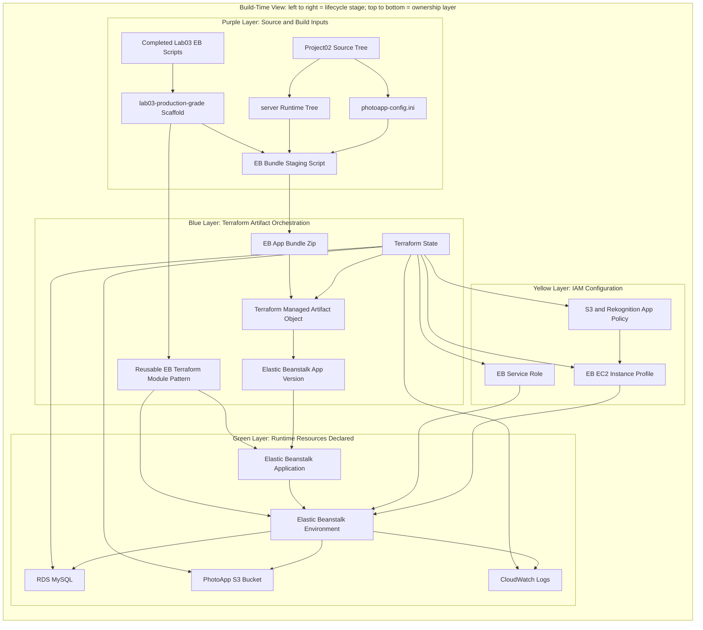
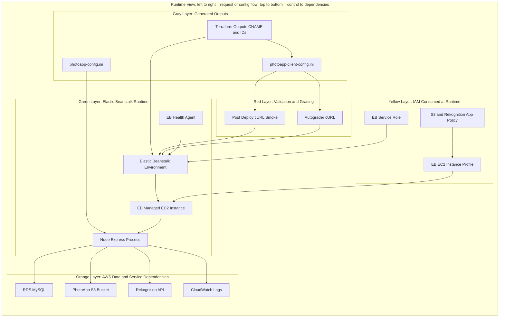
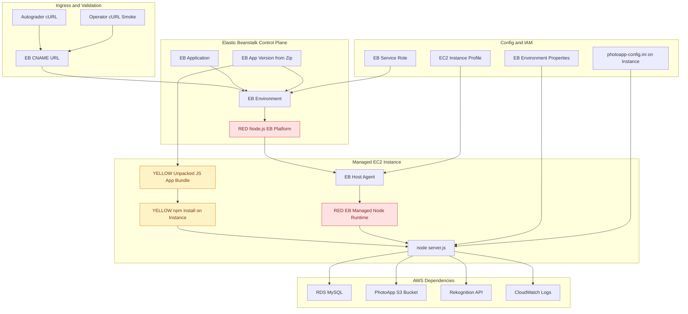
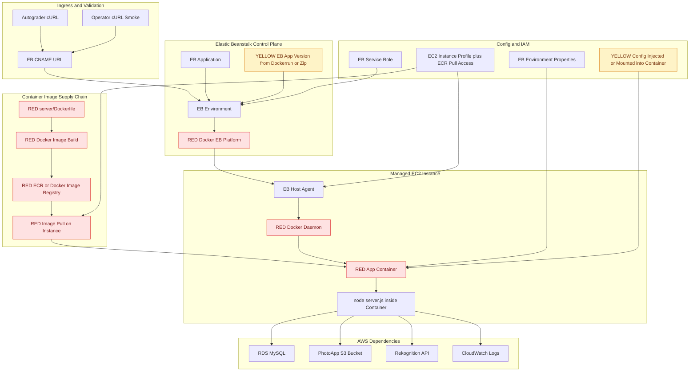

# Project02 Hosting Approach — Terraform-Native Elastic Beanstalk

## Agent Handoff Context

This approach is intended to be executable by a fresh agent without prior chat history. The goal is to finish Project02 Part 02 by deploying the existing PhotoApp Node/Express service to Elastic Beanstalk through a reusable, production-grade EB scaffold derived from the completed Lab03 scripts.

### Current decisions

- **Autograder constraint:** it only validates the deployed application with HTTP/cURL requests. It does not inspect whether deployment used GUI, EB CLI scripts, Docker, or Terraform.
- **Architecture choice:** use **Node-platform Elastic Beanstalk first**, not Docker EB. Container EB remains a future parity path.
- **Reusable dependency:** build a thin **lab03-production-grade** scaffold first, then consume it from Project02.
- **Project02 scope:** keep app-specific code/config in `projects/project02/`; treat `labs/lab03` as compatibility source material, not as the place to make Project02-specific edits.
- **Terraform direction:** Project02 should consume Terraform-native EB resources/module patterns while preserving existing RDS/S3/IAM/CloudWatch modules.

### Must-read files before execution

- `labs/lab03/create.bash`, `labs/lab03/update.bash`, `labs/lab03/delete.bash`: completed course EB script flow.
- `projects/project02/project02-part02-EB.pdf`: assignment acceptance text.
- `projects/project02/MetaFiles/Hosting_Plan.md`: current hosting notes.
- `projects/project02/MetaFiles/Submission_Plan.md`: submission/config notes.
- `projects/project02/infra/envs/dev/main.tf`: current Terraform environment wiring.
- `projects/project02/infra/modules/{rds,s3,iam,cloudwatch}`: existing infrastructure modules.
- `projects/project02/server/package.json`, `server/app.js`, `server/server.js`, and `server/src/photoapp-core/config.js`: deployable app and config path behavior.

### Execution guardrails

- Do not mutate `labs/lab03` into Project02 deployment code. Extract reusable patterns into a new scaffold.
- Do not skip bundle validation. Project02 has nested runtime directories; Lab03’s shallow `zip *` approach is insufficient.
- Do not assume EB IAM roles already exist. Support either creating them or using/importing existing roles, and document the chosen path.
- Keep cURL smoke checks as the acceptance boundary: EB URL must answer core PhotoApp endpoints.
- Treat credentials carefully: `photoapp-config.ini` is gitignored and may contain real RDS/IAM values.

### Suggested starting point

Start with Workstream 1, “Lab03 compatibility extraction.” Produce a small reusable scaffold interface and a current/target visualization before adding Terraform or packaging implementation. Once the scaffold boundary is clear, wire Project02 to it.

## Rescoped Direction

Given the autograder only validates the running application with HTTP/cURL requests, we should treat the PDF’s GUI/Lab03 flow as acceptance guidance, not architecture guidance. The target should be a Terraform-native AWS deployment that can become a reusable template for later projects.

The implementation now has an explicit upstream dependency: first extract the useful parts of the completed `labs/lab03` EB scripts into a reusable **lab03-production-grade** scaffold, then have Project02 consume that scaffold for its EB bundle, Terraform module pattern, and cURL smoke contract. This avoids baking Project02-specific assumptions into the reusable EB deployment utility.

Primary source surfaces:

- `infra/envs/dev/main.tf` and `infra/envs/prod/main.tf`: existing environment entrypoints for RDS, S3, IAM, and CloudWatch.
- `infra/modules/{rds,s3,iam,cloudwatch}`: existing reusable modules.
- `labs/lab03/{create,update,delete}.{bash,ps1}`: course-compatible EB lifecycle scripts; useful as the compatibility oracle.
- New reusable scaffold, proposed as `labs/lab03-production-grade/` or repo-wide `tools/eb-node/`: production-grade EB Node packaging/deploy primitives.
- `server/`: deployable Node/Express app.
- `MetaFiles/Hosting_Plan.md` and `MetaFiles/Submission_Plan.md`: assignment-facing notes that should be updated after implementation.
- `project02-part02-EB.pdf`: acceptance constraints, now interpreted as “running EB URL must answer cURL-compatible endpoints.”

## Recommended Architecture

Build a new Terraform-native EB lane alongside the existing infra modules, with Project02 consuming a generic lab03-production-grade EB scaffold.

Layer color key:

- Purple: source and build inputs.
- Blue: Terraform artifact/version orchestration.
- Yellow: IAM roles, instance profiles, and app policies.
- Green: Elastic Beanstalk runtime.
- Orange: AWS data and service dependencies.
- Red: validation and assignment-facing consumers.
- Gray: generated submission/config outputs.

### Build-Time View

### Runtime And Validation View

Terraform should own EB application, environment, service role, EC2 instance profile, app version, and option settings. The lab03-production-grade scaffold should provide the generic EB Node bundle staging, manifest validation, Terraform module pattern, and smoke-test interface; Project02 supplies only app-specific source paths, config paths, environment names, and smoke endpoints.

## Runtime Architecture Choice: Node EB vs Container EB

Color/difference key for the next two views:

- Red: not present in the other runtime model.
- Yellow: same conceptual responsibility, but modified implementation detail.
- Unmarked nodes are shared concepts across both approaches.

### Node-Platform Elastic Beanstalk Runtime

### Container Elastic Beanstalk Runtime

Practical reading:

- Node EB has fewer moving parts for this assignment: no image registry, no image pull permissions, no Dockerrun contract. The modified piece is packaging: the app bundle must be a clean Node runtime tree.
- Container EB better matches our local Docker artifact but adds a second supply chain: image build, push, registry permissions, and container config injection.
- Since the autograder only cURLs the deployed app, Node EB is the lower-risk first target. Container EB remains a future hardening path if we want deployment parity with local Docker.

## Key Design Choices

- Use Elastic Beanstalk Node platform first, not Docker EB. The app is already a Node service and the course expects Node EB behavior. Docker remains for local validation.
- Treat completed Lab03 as the compatibility oracle, but do not edit it in place for Project02. Extract a production-grade scaffold first.
- Keep existing RDS/S3/IAM modules, but add or consume an EB module from the lab03-production-grade scaffold rather than folding EB into env `main.tf` directly.
- Make bundle staging explicit and testable in the reusable scaffold. Project02’s EB bundle must include runtime JS, `package.json`, lockfile strategy, and `photoapp-config.ini` path behavior.
- Prefer EB instance profile credentials for AWS access if feasible, but do not block on it if the current INI loader still requires explicit `[s3readwrite]` keys. If explicit keys are retained for this assignment, document that as transitional technical debt.
- Treat `photoapp-client-config.ini` generation as a post-deploy output step: Terraform outputs the EB CNAME; operator writes or generates the client config from it.

## Workstreams

### 1. Lab03 Compatibility Extraction

Review `labs/lab03` as the source compatibility record. Extract the reusable decisions into a new scaffold: Node platform, zip bundle shape, app/env naming variables, VPC/subnet variables, role/profile settings, health-reporting setting, unique app versions, create/update/delete lifecycle, and cURL smoke hooks. The scaffold should not know PhotoApp route semantics.

### 2. Current-State Infra Visualization

Document what exists today: completed Lab03 scripts, Terraform modules for RDS/S3/IAM/CloudWatch, Docker AWS lane, local config files, and missing EB resources. This gives the platform team a quick map and prevents duplicate work.

### 3. Target-State Infra Visualization

Create the target diagram for Project02 consuming lab03-production-grade: generic EB Node scaffold underneath, Project02 app/config/infra above it, RDS/S3/IAM/CloudWatch around it, and cURL-only autograder validation at the edge.

### 4. Terraform Module Design

Add or consume a reusable EB Terraform module pattern responsible for:

- EB application.
- EB environment.
- EB application version.
- service role and EC2 instance profile, unless those roles are intentionally imported/existing.
- environment variables including `NODE_ENV`, `PHOTOAPP_CONFIG_PATH`, and any config toggles.
- health reporting option set to basic if matching the assignment constraint remains useful.

### 5. EB Bundle Staging

In the scaffold, add a deterministic script or Make target that creates a deployable bundle from a configured source tree. Project02 config should point it at `server/`, include `photoapp-config.ini`, and omit tests, `_assignment-template`, Dockerfile, and development configs. The bundle check should fail if required runtime files are missing.

### 6. Terraform Environment Wiring

Wire Project02 `infra/envs/dev` to consume the reusable EB module/scaffold first. Keep `prod` as either a mirror or a deferred promotion target depending on how much risk we want today.

### 7. Test Gates

Use layered checks:

- Static: `terraform fmt -check`, `terraform validate`, bundle manifest check.
- Local runtime: existing `tools/phase1-smoke.sh` or targeted Docker AWS-lane smoke.
- Cloud deploy: `terraform plan`, `terraform apply` after operator approval, then curl EB CNAME endpoints.
- Assignment smoke: cURL `/healthz`, `/readyz`, `/users`, `/images`, and one spec endpoint that proves RDS/S3 path is live.

### 8. Submission Readiness

Generate or update the two final config files:

- `photoapp-config.ini`: server-side config matching the EB environment.
- `photoapp-client-config.ini`: points to the EB CNAME with `http://` and no trailing slash.

### 9. Cleanup And Handoff

Update `README.md`, `MetaFiles/Hosting_Plan.md`, `MetaFiles/Submission_Plan.md`, the lab03-production-grade docs, and the infra visualizations. Add destroy/pause notes so RDS and EB cleanup is intentional after grading.

## Level Of Effort

Recommended path with lab03-production-grade dependency: **3 to 4.5 focused engineering days**.

Breakdown:

- Lab03 production-grade scaffold extraction: 0.5 to 1 day.
- Current/target visualization and design: 0.5 day.
- EB Terraform module/scaffold and Project02 env wiring: 1 to 1.5 days.
- Bundle staging and validation through the scaffold: 0.5 to 1 day.
- Cloud apply, IAM/role fixes, smoke debugging: 0.5 to 1 day.
- Docs, submission config, cleanup: 0.5 day.

Risk buffer depends mostly on IAM/EB permissions and Node platform packaging quirks, not app logic. The scaffold adds a little upfront work but reduces duplicated effort and gives future projects a cleaner starting point.

Fastest acceptable variant: **1.5 to 2 days** if we create only the minimal scaffold pieces Project02 needs and reuse existing AWS roles manually.

Platform-grade reusable variant: **4 to 6 days** if we fully solve role creation/imports, artifact versioning, state backend, destroy safety, generated INI outputs, and CI-friendly Terraform plan/apply conventions inside the scaffold.

## Recommendation

Take the middle path: first extract a thin lab03-production-grade scaffold, then use it to deliver Terraform-native EB for Project02 `dev`, deterministic bundle staging, clear cURL acceptance gates, and docs good enough for reuse. Avoid over-rotating into a full multi-env platform framework until Project02 passes EB grading and we have learned where EB actually bites this app.
