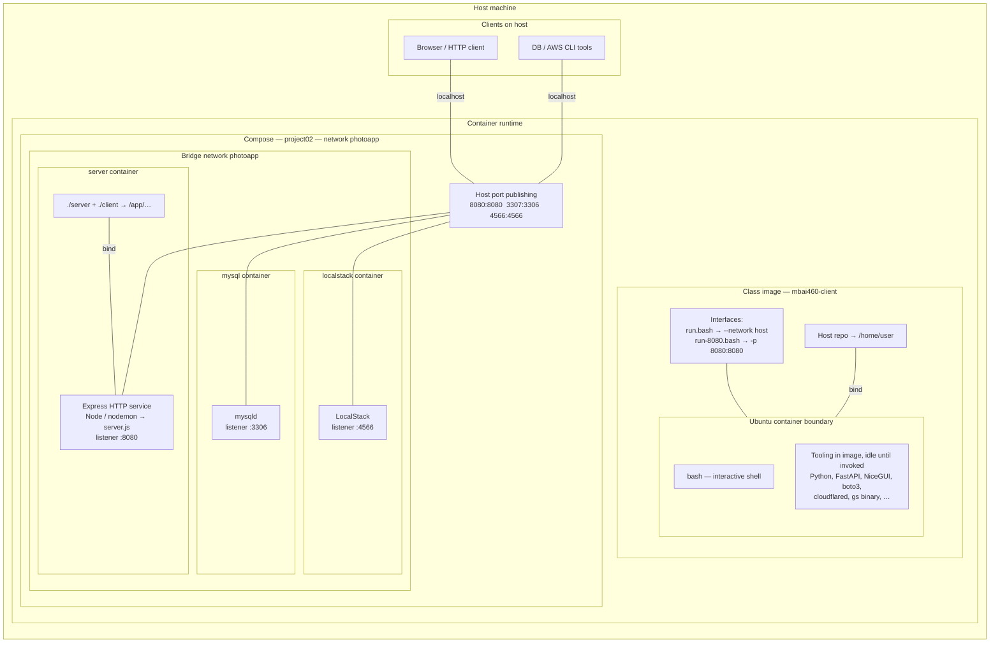

# Docker architecture blueprint

Static paths `./docker/...` refer to the **monorepo root** (`MBAi460-Group1/docker/`). **Project 02** adds **`projects/project02/docker-compose.yml`** (multi-container dev stack). This document maps **system structure**, **boundaries**, and **interfaces**—not execution order.

---

## 1. Short summary

- **Major components**: **Docker engine on the host** running either (a) the **class Ubuntu image** `mbai460-client` for interactive dev, or (b) the **Project 02 compose stack** (**MySQL**, **LocalStack**, **Node server**) on a shared bridge network **`photoapp`**.
- **Containers expected**: **Compose** — `mysql`, `localstack`, `server` (optional future **`client`** is commented out). **Class tooling** — one **`mbai460-client`** container per `docker run` invocation.
- **Active applications**: **Compose** — `mysqld`, LocalStack edge, **Node/Express** (`nodemon`/`node` → `server.js`) listening on **8080**. **Class scripts** — **`bash`** as the started process; Python/web/tooling stacks are **installed**, **not** auto-started by `run*.bash`.
- **Ports that matter**: **8080** (HTTP API — compose `server`); **3307→3306** (MySQL to host); **4566** (LocalStack). **`docker/Dockerfile`** documents **EXPOSE 8000–8010** and **8080** for the class image (not publish).
- **Host ↔ containers**: **Published ports** map host `localhost` to container services on compose; **`run.bash`** uses **`--network host`** (no `-p`, shared host network namespace); **`run-8080.bash`** uses **`-p 8080:8080`**; **bind mounts** overlay source/config into compose `server` and mount the repo into the class container at `/home/user`.

---

## 2. Mermaid architecture diagram

Structural topology: **host → runtime → network → containers → processes**. Links are **architectural relationships** (bind, publish, listen, bridge attachment), not step-by-step flows.

**Reading the blueprint**

| Region | Meaning |
|--------|---------|
| **MODE_A** | Single **Ubuntu** container (**`mbai460-client`**). **`bash`** is the **active** process from **`run*.bash`** / **`run-8080.bash`**; Python/web/cloudflared/**`gs`** are **idle** until invoked. **`MODE_A_NOTE`** summarizes **`--network host`** vs **`-p 8080:8080`**. |
| **MODE_B** | **Three** containers sit on **bridge `photoapp`**; **Express** reaches **MySQL** / **LocalStack** by **DNS on that network** (topology = shared **BRIDGE** subgraph, not sequenced flows). **PUB** is the **published-port** surface from host **localhost** into those listeners. |
| **PUB** | **Port mapping** for compose: **`8080`** → **Express**, **`3307`** → **MySQL**, **`4566`** → **LocalStack**. |

---

## 3. Interface notes

| Interface type | Where it appears | Role |
|----------------|------------------|------|
| **Declared ports** | `docker/Dockerfile` **`EXPOSE 8000-8010`**, **`EXPOSE 8080`** | Documents intent for the **class image**; **does not** open host ports by itself. |
| **Published ports** | Compose **`ports:`**; **`run-8080.bash`** **`-p 8080:8080`** | **Host ↔ container** forwarding (NAT). Compose: **8080**, **3307**, **4566** on host. |
| **Host network mode** | **`run.bash`** **`--network host`** | Container shares the **host network namespace**; **no** `-p`; host and container share **the same** IP/port space. |
| **Bridge / internal DNS** | Compose **`networks: photoapp`** | **server → mysql:3306**, **server → http://localstack:4566** without exposing those paths to the host (though **4566** and **3307** are **also** published for host tools). |
| **Started by runtime scripts** | **`docker/run.bash`**, **`run-8080.bash`** | **`bash`** only. |
| **Installed only (class image)** | Dockerfile + pip/apt | **FastAPI**, **NiceGUI**, **cloudflared**, **boto3** stack, **`gs`**, etc.—available **on demand**, **not** launched by **`run*.bash`**. |
| **Started by compose** | **`server`** `command` | **`npx nodemon server.js`** or **`node server.js`** — **Express** is **actively listening** on **8080** inside the **server** container. |

---

## 4. Confidence notes

### Known from static files

- **`docker/_image-name.txt`** → image tag **`mbai460-client`**.
- **`build.bash`** builds from **`./docker`**; **`run*.bash`** read that tag and run **`bash`** with **`-v .:/home/user`**.
- **`run.bash`**: **`--network host`**; **`run-8080.bash`**: **`-p 8080:8080`**.
- **`docker-compose.yml`**: service list, **`ports`**, **`photoapp`** bridge, **`AWS_ENDPOINT_URL`**, **`PORT`**, **`server`** command override.
- **`server/server.js`** / **`app.js`**: **Express** HTTP server bound to **`PORT`** (**8080** in compose).

### Inferred from structure

- **Compose `client` service** is the **planned** Python client container; **not active** in the current file.
- **Colima / Docker Desktop** as the actual daemon on macOS is **assumed** from context; not named in these files.

### Runtime-confirmable only

- Whether **`nodemon` or `node`** actually runs, container IDs, and **collision** if **compose :8080** and **`run-8080.bash`** both use host **8080**.
- Live listeners: **`ss -tlnp`** / **`docker compose ps`**.
- **`host` network** behavior on non-Linux hosts (e.g. Docker Desktop VM) — **environment-specific**.

---

## File anchors

- `docker/Dockerfile`, `docker/build.bash`, `docker/run.bash`, `docker/run-8080.bash`, `docker/_image-name.txt`
- `projects/project02/docker-compose.yml`, `projects/project02/server/Dockerfile`, `projects/project02/server/server.js`
