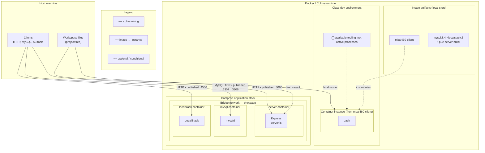
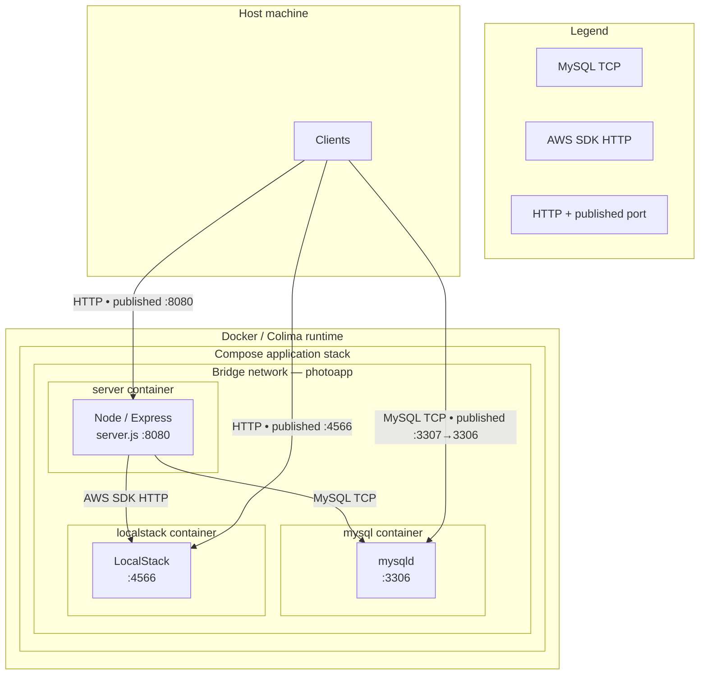
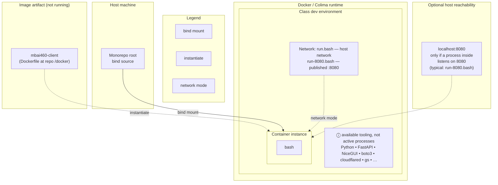

# Docker full lab — architectural blueprints

- **Image store ≠ runtime**: **Tags** like **`mbai460-client`** and **`mysql:8.4`** name **artifacts**; **containers** are **instances** with **processes** inside.
- **Two runtime domains** in one **Docker/Colima** engine: **Compose application stack** (Project 02) vs **class dev environment** (**`mbai460-client`** instance, **bash**).
- **Host↔container** is **`published port`** and **`bind mount`** on **edges**; **Compose bridge `photoapp`** is an **internal** boundary for **server ↔ mysql ↔ LocalStack**.

---

## 1. Full lab blueprint

High-level topology: **host**, **runtime engine**, **image artifacts**, **two domains**, **interfaces** on crossing edges.

---

## 2. Runtime application stack blueprint

**Compose only**: **bridge**, **three containers**, **active listeners**, **host boundary** = **published port** on edges (no separate port “hub” node).

---

## 3. Class dev environment blueprint

**Class tooling image** vs **running instance**; **bash** active; **everything else** in the **note**.

---

## Notes (minimal)

| Label | Confidence |
|--------|------------|
| **`IM_3`** | **Known** names from **compose** + **server** build; **not linked** to containers in the diagram — **no data-plane** implication, only **artifact** context. |
| **Optional :8080** | **Inferred**: **`run-8080.bash`** **publishes** **8080**; **no listener** until you **start** an app in **bash**. |
| **`run.bash` host network** | **Known** from script **flags**; exact behavior on **Docker Desktop/Colima** may differ from **Linux**. |

*(Static sources: `docker/_image-name.txt`, `docker/run.bash`, `docker/run-8080.bash`, `docker/Dockerfile`, `projects/project02/docker-compose.yml`, `server/server.js`.)*
