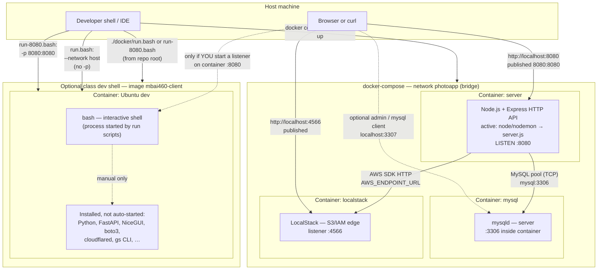

# Docker networking — Project 02 & class container

This note ties together the **monorepo `docker/`** tooling (Ubuntu `mbai460-client` image) and **`projects/project02/docker-compose.yml`** (local dev stack).  
Paths like `./docker/Dockerfile` refer to **`MBAi460-Group1/docker/`** when run from the **monorepo root** (`build.bash` uses `docker build ... ./docker`).

---

## 1. Human summary

- **Class image (`mbai460-client`)**: Built from `docker/Dockerfile` and tagged per `docker/_image-name.txt` (`mbai460-client`). **Runtime scripts start an interactive `bash` shell**, not a long-lived web server. Python web stacks (e.g. FastAPI, NiceGUI), `cloudflared`, and related tooling are **installed** for manual use.
- **Compose stack (Project 02)**: **`mysql`** (MySQL 8.4), **`localstack`** (LocalStack 3, S3 + IAM), and **`server`** (Node.js **Express** HTTP service). All attach to bridge network **`photoapp`**. The **`client`** service is **commented out** (not expected to run until Phase 3).
- **Port 8080 (HTTP)**: In **compose**, the **`server`** service listens on **8080** inside the container and **`8080:8080`** is **published** to the host. In **`run-8080.bash`**, **`-p 8080:8080`** maps host 8080→container 8080; **nothing listens until a process inside the shell binds to 8080**.
- **Other published ports (compose)**: **MySQL** `3307:3306` (host 3307), **LocalStack** `4566:4566`. These are **published** in `docker-compose.yml`, not only `EXPOSE`d.
- **Host interaction**: With **compose**, the host reaches the API at **`http://localhost:8080`**, MySQL at **`localhost:3307`**, LocalStack at **`localhost:4566`**. With **`run.bash`**, **`--network host`** puts the container on the **host network namespace** (no `-p`; the host’s ports are the container’s). With **`run-8080.bash`**, the host reaches a process in the dev container **only if it listens on 8080**, via **port publishing**.
- **Mounts (runtime impact)**: **Compose `server`** bind-mounts `./server` and `./client` for hot reload and config path **`PHOTOAPP_CONFIG_PATH`**. **`run*.bash`** bind-mounts the **repo root** to **`/home/user`** (`-v .:/home/user`).
- **Known vs inferred**: **Files** define images, scripts, and compose wiring **statically**. **Which Python/Node commands you run inside the class container** and **traffic patterns** are **inferred** or **runtime-only** unless you start those processes.

---

## 2. Mermaid diagram

**How to read it**

- **Solid arrows to `express`**: The **compose** stack **actually starts** the Node HTTP server (unless overridden); the host uses **published** port **8080**.
- **Dashed arrows to `bash`**: Port **8080** mapping in **`run-8080.bash`** does not start a server—you must run one inside the shell for the host path to do anything useful.
- **`run.bash`** (**host network**): Not shown as a separate edge label on the diagram; the container **shares** the host’s network—no Docker port map, but **localhost** semantics follow the host.

---

## 3. Interface notes

| Mechanism | What it means here |
|-----------|---------------------|
| **Declared ports** (`EXPOSE 8000-8010`, `EXPOSE 8080` in `docker/Dockerfile`) | **Documentation** for the `mbai460-client` image. Does **not** publish ports to the host by itself. |
| **Published ports** (`-p` / `ports:` in Compose) | **Host↔container** forwarding. **Compose**: `8080:8080`, `3307:3306`, `4566:4566`. **`run-8080.bash`**: `8080:8080` only. |
| **Host network** (`--network host` in `run.bash`) | Container uses the **host’s** IP stack—**no** `-p` mapping. Listener ports are **host ports** directly. |
| **Internal-only (bridge `photoapp`)** | **server → mysql** via hostname **`mysql`**, port **3306**. **server → LocalStack** via **`http://localstack:4566`** (from `AWS_ENDPOINT_URL`). Not exposed on the host unless also in `ports:`. **`4566`/`3306`** are published **separately** for host tools. |
| **Started by runtime vs merely installed** | **Compose `server` `command`**: **`npx nodemon server.js`** or **`node server.js`** — **actively starts** the API. **Class image**: **`docker/run*.bash`** ends with **`bash`** — **shell only**; FastAPI/NiceGUI/cloudflared are **not** started by these scripts. |

---

## 4. Confidence notes

### Known from static files

- Image name **`mbai460-client`** (`docker/_image-name.txt`).
- **`run.bash`**: `--network host`, bind mount **`.:/home/user`**, **`bash`**.
- **`run-8080.bash`**: **`-p 8080:8080`**, same bind mount, **`bash`**.
- **`docker/Dockerfile`**: **EXPOSE** ranges **`8000-8010`**, **`8080`**; **no image-level `CMD`** overriding Ubuntu’s default after the final `EXPOSE` block (runtime entrypoint in practice is whatever `docker run` passes—here **`bash`**).
- **`docker-compose.yml`**: services, **`ports`**, **`networks`**, **`server`** env (`PORT=8080`, `AWS_ENDPOINT_URL`), and **override command** for nodemon/node.
- **`server/server.js`** / **`app.js`**: **Express** app listening on **`PORT` (default 8080)**.

### Inferred from file structure / runtime scripts

- **Compose `client` service** is the **intended** future Python client container; it is **not active** in the checked-in compose file.
- **`run.bash` / `run-8080.bash`** are for **interactive coursework** in the Ubuntu image; **Project 02’s** primary long-running API is the **compose `server`** container, not the class shell.
- **Potential host port overlap**: Compose and **`run-8080.bash`** both use **host `8080`** if used **at the same time**.

### Only confirmable at runtime

- **`docker ps` / `docker compose ps`**: Actual container names, PIDs, and whether **`nodemon`** vs **`node`** ran.
- **`ss` / `lsof`** (host or container): What is **listening** on **8080**, **3307**, **4566**.
- **Live traffic**: Which routes hit Express, and whether LocalStack/MySQL are healthy (`readyz`, healthchecks).

---

## File references (quick)

- Monorepo: `docker/Dockerfile`, `docker/run.bash`, `docker/run-8080.bash`, `docker/build.bash`, `docker/_image-name.txt`
- Project 02: `projects/project02/docker-compose.yml`, `projects/project02/server/Dockerfile`, `projects/project02/server/server.js`, `projects/project02/server/app.js`
