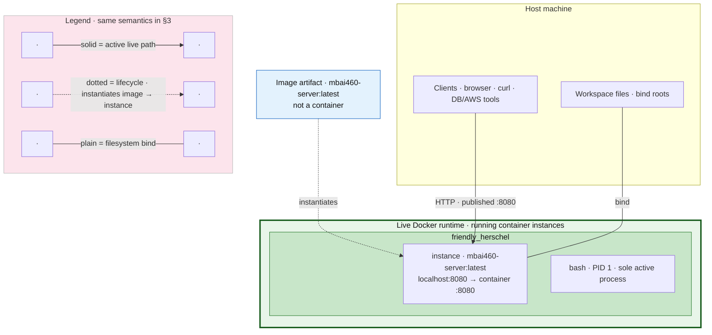
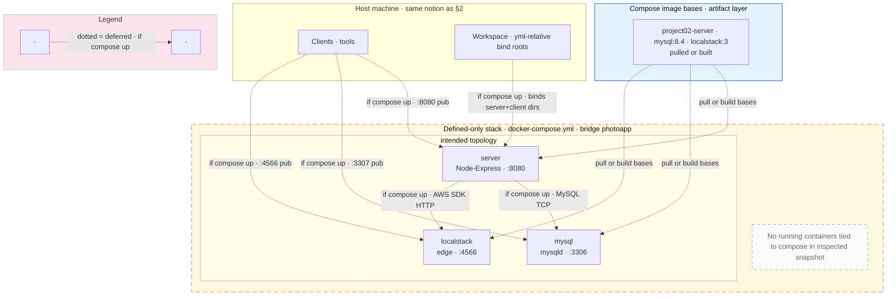

# Existing local deployment architecture view

Snapshots: **`docker`** / **`docker compose`** inspected read-only · **no compose stack was started** during this exercise.

---

## 1. Short summary

- **Declarative (`projects/project02/docker-compose.yml`)**: **three** active service definitions (**`mysql`**, **`localstack`**, **`server`**) on bridge **`photoapp`**; **`client`** exists only **commented out** · **`make up`** expects **`client/photoapp-config.ini`** (currently only **`…example`** in tree).
- **Observed Docker (`docker ps`, `docker compose ps`)**: **no Compose-managed containers**; **one running instance** (**`friendly_herschel`**), **`mbai460-server`** image · **PID 1**: **`bash`** · **published** **`localhost:8080`** · **binds** **`images/mbai460-server`** and **`dist`** into **`/home/user`** (**not** the monorepo `docker/run*.bash` default of **`.` → `/home/user`**).
- **Ports/interfaces (compose intent)**: **`8080:8080`**, **`3307:3306`**, **`4566:4566`** · **`run-8080.bash`** (repo **`MBAi460-Group1/docker/`**) **publishes 8080** for the **Ubuntu class image**, **`run.bash`** uses **`--network host`**.
- **Shape**: Compose file describes a **multi-container local slice** (DB + mock AWS edge + Node API) · **runtime right now** is a **single ad-hoc container** (not from that compose file).
- **Uncertainty**: Whether **anything listens on 8080** inside **`friendly_herschel`** not verified (PID 1 is **`bash`**) · whether **`mbai460-client`** image exists on disk (not in the trimmed **`docker images`** list shown during inspection).

---

## 2. Live Docker runtime · running containers only

**Answers:** What is **`docker ps`** actually executing **right now**?

Only **live** workloads sit inside **`Live Docker runtime`**. The **image** sits **outside** that box—it is storage, not a running container.

---

## 3. Compose stack · defined in project · inactive at inspection time

**Answers:** What does **`docker-compose.yml`** **declare** — without implying **`docker compose ps`** showed anything running?

Everything here is **declarative topology** (**dotted** = would apply **`if compose up`**). **`Live Docker runtime` does not include this.**

---

### Inspection snapshot (supporting notes, not topology)

• `docker compose ps` had no compose service rows · `docker ps` showed one **`mbai460-server`** container, **8080** mapped, binds **`images/mbai460-server`** + **`dist`**. • **PID 1 `bash`** — nothing confirmed listening on **8080** inside the container. • Monorepo class image tag **`mbai460-client`** in `docker/_image-name.txt` is orthogonal to this running instance unless you explicitly build/run that stack.

---

## 4. Reality classification

| Component | Class |
|-----------|--------|
| **`friendly_herschel`** · **`bash`** · **8080 map** · **binds to `images/mbai460-server` + `dist`** | **Active now** (from **`docker ps`**) |
| **Compose services** `mysql` · `localstack` · `server` · bridge **`photoapp`** | **Configured but not running** (`docker compose ps` empty) |
| **Network `project02_photoapp`** (exists, **no** attached containers in inspect) | **Residual / idle** |
| **Monorepo `docker/Dockerfile` tooling** (Python · FastAPI · cloudflared · **`gs`**, etc.) | **Installed in image when built** · **inactive** unless a **`mbai460-client`** container runs **`bash`** and you invoke them |
| **Commented `client:` service** in compose | **Inactive / not defined** as runtime |
| **Real AWS RDS · S3 · Rekognition** | **Target / future / prod** (not this diagram) |

---

## 5. Architecture comparison (local vs target chain)

**Target (course context, not drawn):** **Client/UI → Web service → MySQL/RDS → S3 (+ Rekognition)**.

**This repo’s local compose file** is a **partial emulator**: **Web (Node/Express) → MySQL → LocalStack (S3/IAM)** with **Rekognition called out in comments as SDK-level mock** · **no compose-based client container** · **observed machine state** does **not** currently run that stack—only the **standalone `mbai460-server` + `bash`** instance.

---

## 6. Command / file anchors

- **Monorepo:** `MBAi460-Group1/docker/Dockerfile`, `build.bash`, `run.bash`, `run-8080.bash`, `_image-name.txt`
- **Project 02:** `docker-compose.yml`, `server/Dockerfile`, `server/server.js`, `server/package.json`, `client/photoapp-config.ini.example`
- **Read-only checks used:** `docker context show`, `docker ps -a`, `docker images`, `docker compose ps`, `docker network inspect project02_photoapp`, `docker inspect friendly_herschel`
