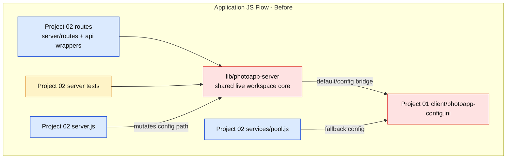
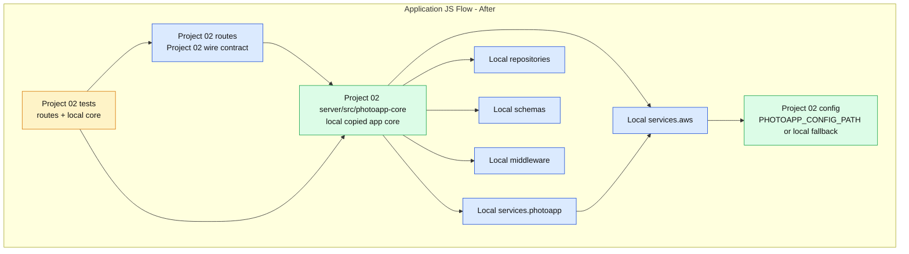
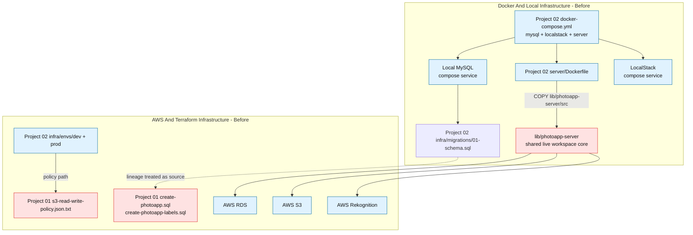
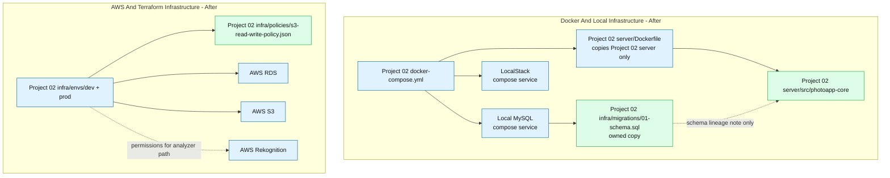
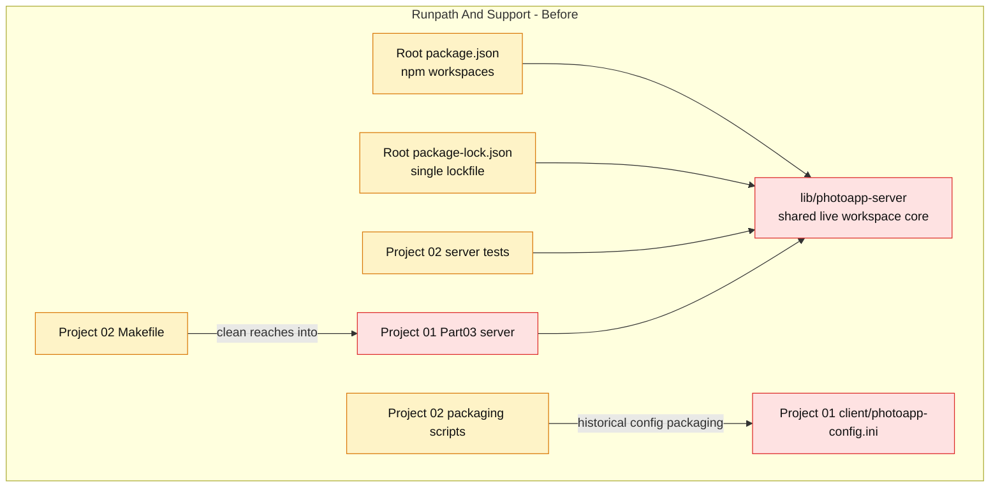
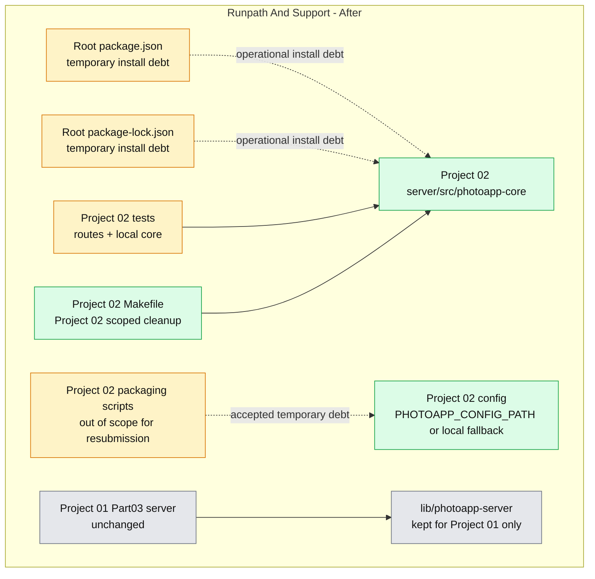

# Project 02 Split MVP: Application-Centered View

Use this as the targeted visualization checkpoint for the Project 02 split MVP.

Review the application flow first, then inspect the surrounding infrastructure and operational support layers.

Legend:

- Blue: core application runtime
- Green: project-owned target components
- Yellow: support/test/ops
- Red: leakage or coupling being removed
- Gray: accepted temporary debt or out-of-scope support

## Application Flow

### Before

### After

## Infrastructure

### Before

### After

## Runpath And Support

### Before

### After

## Visual Checkpoint

Questions to answer before promotion to `visualizations/`:

- Does the Application JS layer keep Project 02 runtime inside `server/src/photoapp-core`?
- Does the Infrastructure section show Docker/local and AWS/Terraform separately from runpath support?
- Does the Docker/local infrastructure avoid copying `lib/photoapp-server`?
- Does the AWS/Terraform layer use only Project 02-owned policy/schema paths?
- Does the Runpath And Support section show root workspace coupling as temporary debt, not application runtime coupling?
- Does `lib/photoapp-server` staying alive for Project 01 only match the MVP scope?

Accepted temporary debt for this execution:

- Root npm workspace and root lockfile remain for install determinism.
- Project 02 submission-packaging scripts may still contain historical Project 1 config assumptions because resubmission is explicitly out of scope.
