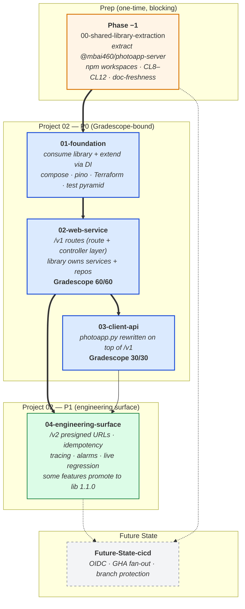

# Project 02 Part 01 — Approach Overview & Conventions

> **For agentic workers:** Read this file first. It is the umbrella for `01-foundation.md`, `02-web-service.md`, `03-client-api.md`, `04-engineering-surface.md`, and any `Future-State-*.md` workstreams in this directory. Execute workstreams as TDD checklists: write the failing test, watch it fail, implement the smallest change, then verify it passes. Configuration-only steps still need integration or smoke checks.

## Goal

Rebuild PhotoApp as a multi-tier cloud application: a Node.js/Express web service in front of RDS / S3 / Rekognition, with the existing Python client refactored to talk only to that web service. Pass the two Gradescope autograders (60/60 web service + 30/30 client API) **and** ship a production-grade scaffolding (IaC, observability, structured error handling, comprehensive tests) so this codebase is reusable for Part 02 (EB deployment) and beyond.

**Critical context:** Project 02 does **not** start from a blank slate. Significant scaffolding already exists in this monorepo from Project 01 + the shared lab backbone. The plan below is structured around **consuming / extending / reusing** that work via a shared library, not rebuilding it and not duplicating it.

> **Sequencing note (read this before reading the asset tables):** Phase −1 (`00-shared-library-extraction.md`) runs **before** any Project 02 server work. It extracts Part 03's service core into `MBAi460-Group1/lib/photoapp-server/` (the shared library `@mbai460/photoapp-server`). Project 02 then begins as a **consumer** of that library, configuring DI seams (mount-prefix-aware error mapping, variadic envelope shapes) rather than copy-and-adapting source files. The asset tables below describe what each Part 03 file becomes in the shared library and how Project 02 consumes it. The earlier "port + adapt" model — under which Project 02 owned a parallel copy of every file — was retired after a pressure test surfaced it as deliberate duplication accepted under the banner of risk avoidance; the rationale is captured in the *Footnote: Why This Used to Be "Future State"* section at the end of `00-shared-library-extraction.md`.

## Workstream Dependency Graph (orient yourself in 30 seconds)



**Reading the graph:** thick edges (`==>`) are hard preconditions; thin edges (`-->`) are soft (the downstream work is easier with the upstream done but isn't blocked). Dashed edges (`-.->`) point at future-state work that benefits from but doesn't gate the present plan. Phase −1 is amber because it's a one-time preparatory cost; P0 is blue because it's Gradescope-bound; P1 is green because it's engineering-grade additive work; future-state is grey-dashed because it's deferred by design.

## Workstream Map

The same plan in tabular form — the row order is the execution order. Each workstream has its own `## Dependencies` section listing what must already be green.

| File                          | Purpose                                                                                          | Phase                |
| ----------------------------- | ------------------------------------------------------------------------------------------------ | -------------------- |
| `00-overview-and-conventions.md` (this file) | Umbrella, contracts, conventions, instructor-vs-our-path, file layout, **inherited assets** | n/a — read first      |
| `00-shared-library-extraction.md` | **Phase −1: prep.** Extract Part 03's service core into `@mbai460/photoapp-server`; bootstrap npm workspaces; collaboration-safety scaffolding (lockfile merge driver, branch protection, PR template, `lib:` label); doc-staleness prevention protocol (`MetaFiles/DOC-FRESHNESS.md` + per-phase touchpoints). **Hard precondition for `01-foundation.md`.** | Phase −1 (prep) |
| `01-foundation.md`            | **Phase 0: consume the library + reuse shared infra/utils.** Then: docker-compose, Terraform module refactor, Project 02-specific observability (`pino`, `pino-http`, request_id), validation middleware, OpenAPI stub, full test pyramid harness | Phase 1 (P0)          |
| `02-web-service.md`           | **Phase 0: configure consumer + verify DI seams.** Then: six spec-compliant web service routes (route + controller layer; service layer comes from `@mbai460/photoapp-server`) | Phase 2a (P0 + P1)    |
| `03-client-api.md`            | `photoapp.py` rewrite (six API functions) hitting the web service; behavioural contract from Part 02; Gradescope client submission | Phase 2b              |
| `04-engineering-surface.md`   | `/v2` presigned URL flow, idempotency, pagination, tracing, dashboards, alarms, live regression — extends shared CloudWatch/Terraform; library 1.1.0 candidate features (pool factory, request_id, validate) promote here | Phase 3 (P1 + P2)     |
| `Future-State-cicd.md`        | GitHub Actions pipeline: lint → tests → ECR → terraform → EB rollback-gated deploy; depends on shared remote-state + Secrets Manager; consumes the path-filtered job matrix scaffolded in Phase −1 | Future State          |

## Optional Steps Convention (test early; tool-up future selves)

Throughout the workstream Approach docs you'll find four kinds of optional callout — none are blocking, all are explicitly *the executor's call in the moment*:

- `> **Optional Mermaid Visualization Step** — suggested file …` — render a 2D diagram before a major design or infra change.
- `> **Optional Test Step** — suggested file …` — pin an invariant *before* moving on, while the surface is fresh in your head.
- `> **Optional Utility Step** — suggested artifact `tools/X` or `utils/X` or `make X` …` — wrap a sequence into a reusable tool *the moment the repetition appears*.
- `> **Optional Documentation Step** — suggested artifact `…/<name>.md` …` — capture a table or convention as a human-readable reference *while the rationale is fresh*. Used sparingly (most documentation lands in mandatory phase deliverables like `MetaFiles/DOC-FRESHNESS.md` or `lib/photoapp-server/README.md`); the optional flavor exists for "the test already encodes this; should the humans also have it?" moments where the answer is "yes if it's cheap."

**Decision branches** (apply uniformly to all four):

1. **Build now** — pick this when (a) the next step needs the artifact anyway, (b) the same sequence is about to come up multiple times, or (c) a regression at this point would silently degrade Gradescope / live AWS. *Build it, use it once mid-flight, commit it.*
2. **Queue in `MetaFiles/TODO.md`** — pick this when the artifact is useful but the dependencies aren't yet in place (e.g., a test that needs a not-yet-built service, a util that wraps a not-yet-stable command). Append a row to `MetaFiles/TODO.md` per the schema established in `00-shared-library-extraction.md` § 5.7.
3. **Skip** — pick this when the artifact would be overkill for the surface area being touched (one-off command, mocks already cover the case, the convention is well-enforced elsewhere). Skip silently unless the reason is non-obvious or contrarian, in which case capture it in the commit message that closes the phase (one line is enough).

**Bias toward placement, not toward execution.** The Approach tends to suggest *more* of these than will be built; that's the design. Each callout exists so the executor *considers* the opportunity rather than discovering the regret three phases later. When in doubt, queue rather than skip — `MetaFiles/TODO.md` is cheap.

### Recording decisions

Each decision branch has exactly one natural artifact home:

| Decision | Artifact home | Format |
| --- | --- | --- |
| **Build now** | The artifact itself + its commit | Conventional Commits per `Conventions § Commits`. The commit message names the originating callout (e.g., `feat(server): add tests/unit/mount_order.test.js (per 01-foundation.md Phase 2 Optional Test Step)`). |
| **Queue** | `MetaFiles/TODO.md` § Open | One row per the schema in `00-shared-library-extraction.md` § 5.7. |
| **Skip (default)** | None | Silence accepts the default; the callout was optional. |
| **Skip (contrarian)** | Commit message of the phase-closing commit | One line: `// skipped <callout-id>: <reason>`. Surfaces the reasoning to a future reader who wonders "did anyone consider X?" |
| **Retire** (built consideration; decided not to pursue) | `MetaFiles/TODO.md` § Retired | Same row as Queue, plus a one-sentence reason. |

**Grooming.** `MetaFiles/TODO.md` is re-read at the start of every workstream (it's listed in each Approach doc's Documentation touchpoint). Promote anything whose Trigger fired; retire anything whose context evaporated.

### Naming convention for utilities (`tools/` vs `utils/`)

Project 01 already uses both directory names; the implicit convention is now made explicit so callouts pick the right one consistently:

- **`utils/<name>`** — small, focused helpers that are mostly invoked *by other things* (pre-commit hooks, CI jobs, Makefile targets, other scripts). Single-purpose, often parameterless, often pass/fail. Examples: `utils/cred-sweep`, `utils/lib-symlink-check`, `utils/no-service-leak`, `utils/freshen-lockfile`. **Heuristic: would a human invoke this directly with arguments? If no, `utils/`.**
- **`tools/<name>`** — developer-facing CLIs with arguments and human-readable output. Multi-purpose or parameterized; intended to be run interactively during development or debugging. Examples: `tools/route-scaffold.sh <name>`, `tools/presign-curl <assetid>`, `tools/synthetic-alarm-trigger <alarm-name>`, `tools/gradescope-preview`. **Heuristic: would a human invoke this with `--help`? If yes, `tools/`.**

Border cases (where either is defensible): `tools/wait-for host:port` is a parameterized CLI but mostly invoked from `make up` — `tools/` wins because it accepts arguments. `utils/run-extraction-canary` is a wrapper but argumentless — `utils/` wins. When in doubt, prefer the directory the artifact's *primary caller* lives in.

## Inherited Assets — What Project 02 Reuses

Project 02 stands on top of three existing bodies of work:

### From Project 01 Part 03 (`projects/project01/Part03/server/`) → extracted into `lib/photoapp-server/` in Phase −1

A working Express + Node.js web service with a layered architecture, already accepted at end of Project 01. **Phase −1 extracts its service core into the shared library `@mbai460/photoapp-server`.** Project 02 (and Part 03 itself, post-extraction) consume the library; they do not own parallel copies. The "Project 02 disposition" column below describes how Project 02 *consumes* each library export, not how it copies a file.

| Asset (Part 03 path → library destination)                                  | Status (after Phase −1) | Project 02 disposition                                                                                          |
| ------------------------------------------------------ | ------------------- | ---------------------------------------------------------------------------------------------------------------- |
| `server/app.js` — exports `app`, no `listen()`          | Done; surface-specific (stays in each consumer) | **Net-new in Project 02** — Project 02 owns its own `app.js` because the wire contract differs. Pattern (split + export, no `listen()` in `app.js`) is borrowed from Part 03's app.js. |
| `server/server.js` — listen entrypoint                  | Done; surface-specific | **Net-new in Project 02** — Project 02 owns its own `server.js`; adds `closePool()` graceful shutdown hook tied to Project 02's pool factory. |
| `server/config.js` → `lib/photoapp-server/src/config.js` | Done; **in library** | **Consume**: `const { config } = require('@mbai460/photoapp-server')`. Identical loader; both surfaces read `photoapp-config.ini` the same way. |
| `server/services/aws.js` → `lib/photoapp-server/src/services/aws.js` (`getDbConn`, `getBucket`, `getBucketName`, `getRekognition`) | Done; **in library** | **Consume + extend via DI**: `01-foundation.md` Phase 7 extends the library's AWS service factory with `mysql2.createPool` (replaces per-request `createConnection` for both surfaces; promoted into the lib in 1.1.0) and adds Project 02-specific `getBucketBreaker()` / `getRekognitionBreaker()` (`opossum`) in Project 02's tree. |
| `server/services/photoapp.js` → `lib/photoapp-server/src/services/photoapp.js` (`getPing`, `listUsers`, `listImages`, `uploadImage`, `downloadImage`, `getImageLabels`, `searchImages`, `deleteAll`) | Done; **in library** | **Consume**. The library's `uploadImage`/`downloadImage` accept buffer in / buffer out (per Phase −1 reconciliation). Project 02's `routes/v1/image.js` controller does the base64 ↔ buffer transform at the route boundary; Part 03's controller does the multer ↔ buffer transform. The library is buffer-native; surfaces own transport adapters. |
| `server/middleware/upload.js` → `lib/photoapp-server/src/middleware/upload.js` (multer config, `cleanupTempFile`) | Done; **in library** | **Consume via factory**: `createUploadMiddleware({ destDir, sizeLimit })`. Project 02 spec uses JSON+base64 (no multer on `/v1`); Project 02 mounts the upload middleware only on `/v2` engineering routes via the same factory. |
| `server/middleware/error.js` → `lib/photoapp-server/src/middleware/error.js` (central error mapping `no such userid`/`no such assetid`/`LIMIT_*`) | Done; **in library** | **Consume via factory**: `createErrorMiddleware({ statusCodeMap, errorShapeFor, logger })`. Project 02 passes a `statusCodeMap` that is mount-prefix-aware (`/v1` keeps spec status codes; `/v2` is REST-correct) and a `logger` constructed from Project 02's `pino`. **Identical library code; different DI config; zero duplicated source.** |
| `server/schemas.js` → split into `lib/photoapp-server/src/schemas/envelopes.js` + `schemas/rows.js` (`successResponse`, `errorResponse`, row converters, `deriveKind`) | Done; **in library** | **Consume**. The library's `successResponse({ ...extras })` is variadic by design (`{message: 'success', ...extras}`), satisfying Part 03's `{message, data}` and Project 02's per-route shapes (`{message, M, N}`, `{message, assetid}`, `{message, userid, local_filename, data}`) from a single helper. Row converters are unchanged. |
| `server/tests/` (service-layer subset → `lib/photoapp-server/tests/`; surface-specific tests stay in Part 03) | Done; service-layer **in library** | Project 02 inherits the library's service-layer test patterns and adds its own surface-specific tests (`tests/integration/`, `tests/contract/`, `tests/smoke/`, `tests/happy_path/`, `tests/live/`) under `01-foundation.md` Phase 11. **Service-layer tests run once for both surfaces.** |
| `package.json` (Express 5, mysql2, AWS SDK v3, multer, ini, p-retry, jest, supertest) | Done; deps split — library vs surface | Project 02's `projects/project02/server/package.json` declares `"@mbai460/photoapp-server": "*"` (workspace protocol; per CL8 in `00-shared-library-extraction.md`) plus surface-specific dev deps (`pino`, `pino-http`, `zod`, `opossum`, `aws-sdk-client-mock`, `chai-openapi-response-validator`). |
| `MetaFiles/refactor-log.md` precedent                 | Done                | Mirror in Project 02 (`projects/project02/client/MetaFiles/refactor-log.md`); reference Phase −1's reconciliation log (`learnings/2026-XX-XX-photoapp-server-extraction.md`) for any library-internal change history. |

**Important contract differences between Part 03 and Project 02 spec:**

| Concern                | Part 03 (`/api/*`)                                   | Project 02 spec (no prefix)                                                                  |
| ---------------------- | ----------------------------------------------------- | -------------------------------------------------------------------------------------------- |
| URL prefix             | `/api/`                                               | none (Gradescope hits `/ping`, `/users`, …)                                                  |
| Image upload transport | `multipart/form-data`, `userid` field + `file` field  | `application/json` body `{local_filename, data: <base64>}` to `POST /image/:userid`           |
| Image download transport| native streaming `Body.pipe(res)` from `GET /api/images/:assetid/file` | base64 in JSON body from `GET /image/:assetid` → `{message, userid, local_filename, data}` |
| Search route           | `GET /api/search?label=`                              | `GET /images_with_label/:label`                                                              |
| Envelope               | uniform `{message: 'success', data: ...}`             | per-route: ping uses `{message, M, N}`; upload uses `{message, assetid}`; lists use `{message, data: [...]}`; download uses `{message, userid, local_filename, data}` |
| `users` row shape      | `{userid, username, givenname, familyname}`          | **Same** — `{userid, username, givenname, familyname}`                                       |
| `images` row shape     | `{assetid, userid, localname, bucketkey, kind}`      | `{assetid, userid, localname, bucketkey}` (`kind` is internal-only on the spec surface)      |
| Error envelope         | `{message: 'error', error: '<msg>'}`                  | varies: ping uses `{message, M: -1, N: -1}`; upload uses `{message, assetid: -1}`; download uses `{message, userid: -1}`; lists use `{message, data: []}` |

The route layer is the only place these shapes diverge — services, repositories, schemas, and middleware are reusable as-is.

### From Project 01 Part 02 (`projects/project01/client/photoapp.py`)

The behavioural reference for the Project 02 client:

| Function                              | Part 02 signature                                 | Project 02 disposition                                                                              |
| ------------------------------------- | ------------------------------------------------- | --------------------------------------------------------------------------------------------------- |
| `initialize(config_file, s3_profile, mysql_user)` | sets globals, validates ini             | **Replaced** by `WEB_SERVICE_URL` config in `photoapp-client-config.ini`; provided by assignment    |
| `get_ping()` → `(M, N)`               | direct S3 + RDS call                              | **Provided** by assignment baseline; calls web service                                              |
| `get_users()` → `[(userid, username, givenname, familyname), ...]` | direct RDS call             | **Provided** by assignment baseline; calls web service                                              |
| `get_images(userid=None)` → `[(...)]` | direct RDS call                                   | **Rewrite** to call `GET /images[?userid=]`; same return shape, same ordering                      |
| `post_image(userid, local_filename)` → `int` (assetid) | direct S3+Rekognition+RDS              | **Rewrite** to call `POST /image/:userid` with base64 body; same exception (`ValueError("no such userid")` → `HTTPError`) |
| `get_image(assetid, local_filename=None)` → `str` (path written) | direct S3 download           | **Rewrite** to call `GET /image/:assetid`; decode base64; write file; same return                   |
| `get_image_labels(assetid)` → `[(label, confidence), ...]` | direct RDS call                  | **Rewrite** to call `GET /image_labels/:assetid`                                                   |
| `get_images_with_label(label)` → `[(assetid, label, confidence), ...]` | direct RDS call         | **Rewrite** to call `GET /images_with_label/:label`                                                |
| `delete_images()` → `True`            | direct RDS truncate + S3 deleteobjects            | **Rewrite** to call `DELETE /images`                                                               |

Tuple shapes and ordering must match Part 02 verbatim (Project 02 callers / Gradescope tests rely on them).

### From Shared Lab Backbone (`infra/`, `utils/`, `docker/`)

Operational tooling that Project 02 calls — no rebuilding.

| Asset                                          | Status              | Project 02 disposition                                                                                                  |
| ---------------------------------------------- | ------------------- | ----------------------------------------------------------------------------------------------------------------------- |
| `infra/terraform/main.tf` — S3 bucket, RDS MySQL 8 (`db.t3.micro`, public, IAM auth on), `photoapp-rds-sg` (3306 from 0.0.0.0/0), IAM users `s3readonly` + `s3readwrite` (Rekognition full access) + access keys | Done | **Reuse** as-is for Project 02 Part 01; engineering surface (workstream 04) extends with new modules under `infra/modules/` |
| `infra/config/photoapp-config.ini` — backbone read-only DB + S3 config; consumed by `utils/run-sql`, `utils/validate-db`, `utils/smoke-test-aws` | Done | **Reuse**; also referenced by Project 02 server (workstream 02) via `server/config.js` |
| `projects/project01/client/photoapp-config.ini` — read-write DB user + s3readwrite profile; used by Part 03 server | Done | **Reuse** — Project 02 web service references this same file (the assignment-provided pattern: copy `photoapp-config.ini` from Part 01 setup into the server folder) |
| `utils/run-sql` — runs SQL files inside Docker as RDS admin; substitutes `${PHOTOAPP_RO_PWD}`, `${PHOTOAPP_RW_PWD}`, `${SHORTEN_APP_PWD}` | Done | **Reuse** for any Project 02 schema migrations (e.g., `idempotency_keys` table in workstream 04) |
| `utils/validate-db` — 26 checks against `photoapp` schema, including ENUM `kind` (Q8); seeded users `p_sarkar` / `e_ricci` / `l_chen` | Done | **Reuse** for sanity-check after Project 02 changes; **extend** if workstream 04 adds new tables |
| `utils/rebuild-db` — runs `create-photoapp.sql` + `create-photoapp-labels.sql` then `validate-db` | Done | **Reuse** for clean-slate dev; document the order |
| `utils/smoke-test-aws` — 10 checks against live AWS (S3 head/ACL, RDS describe, SG rule, TCP probe) | Done | **Reuse** in Project 02 Part 01 acceptance + workstream 04 live regression |
| `utils/cred-sweep` — git-grep for AKIA / lab passwords / committed `terraform.tfvars` / `photoapp-config.ini` paths | Done | **Reuse** as pre-commit hook (workstream 01 Phase 1.3 adds it to husky) |
| `utils/rotate-access-keys`, `utils/rotate-passwords` — IAM key + RDS password rotation | Done | **Reuse**; engineering surface (workstream 04) adds tagging-aware variant |
| `utils/aws-inventory` — region-wide resource scan, labels `[TF]` vs `[MANUAL]` | Done | **Reuse** for drift detection                                                                                                          |
| `utils/docker-up`, `docker-down`, `docker-status` (Mac/Colima) | Done                | **Reuse**                                                                                                               |
| `docker/Dockerfile` — Ubuntu base, Python 3 + boto3 + pymysql + nicegui + cloudflared + Gradescope `gs` CLI | Done | **Reuse** as the **client** image for Project 02; the **server** image is `mbai460-server-main` (assignment-provided) running locally alongside |
| `docker/run`, `docker/run-8080` (and `.bash` variants) — interactive shell, `--network host` or `-p 8080:8080` | Done | **Reuse** for the client side; new `docker-compose.yml` (workstream 01 Phase 10) orchestrates client + server + MySQL + LocalStack as an alternative |
| `MetaFiles/QUICKSTART.md` — collaborator setup walkthrough | Done                | **Reuse**; Project 02 follows the same `secrets/` + `terraform apply` + `run-sql` + `validate-db` flow                                                  |

### From `projects/project01/` (database)

| Asset                                                | Status        | Project 02 disposition                                                                          |
| ---------------------------------------------------- | ------------- | ----------------------------------------------------------------------------------------------- |
| `create-photoapp.sql` — canonical DDL: `users` (`userid`, `username`, `pwdhash`, `givenname`, `familyname`), `assets` (`assetid`, `userid`, `localname`, `bucketkey`, `kind ENUM('photo','document')`), seeded users 80001-80003, IAM app users `photoapp-read-only` / `photoapp-read-write` | Done | **Reuse** — Project 02 schema is identical |
| `create-photoapp-labels.sql` — `labels` (`labelid`, `assetid` FK CASCADE, `label`, `confidence`)               | Done | **Reuse** — Project 02 labels schema is identical |
| `migrations/2026-04-26-add-assets-kind.sql` — forward-only `kind` column add | Done (one-shot) | **Done**; do not re-run after `rebuild-db` (the DDL absorbed the column) |

### Conclusion

The bulk of "engineering-grade" scaffolding already exists. Project 02's job is:

1. **Run Phase −1** (`00-shared-library-extraction.md`) to extract Part 03's service core into `@mbai460/photoapp-server`. After this, Part 03 is a consumer of the library, not the owner of the service core.
2. **Begin Project 02 as a library consumer** — install `@mbai460/photoapp-server`, configure the DI seams (mount-prefix-aware error mapping, variadic envelope, opossum-wrapped AWS clients, pool factory), and write the new wire-contract surface (`/v1` spec routes, `/v2` engineering routes).
3. **Rewrite** the client `photoapp.py` to call the web service while preserving the Part 02 tuple-shape contract.
4. **Add what's genuinely new for Project 02** in Project 02's own tree: `pino` structured logging, `pino-http` request logging, `request_id` middleware, `zod` validation, `opossum` circuit breakers (Project 02 wraps the lib's AWS clients), OpenAPI 3.1 spec, docker-compose with LocalStack, the full six-layer test pyramid, and the engineering-surface workstream (`/v2` presigned URLs, idempotency, tracing, alarms). Net-new code stays in Project 02 until a third consumer justifies promotion to the library (YAGNI per CL2).
5. **Reuse** the shared Terraform tree, `utils/`, Docker image, and database schema verbatim.

> **Optional Mermaid Visualization Step** — suggested file `visualizations/Target-State-project02-inheritance-map-v1.md`
>
> Before kicking off Phase −1, render a one-page Mermaid `flowchart LR` of the **inheritance map** so reviewers see at a glance where every Project 02 file comes from after library extraction.
>
> - **Story**: "Three sources feed into Project 02. The shared library `@mbai460/photoapp-server` (extracted from Part 03 in Phase −1) is the source of truth for services / repositories / middleware / schemas. The shared backbone (`infra/`, `utils/`, `docker/`) is reused as-is. Net-new Project 02 code (request_id, validate, observability, route layer, controllers) lives in Project 02's own tree."
> - **Focus**: paint the **library boundary** — the line between `lib/photoapp-server/` (consumed by both Part 03 and Project 02) and the surface-specific code in each project — in **red/amber** (`style X fill:#fcc,stroke:#900,stroke-width:3px`); that boundary is the architectural decision Phase −1 makes. Paint the **DI seams** (`createErrorMiddleware`, injected `pino` logger, pool factory) in **amber** because they are how the same library satisfies divergent surface needs. Paint **net-new Project 02 modules** in **green**.
> - **Shape vocab**: rounded rect = file/module; subgraph = tree (`Part 03 server`, `lib/photoapp-server`, `Project 02 server`, `shared backbone`); trapezoid = DI seam; arrows labeled `consumes`, `extends-via-DI`, `reuses`, `new`.
> - **Brevity**: filename only as node label (`app.js`, not `server/app.js`); subgraph titles carry the path.
> - **Edges**: verb-only labels.
> - **Direction**: `flowchart LR` so the library sits as the visual fan-in point.

## Our Path vs. The Instructor's

The instructor's PDF teaches a minimum viable path: copy a starter image, edit ini files by hand, scatter `console.log` everywhere, copy `photoapp-config.ini` between Docker images, deploy via `eb` CLI in a separate handout. Our path layers engineering-grade scaffolding under the same Gradescope contract.

| Layer                     | Instructor's path                                                          | Our path                                                                                                       |
| ------------------------- | -------------------------------------------------------------------------- | -------------------------------------------------------------------------------------------------------------- |
| Infrastructure            | Manual EB CLI deploy in Lab 03 / Part 02                                   | Terraform module: EB env, RDS, S3, IAM roles, security groups, log groups; remote state per env                |
| Secrets                   | `photoapp-config.ini` baked into the server image                          | AWS Secrets Manager + Parameter Store; IAM instance profile on EB; no static keys on disk                       |
| Local dev                 | Two manually-coordinated Docker images, manual ini copy                    | `docker-compose` with client, server, MySQL, LocalStack; one `make up`                                           |
| Web service shape         | One JS file per route, try/catch + 500 inline                              | Layered: routes → controllers → services → repositories; AWS clients injected; central error middleware        |
| DB connections            | `get_dbConn()` opens/closes per request                                    | Module-level `mysql2.createPool` shared across requests; tuned to RDS class                                     |
| Logging                   | `console.log` everywhere                                                   | `pino` structured JSON + `pino-http`; request id + correlation id; CloudWatch log groups per env                |
| Health checks             | One `/ping` doing real work against S3 + RDS                               | `/healthz` (liveness, no-op) + `/readyz` (deps probe); EB ALB targets liveness                                  |
| Reliability               | `p-retry` on MySQL only                                                    | Circuit breaker (`opossum`) around RDS / S3 / Rekognition; bounded timeouts; bulkheads on concurrent S3 ops    |
| Validation                | Manually pull values off `req`                                             | `zod` schemas per route, one middleware for body + params + query, structured 400 on failure                   |
| API contract              | JSON shapes embedded in JSDoc                                              | OpenAPI 3.1 spec; generated TS types for server + Pydantic models for client; contract tests run in P0 suite    |
| Image transfer            | Base64 in JSON body, 50 MB global `express.json` limit                     | Spec-compliant base64 routes for Gradescope; engineering `/v2` routes use S3 presigned URLs (workstream 04)     |
| Tests                     | Single `tests.py` against a live web service                               | Full pyramid against every component: unit, integration (LocalStack + ephemeral MySQL), contract, smoke, happy-path E2E, live regression — gated to fail on regression |
| Code quality              | None required                                                              | ESLint + Prettier (JS); ruff + black + mypy (Py); pre-commit hooks; Conventional Commits                        |
| Cost & ops                | Manual `aws rds stop-db-instance` reminder                                 | Tagging on every resource; scheduled spindown (EventBridge → Lambda); CloudWatch budget alarm; teardown script  |
| CI/CD                     | Manual `gs submit` from Docker shell                                       | Future State (`Future-State-cicd.md`): GHA → ECR → terraform → EB rollback-gated deploy → post-deploy smoke     |

The strategic architecture review behind these choices lives in the canvas at `~/.cursor/projects/Users-erik-Documents-Lab-mbai460-client/canvases/project02-engineering-grade-review.canvas.tsx`. This Approach is the executable form of that review.

## Scope

This Approach covers Project 02 **Part 01** only — the multi-tier app running locally, with both Gradescope autograders passing, on top of the production-grade scaffolding. EB deployment is **Part 02** (Lab 03) and is out of scope for this directory.

In scope:

- Web service (Node.js/Express) with seven HTTP endpoints (`/`, `/ping`, `/users`, `/images`, `/image/:userid`, `/image/:assetid`, `/image_labels/:assetid`, `/images_with_label/:label`, `/images` DELETE) — assignment specifies six new routes plus the two pre-implemented (`/ping`, `/users`).
- Client-side `photoapp.py` rewritten so every API function calls the web service (no direct AWS / RDS access from the client).
- Production-grade scaffolding: Terraform (local-only modules; no apply yet), docker-compose, structured logging, health endpoints, error middleware, mysql pool, lint/format/pre-commit, OpenAPI stub, full test pyramid harness.
- Engineering surface (`/v2` presigned URLs, idempotency, tracing, alarms, live regression) — additive, behind feature flags.
- Both Gradescope submissions: web service (60/60) and client API (30/30).

Out of scope (Part 02 / future):

- Elastic Beanstalk deployment + matching Terraform `apply` against a real account.
- Production-tier monitoring (Datadog, Grafana, full SLO dashboards).
- Auth / multi-tenant security beyond the IAM scaffold.
- CI/CD pipeline — captured in `Future-State-cicd.md` for the next iteration.

## API Contract Summary

> **Optional Mermaid Visualization Step** — suggested file `visualizations/project02-api-contract-v1-vs-v2-v1.md`
>
> Before reading the contract tables below, render a `flowchart TD` showing the **two API surfaces** that share the same service layer.
>
> - **Story**: "Same use cases, two URL surfaces. `/v1/*` is the locked Gradescope wire contract; `/v2/*` is the engineered surface. Both delegate into a single `services/photoapp.js`."
> - **Focus**: highlight the **divergence points** (URL prefix, body shape — base64 vs presigned, envelope shape, status codes 400-only-on-v1 vs 404-on-v2) in **red**. Paint the shared service layer in **green** so the viewer sees that *only the route layer differs*.
> - **Shape vocab**: stadium `([...])` = HTTP route; rounded `(...)` = controller / service; cylinder `[(...)]` = AWS / RDS resource; subgraph = mount prefix (`/v1` vs `/v2`).
> - **Brevity**: ≤ 4 words / node; verb-only edges (`adapts`, `delegates`, `wraps`).
> - **Direction**: `flowchart TD` so the two surfaces fan in to a shared bottom layer.

The Gradescope autograder pins exact route paths, HTTP verbs, status codes, and JSON envelope shapes. **This is a stable public contract.** Every `02-web-service.md` route returns the documented envelope; engineering improvements (better status codes, presigned URLs, pagination) live under `/v2/*` in `04-engineering-surface.md`.

### Spec-compliant routes (locked by Gradescope)

| Verb     | Path                              | Body / params                                          | Success body                                                                                                             | Error bodies                                                       |
| -------- | --------------------------------- | ------------------------------------------------------ | ------------------------------------------------------------------------------------------------------------------------ | ------------------------------------------------------------------ |
| `GET`    | `/`                               | n/a                                                    | `{status: "running", uptime_in_secs: int}`                                                                               | 500 on uptime calc failure                                         |
| `GET`    | `/ping`                           | n/a                                                    | `{message: "success", M: int, N: int}` (M = S3 object count, N = user count)                                             | 500 `{message: <err>, M: -1, N: -1}`                               |
| `GET`    | `/users`                          | n/a                                                    | `{message: "success", data: [{userid, username, givenname, familyname}, ...]}` ordered by `userid` ASC                  | 500 `{message: <err>, data: []}`                                   |
| `GET`    | `/images`                         | optional `?userid=int`                                 | `{message: "success", data: [{assetid, userid, localname, bucketkey}, ...]}` ordered by `assetid` ASC; `kind` is internal-only and not surfaced | 500 `{message: <err>, data: []}`                                   |
| `POST`   | `/image/:userid`                  | body `{local_filename: string, data: base64-string}`   | `{message: "success", assetid: int}`                                                                                     | 400 `{message: "no such userid", assetid: -1}`, 500 `{...assetid: -1}` |
| `GET`    | `/image/:assetid`                 | n/a                                                    | `{message: "success", userid: int, local_filename: string, data: base64-string}`                                         | 400 `{message: "no such assetid", userid: -1}`, 500 `{...userid: -1}`  |
| `GET`    | `/image_labels/:assetid`          | n/a                                                    | `{message: "success", data: [{label, confidence}, ...]}` ordered by `label` (per spec)                                   | 400 `{message: "no such assetid", data: []}`, 500 `{...data: []}`      |
| `GET`    | `/images_with_label/:label`       | partial label substring                                | `{message: "success", data: [{assetid, label, confidence}, ...]}` ordered by `assetid` then `label`, case-insensitive    | 500 `{message: <err>, data: []}`                                       |
| `DELETE` | `/images`                         | n/a                                                    | `{message: "success"}` (DB cleared; S3 best-effort)                                                                       | 500 `{message: <err>}`                                                 |

### Engineering `/v2` routes (added in workstream 04, not submitted to Gradescope)

| Verb     | Path                                    | Notes                                                                                                            |
| -------- | --------------------------------------- | ---------------------------------------------------------------------------------------------------------------- |
| `POST`   | `/v2/images/:userid/upload-url`         | Returns presigned PUT URL + bucketkey; client streams bytes directly to S3                                        |
| `POST`   | `/v2/images/:userid/finalize`           | Client posts `{bucketkey, local_filename}` after upload; service writes DB row + triggers Rekognition             |
| `GET`    | `/v2/images/:assetid/download-url`      | Returns presigned GET URL with TTL                                                                                |
| `GET`    | `/v2/images?cursor=...&limit=...`       | Cursor pagination over assets                                                                                     |
| `DELETE` | `/v2/images/:assetid`                   | REST-correct per-asset delete; 404 on unknown assetid                                                             |

## Design Decisions

- **D1 — Two Docker images locally; one Terraform tree.** Per the assignment, the local dev environment is the existing client image plus the `mbai460-server` image. Our `docker-compose.yml` orchestrates both alongside MySQL and LocalStack. Terraform code lives under `infra/` and only models cloud resources; locally, compose covers everything.
- **D2 — Spec-compliant routes are the wire contract; engineering work happens *behind* them.** Routes in `server/routes/v1/*.js` are thin adapters that translate to/from the legacy JSON envelope. All actual logic lives in `server/services/photoapp.js` and is shared with the `/v2` routes.
- **D3 — `/v2` routes are additive and behind a feature flag.** `ENABLE_V2_ROUTES=1` mounts the v2 surface; default off so Gradescope autograder traffic only hits the spec-compliant routes.
- **D4 — Client picks the API surface via config.** `photoapp-client-config.ini` gains an optional `api_version` key (default `v1`). The Gradescope-submitted `photoapp.py` ships with `v1`; engineering tests run with `v2`.
- **D5 — Single source of truth for AWS clients and DB pool: `@mbai460/photoapp-server` (`services/aws.js`).** Phase −1 extracts this file from Part 03 into the shared library (replacing the legacy `helper.js` for both surfaces). Project 02 **consumes** the library's AWS factory and **extends** it from its own tree with `mysql2.createPool` (Project 02-specific `services/pool.js`; replaces per-request `createConnection` for transactional flows) and `opossum` circuit breakers around S3 / Rekognition (Project 02-specific `services/breakers.js`). Pool factory and breakers are 1.1.0 promotion candidates once a third consumer or refactor justifies it.
- **D6 — Retry policy is split, not overlapping.** Client retries only on `ConnectionError` / `Timeout` (per spec). The web service retries MySQL via `p-retry` (max 3 total attempts) and wraps every AWS call in `opossum` with bounded timeouts. AWS SDK v3 already retries internally; we do not double-retry.
- **D7 — Spec-compliant status codes are 200 / 400 / 500 *only*.** REST-correct `404` on "no such id" lives only on `/v2`. The error-mapping middleware checks the request path's mount prefix to choose the right code.
- **D8 — Logging and tracing are opt-in by env var.** `LOG_LEVEL`, `TRACING_ENABLED`, `OTEL_*` follow 12-factor. In LocalStack-backed dev, tracing exporters are no-ops.
- **D9 — Tests are gated, not deleted, when not applicable.** Live AWS tests live in `live_*.test.js` / `live_*.py` files and are skipped unless `PHOTOAPP_RUN_LIVE_TESTS=1` is set. Smoke and happy-path E2E tests run against `docker-compose up`.
- **D10 — Forward-only Terraform.** No destroy-then-recreate cycles in shared envs. Resource changes that require recreation get a deliberate `terraform apply -target` plan and a `refactor-log.md` entry.
- **D11 — Same Express app instance for `/v1` and `/v2`.** No separate process. The mount order is `/v2` (when enabled) → `/v1` → 404 fallback. Mounting `/v2` first prevents accidental shadowing by parameterised v1 paths like `/image/:assetid`.
- **D12 — Spec-compliant routes are mounted at the *root*, not `/v1`.** Gradescope hits paths without a prefix (`/ping`, `/users`, `/image/:userid`, …). The `/v1` term in this Approach refers to the *router module* (`server/routes/v1/*.js`) which is mounted at `/`. The mount path is `/v1/*` only inside the `OPTIONAL_V1_PREFIX` environment override (used in non-Gradescope live regression to make traffic distinguishable in CloudWatch). Default mount is at root.
- **D13 — Both server trees consume one shared library; neither owns the service core.** Phase −1 (`00-shared-library-extraction.md`) extracts Part 03's services / repositories / middleware / schemas into `@mbai460/photoapp-server`. After Phase −1, both `projects/project01/Part03/server/` and `projects/project02/server/` are *consumers* of the library — they own surface-specific code (app.js, server.js, routes, controllers, contract tests) and configure shared internals via DI seams. There is no parallel internal source to keep in sync. The earlier "two trees coexist; consolidate later" model was retired after a pressure test surfaced it as deliberate duplication; see `00-shared-library-extraction.md` *Footnote: Why This Used to Be "Future State"*.

> **Optional Mermaid Visualization Step** — suggested file `visualizations/Target-State-project02-app-mount-order-v1.md`
>
> The decisions above (D2/D3/D7/D11/D12) are easy to misread in prose. Before workstream 01 builds the Express app, render a `flowchart LR` of the **request lifecycle through `app.js`** so the mount order is unambiguous.
>
> - **Story**: "An incoming request flows through middleware in this order; here is where `/v1` vs `/v2` decisions branch."
> - **Focus**: highlight the **error middleware mount-prefix decision** (the spot where `req.baseUrl.startsWith('/v2')` flips status code mapping) in **red** — that's the most error-prone bit. Highlight the **`ENABLE_V2_ROUTES=1` gate** in **amber** since toggling it changes the surface.
> - **Shape vocab**: stadium `([...])` = client request entry; rounded `(...)` = middleware / router / handler; hexagon `{{...}}` = decision (mount-prefix gate, feature flag); diamond `{...}` = 404 fallback.
> - **Brevity**: ≤ 4 words / node; edges labeled `next()`, `error`, `404`.
> - **Direction**: `flowchart LR` so the lifecycle reads left → right.

## File Layout

Target tree at the end of Part 01 (only this directory's files; the server image's `server/` mirror lives under that image's checkout):

```text
MBAi460-Group1/projects/project02/client/
  client.py                         # provided UI driver (untouched)
  gui.py                            # provided UI driver (untouched)
  photoapp.py                       # rewritten by workstream 03
  photoapp-client-config.ini        # provided; gains `api_version` key
  photoapp-client-config.ini.example  # template, committed (workstream 01)
  tests.py                          # extended in workstream 03 (existing scaffold preserved)
  00no-labels.jpg … 04sailing.jpg   # provided test fixtures
  project02-part01.pdf              # assignment handout
  MetaFiles/
    Approach/
      00-overview-and-conventions.md
      00-shared-library-extraction.md   # Phase −1: prep, runs before 01-foundation
      01-foundation.md
      02-web-service.md
      03-client-api.md
      04-engineering-surface.md
      Future-State-cicd.md
    refactor-log.md                 # decisions log (workstream 01 creates)
    EXPECTED-OUTCOMES.md            # gradescope deliverables (workstream 01 creates)
    NAMING-CONVENTIONS.md           # cross-agent naming standard (workstream 01 creates)
    TODO.md                         # follow-on items deferred from this Approach
```

Server image side (after Phase −1: shared library + thin Project 02 surface):

```text
MBAi460-Group1/                               # workspace root (Phase −1)
  package.json                               # NEW (Phase −1) — workspace root with [lib/*, projects/project01/Part03, projects/project02/server]
  package-lock.json                          # NEW (Phase −1) — single root lockfile for all workspaces
  README.md                                  # UPDATE (Phase −1) — workspace bootstrap + lib pointer
  QUICKSTART.md (or MetaFiles/QUICKSTART.md) # UPDATE (Phase −1) — clone → npm install at root → workspace navigation
  CONTRIBUTING.md                            # NEW (Phase −1) — workspace etiquette, lockfile merge, library change protocol
  MetaFiles/
    DOC-FRESHNESS.md                         # NEW (Phase −1) — doc-staleness prevention protocol (CL11)
  lib/
    photoapp-server/                         # NEW (Phase −1) — shared service core extracted from Part 03
      package.json                           # @mbai460/photoapp-server@1.0.0
      README.md                              # NEW — public API, DI seams, version policy
      CHANGELOG.md
      src/
        index.js                             # exports map: { config, services, repositories, middleware, schemas }
        config.js                            # CONSUMED FROM Part 03
        services/aws.js                      # CONSUMED FROM Part 03 (pool factory promoted in 1.1.0 from 01-foundation Phase 7)
        services/photoapp.js                 # CONSUMED FROM Part 03 (buffer-native; surfaces own transport adapters)
        repositories/{users,assets,labels}.js # NEW (Phase −1, CL9 reconciliation: SQL extracted from Part 03's inline service)
        middleware/error.js                  # FACTORY: createErrorMiddleware({ statusCodeMap, errorShapeFor, logger })
        middleware/upload.js                 # FACTORY: createUploadMiddleware({ destDir, sizeLimit })
        schemas/envelopes.js                 # successResponse({...extras}) — variadic (satisfies both surfaces)
        schemas/rows.js                      # row converters + deriveKind
      tests/                                 # service-layer tests (run once for both surfaces)
        services/, repositories/, middleware/, schemas/
projects/project01/Part03/server/             # consumer of @mbai460/photoapp-server (after Phase −1)
  app.js                                     # imports from @mbai460/photoapp-server; constructs error middleware via createErrorMiddleware({ /* Part 03 mapping */ })
  server.js
  routes/photoapp_routes.js                  # imports services from lib; calls successResponse({ data })
  package.json                               # depends @mbai460/photoapp-server (workspace protocol *)
  Dockerfile                                 # workspace-aware copy pattern
  tests/integration/                         # surface-specific (Part 03 wire contract)
  tests/live/                                # surface-specific live regression
projects/project02/server/                    # NEW (built starting at 01-foundation.md Phase 0; consumes the library)
  app.js                                     # NEW — Project 02 mount order: /v2 (when ENABLE_V2_ROUTES=1) → /v1 router at root → 404
  server.js                                  # NEW — listen entrypoint + closePool() shutdown hook (calls Project 02's pool)
  photoapp-config.ini                        # gitignored; symlink/copy from projects/project01/client/photoapp-config.ini
  photoapp-config.ini.example                # template, committed
  routes/
    v1/{ping,users,images,image,image_labels,images_with_label,delete_images}.js  # NEW — thin spec adapters
    v2/{images_upload,images_download,images_paginated}.js                         # NEW (workstream 04)
  controllers/
    v1/*.js                                  # NEW — thin controllers; set res.locals.errorShape; call lib services with buffer adapters
    v2/*.js                                  # NEW (workstream 04)
  middleware/
    request_id.js                            # NEW (Project 02-specific; promotion to lib is library 1.1.0 candidate)
    logging.js                               # NEW — pino-http
    validate.js                              # NEW — zod-based
  schemas/
    request_schemas.js                       # NEW — zod schemas per route (surface-specific)
  observability/
    pino.js                                  # NEW
    tracing.js                               # NEW (workstream 04)
  services/
    pool.js                                  # NEW — Project 02's mysql2.createPool factory; injected into lib's photoapp services for transactional flows; promotion to lib is 1.1.0 candidate
    breakers.js                              # NEW — opossum wrappers around lib's getBucket / getRekognition
  tests/
    integration/                             # NEW — LocalStack + ephemeral MySQL
    contract/                                # NEW — OpenAPI conformance
    smoke/                                   # NEW
    happy_path/                              # NEW
    live/                                    # NEW (gated)
  package.json                               # depends @mbai460/photoapp-server (workspace protocol *) + pino, pino-http, zod, opossum, aws-sdk-client-mock, chai-openapi-response-validator
  jest.config.js                             # NEW
  .eslintrc.cjs, .prettierrc                 # NEW
  Dockerfile                                 # NEW: multi-stage, workspace-aware
  README.md                                  # NEW (workstream 01) — references lib/photoapp-server/README.md
projects/project02/infra/                    # NEW: Terraform tree refactored from existing infra/terraform/
  modules/
    rds/                                     # NEW (refactor)
    s3/                                      # NEW (refactor)
    iam/                                     # NEW (refactor)
    cloudwatch/                              # NEW (workstream 04)
  envs/
    dev/                                     # NEW: existing infra/terraform/ becomes the dev env
    prod/                                    # NEW (workstream 04, future EB env)
projects/project02/docker-compose.yml        # NEW: client + server + MySQL + LocalStack
projects/project02/api/
  openapi.yaml                               # NEW: OpenAPI 3.1 source of truth
.github/
  pull_request_template.md                   # NEW (Phase −1) — onboarding-impact + library-touching checkboxes
  workflows/                                 # path-filtered job matrix scaffolded in Phase −1; full pipeline in Future-State-cicd.md
```

The Terraform refactor in `projects/project02/infra/` is **non-destructive** — it imports the existing state from `infra/terraform/` and re-arranges it into modules without recreating resources. The existing `infra/terraform/main.tf` stays in place during the migration; the cutover happens via `terraform state mv` (workstream 01 Phase 12).

## Conventions

- **Filenames.** Server JS: `kebab-case.js` for files, `camelCase` for exports, except where the legacy `api_*.js` filenames exist in the assignment-provided baseline (those are removed by workstream 02). Python stays `snake_case`.
- **Response envelopes.** `successResponse(data)` / `errorResponse(message, extras?)` from `server/schemas/envelopes.js`. No route hand-rolls JSON.
- **Logging.** `pino` everywhere; never `console.log` in committed code. Per-request log includes `req_id`, `correlation_id`, `route`, `method`, `status`, `duration_ms`. Errors include `err.message`, `err.stack`, and `err.cause` (chained).
- **Errors.** Throw subclasses of `AppError` (`BadRequestError`, `NotFoundError`, `ServiceUnavailableError`, `ConflictError`). The error middleware maps to HTTP based on the class plus the request mount prefix (`/v1` keeps spec status codes, `/v2` is REST-correct).
- **Retries.** Client: `@retry(stop=stop_after_attempt(3), wait=wait_exponential(multiplier=1, min=2, max=30), retry=retry_if_exception_type((ConnectionError, Timeout)), reraise=True)`. Server MySQL: `await pRetry(() => fn(), {retries: 2})`. Server AWS: `opossum` with `timeout: 10_000, errorThresholdPercentage: 50, resetTimeout: 30_000`.
- **DB.** Module-level `mysql2.createPool({connectionLimit: 5, ...})` exported from `server/services/aws.js`. Use `pool.execute(...)` for parameterized queries; use `pool.getConnection()` + explicit transaction only for `POST /image` and `DELETE /images`. **Never** open `mysql2.createConnection` per request.
- **Validation.** Every route defines a `zod` schema in `server/schemas/request_schemas.js`. The `validate` middleware parses `body`, `params`, `query` and forwards typed values on `req.validated`.
- **Tests.** Pyramid: service-layer unit (mocked, in `lib/photoapp-server/tests/`) → integration (LocalStack + ephemeral MySQL, in `projects/project02/server/tests/integration/`) → contract (OpenAPI) → smoke → happy-path E2E → live (gated). Workstream 01 ships the harness on top of the library tests already established in Phase −1.
- **Commits.** Conventional Commits: `feat(server):`, `fix(client):`, `chore(infra):`, `test(...)`, `docs(...)`, `refactor(...)`. Library-touching commits use `feat(lib:photoapp-server)` / `fix(lib:photoapp-server)` / etc. Suggested commit points are listed at the end of each workstream file.
- **Doc freshness (CL11 from `00-shared-library-extraction.md`).** Onboarding-facing documentation (`README.md`, `QUICKSTART.md`, `CONTRIBUTING.md`, every `projects/<X>/README.md`, every `lib/<Y>/README.md`, plus `infra/`, `utils/`, `docker/` READMEs) has the same status as production code. Any PR that changes the install command, directory layout, dev loop, env vars, local-dev infra, contributor-facing tools, or IAM/AWS/secrets-handling steps **must** update the matching docs in the same PR. The PR template asks the question explicitly. The full inventory and protocol live in `MetaFiles/DOC-FRESHNESS.md` (created in Phase −1). Every workstream phase below ends with a *Documentation touchpoint* item naming the doc(s) to refresh.
- **Library-touching PRs.** Any PR that modifies `lib/photoapp-server/` carries the GitHub label `lib:photoapp-server` (CL12). Reviewers think across consumers when they see the label. Library version pinning is *floating* (workspace protocol `*`) during pre-1.0.0 (the period through Project 02 submission); strict-pin both consumers post-1.0.0.

## Compatibility Strategy with Gradescope

Two submission sites, two autograders, two file bundles (per the handout):

| Submission                | Files                                              | Target | Source (which Docker image)                        |
| ------------------------- | -------------------------------------------------- | ------ | ------------------------------------------------- |
| Project 02 – web service   | `server/*.js` + `server/*.ini`                      | 60/60  | server image, `/server` folder                     |
| Project 02 – client API    | `server/*.js` + `server/*.ini` + `client/photoapp.py` | 30/30  | server image (after copying `photoapp.py` over)    |

Engineering work happens behind the spec-compliant surface so submissions remain valid:

1. Spec-compliant `routes/v1/*.js` are thin adapters returning the documented envelopes; they delegate to `services/photoapp.js`.
2. Engineering features live under `routes/v2/*.js` and only mount when `ENABLE_V2_ROUTES=1`.
3. Submission tarball is built by a script (`tools/package-submission.sh`) that strips `routes/v2/`, `observability/`, `infra/` references, and any non-required files before invoking `gs submit`. This keeps the submission surface minimal and reduces the chance of an autograder collision.

## Cross-cutting Standards

- **Twelve-factor config.** Every config knob is read from env first, falling back to `*-config.ini`. No hardcoded secrets in source.
- **No global mutable state.** Pools, clients, breakers, and loggers are constructed once in `services/aws.js` and `observability/*.js` and exported as immutable handles.
- **Idempotent setup scripts.** Anything in `tools/` and `infra/` re-runs cleanly. Database migrations live under `infra/migrations/` and are forward-only.
- **Same Node version locally and in CI.** Pin via `.nvmrc` and `engines` in `package.json`.

## Suggested Overall Commit Points

Workstream-level milestones (each workstream file lists finer commit points):

- After `01-foundation.md`: `feat(infra): part 02 foundation - compose, terraform, observability, error middleware, pool, lint, openapi, test harness`.
- After `02-web-service.md` Phase 9 + Gradescope green: `feat(server): part 02 web service - 6 spec-compliant routes on layered architecture (60/60 gradescope)`.
- After `03-client-api.md` Phase 4 + Gradescope green: `feat(client): part 02 client api - photoapp.py rewrite to call web service (30/30 gradescope)`.
- After `04-engineering-surface.md`: `feat(server): part 02 engineering surface - v2 presigned urls, idempotency, tracing, alarms`.

## Risks And Mitigations

- **Risk:** Engineering work breaks the Gradescope contract.
  - **Mitigation:** Contract tests in P0 lock every spec route's verb / path / status code / envelope. CI (when it lands) blocks any PR that fails contract suite.
- **Risk:** Two Docker images drift in their config / dependency expectations.
  - **Mitigation:** Both images are described in `docker-compose.yml`; the `make up` flow rebuilds both. `server/photoapp-config.ini.example` lives next to the server code.
- **Risk:** `photoapp-config.ini` with real credentials gets committed.
  - **Mitigation:** `.gitignore` rule pinned in workstream 01; `*.example` template with placeholder values is the only committed config. Pre-commit hook checks for staged `*-config.ini` (non-`.example`) files.
- **Risk:** RDS connection exhaustion under retries when load picks up.
  - **Mitigation:** `mysql2.createPool` with conservative `connectionLimit: 5`; `p-retry` capped at 2 retries; circuit breaker opens before pool saturates.
- **Risk:** Base64 image transit eats memory on the server.
  - **Mitigation:** Spec-compliant routes keep the 50 MB body cap as required, but track payload size in a `pino` log field so we can spot abuse. Engineering `/v2` routes use presigned URLs and remove the body entirely.
- **Risk:** Submission tarball includes engineering files and confuses the autograder.
  - **Mitigation:** `tools/package-submission.sh` builds a clean tarball with only the required files; the script's allowlist is asserted by a unit test in P0.
- **Risk:** Live AWS tests run accidentally and rack up cost.
  - **Mitigation:** Every live test file gates on `PHOTOAPP_RUN_LIVE_TESTS=1`; `npm test` and `pytest` skip them by default; pre-commit denies `PHOTOAPP_RUN_LIVE_TESTS=` in committed files.

## Footnote: Assignment + Repository Provenance

Three sources of starter material flow into Project 02:

1. **Instructor's `mbai460-server` image** — Provides bare `app.js`, `config.js`, `helper.js`, `api_get_ping.js`, `api_get_users.js` (the provided routes), plus the empty stubs `api_get_images.js`, `api_post_image.js`, `api_get_image.js`, `api_get_image_labels.js`, `api_get_images_search.js`, `api_delete_images.js`. This is the **assignment baseline** — Gradescope expects to find these route files (or equivalents) implementing the spec.

2. **Instructor's `mbai460-client` image** — Provides `client.py`, `gui.py`, `tests.py`, and `photoapp.py` with `initialize()` + `get_ping()` + `get_users()` already calling the web service. This is the **assignment client baseline** — Gradescope expects `photoapp.py` to ship these and the six new functions.

3. **Shared library `@mbai460/photoapp-server`** (extracted from Project 01 Part 03 server tree in Phase −1) — Provides the **layered service core**: `config.js`, `services/photoapp.js` + `services/aws.js` (use cases + client factory), `repositories/{users,assets,labels}.js` (extracted SQL), `middleware/error.js` + `middleware/upload.js` (factories taking DI config), `schemas/{envelopes,rows}.js` (envelopes + row converters + `deriveKind`), and a service-layer Jest suite. This is **internal lab IP**, not an assignment baseline. Both Part 03 and Project 02 are *consumers* of this library.

Project 02's job is to land the assignment baseline (1+2) **on top of** the shared library (3) by writing the route + controller layer, configuring the library's DI seams (mount-prefix-aware error mapping, variadic envelopes, pool injection, opossum-wrapped AWS calls), and adding what's genuinely new for Project 02 outside the library (pino + pino-http, request_id, validate, OpenAPI, compose+LocalStack, full pyramid, engineering surface).

The legacy `api_*.js` files are **never written** in Project 02 — they exist only in the assignment baseline and are replaced from the start by the layered `routes/v1/*.js` adapters that delegate to the library's `services/photoapp.js`. The smoothing log goes into `MetaFiles/refactor-log.md`; library-internal change history lives in `lib/photoapp-server/CHANGELOG.md` + the Phase −1 `learnings/2026-XX-XX-photoapp-server-extraction.md`.

For the prep workstream that extracts the library (run **before** `01-foundation.md`), see `00-shared-library-extraction.md`.
