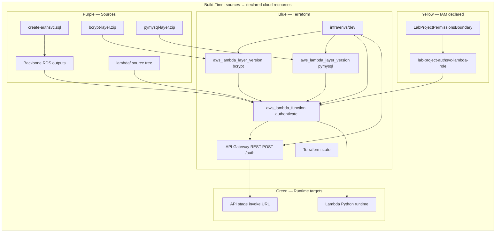
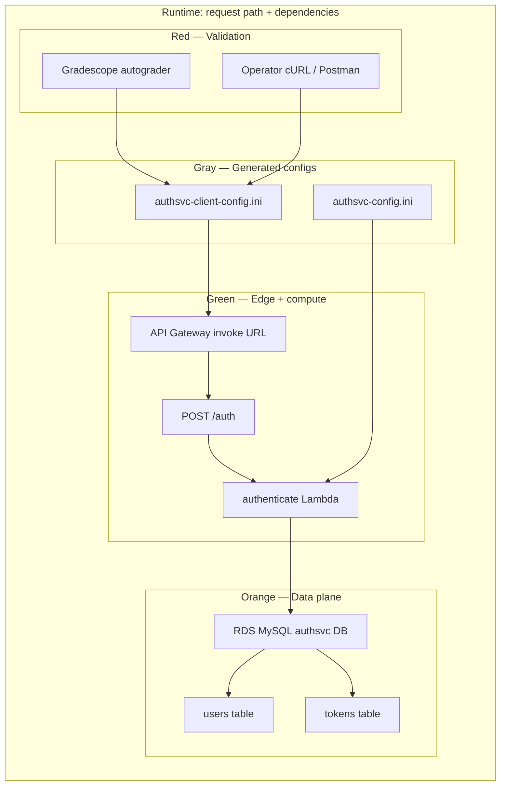
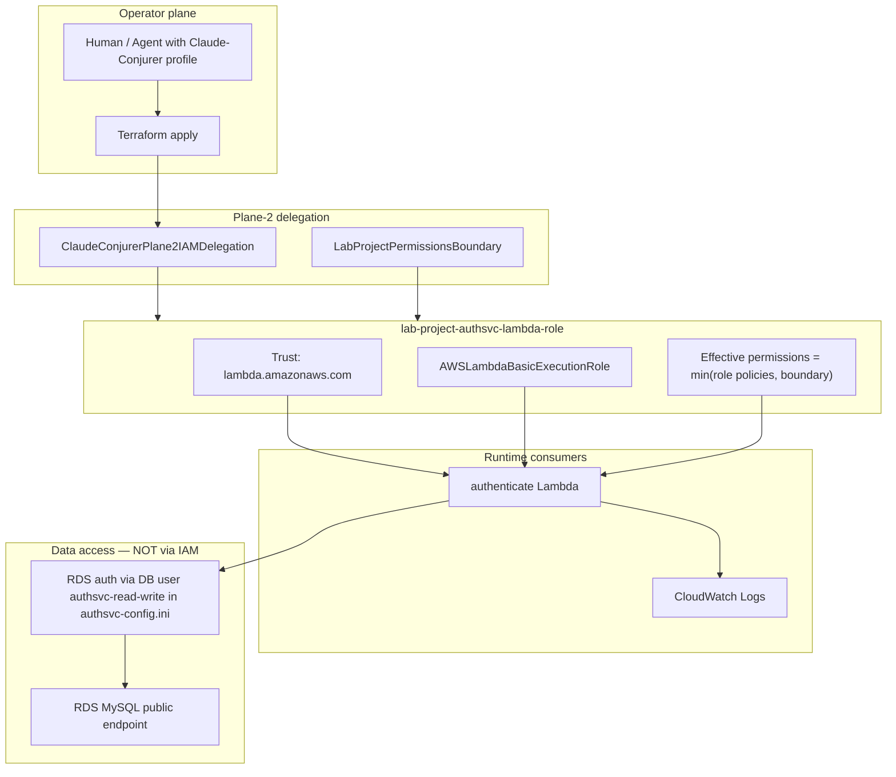

# Project 03 — Part 01 Approach (Authentication Microservice)

**Date:** 2026-06-08  
**Status:** Executable plan — fresh-agent handoff  
**Scope:** **Part 01 only.** Instructor cancelled Part 02 (chat/register). Ignore Part 02 deliverables for this quest.

**Audience:** **Execution Agent** — you may **not** read `project03-part01.pdf`. This document is the **sole assignment specification** plus execution runbook. **OverSeer Agent** authored the plan; escalate structural ambiguities to OverSeer. **Human CoPilot** owns AWS account access, sign-offs, and Gradescope UI actions when automation fails.

---

## Agent Handoff Context

The goal is **50/50 on Gradescope** for **“Project 03, part 01 - authsvc”** by deploying a working `POST /auth` authentication microservice (Lambda + API Gateway + RDS `authsvc` database on the course MySQL server).

### Scope lock (instructor update)

- **In scope:** Authentication microservice — username/password → token; token → userid.
- **Out of scope:** Part 02 chat app, `register` Lambda, `create-chatapp.sql`, `client/client.py` chat client, `chatapp-client-config.ini`.
- **Still useful (optional):** `client/authsvc-client-config-staff.ini` for comparing against staff service during debugging — not a submission artifact.

### Autograder constraint

Gradescope validates **live deployment** using the two submitted INI files. It does not care whether you used the AWS Console or Terraform. HTTP behavior at the API Gateway invoke URL must match `authsvc-client-config.ini`; Lambda must reach RDS per `authsvc-config.ini`.

### Execution Agent bootstrap (before Checkpoint 1)

| Prerequisite | How to verify |
|--------------|---------------|
| Repo root | `MBAi460-Group1/` (monorepo containing `projects/project03/`) |
| Working directory for all `make` targets | `projects/project03/` |
| AWS region | **`us-east-2`** (assignment + backbone default) |
| AWS profile | `Claude-Conjurer` or value in `terraform.tfvars` — **Decision Point DP-0** if unsure |
| Credentials files | `secrets/aws-credentials`, `secrets/aws-config` per repo `QUICKSTART` / `infra/terraform` |
| Docker client image (Gradescope submit) | Sibling `mbai460-client/` with `.gradescope` token; image from `./docker/build` at repo root |
| RDS admin password | `labs/lab01/Part 01 - AWS Setup/secrets/rds-master-password.txt` |
| Backbone RDS hostname | `infra/config/photoapp-config.ini` `[rds] endpoint` (used by `_run_sql.py`) |

```bash
# Sanity from repo root
cd MBAi460-Group1
export AWS_PROFILE="${AWS_PROFILE:-Claude-Conjurer}"
aws sts get-caller-identity
cd projects/project03 && pwd   # confirm execution lane
```

### Must-read files before execution

| File | Why |
|------|-----|
| **This file** (`6_8_Part1_Approach.md`) | Full assignment spec + checkpoints (replaces PDF for Execution Agent) |
| `projects/project03/create-authsvc.sql` | `authsvc` DB schema, seed users, `authsvc-read-write` DB user |
| `projects/project03/authenticate.zip` or `lambda/` after extract | `authenticate` function, 5 TODOs, test events |
| `projects/project03/layers/bcrypt-layer.zip`, `pymysql-layer.zip` | Pre-built Lambda layers for Part 01 |
| `infra/terraform/outputs.tf` | Backbone RDS hostname/port (Path A) |
| `infra/bootstrap/LAB_PROJECT_IAM_CONTRACT.md` | `lab-project-*` role naming + permissions boundary |
| `utils/_run_sql.py` | SQL runner for `make db-init` |

**Format references only (other projects — do not execute their steps):** `MetaFiles/Examples/Example-Hosting-Approach.md`, `MetaFiles/Examples/Example-Submission_Plan.md`. Use them for document structure, not for EB, PhotoApp, or Lab 04 deliverables.

**Optional pattern library (copy ideas, not requirements):** `labs/lab04/infra/`, `labs/lab04/Makefile`, `labs/lab04/tools/test-api.sh` — similar Lambda + API Gateway shape, but Project 03 targets `POST /auth`, `authsvc-config.ini`, and the `authenticate` multi-file zip.

### RDS strategy (default vs fallback)

**Default (assignment-aligned):** Part 01 assumes an **existing MySQL server on RDS** from earlier course work. Project 03 adds the `authsvc` **database** on that server via `create-authsvc.sql` — it does not require a new RDS **instance** in the happy path.

| Path | When | Action |
|------|------|--------|
| **A — Backbone RDS (default)** | `infra/terraform` RDS is up, reachable, and `make db-init` succeeds | Wire `authsvc-config.ini` to backbone `rds_address`; **do not** create Project 03 RDS in Terraform |
| **B — Project 03 RDS (fallback)** | Backbone RDS missing, destroyed, unreachable from Lambda, wrong account/region, security group blocks Lambda, or Human CoPilot directs isolation | **Stop and flag Human CoPilot** with evidence (commands, errors, CloudWatch). After approval, add `infra/modules/rds-authsvc/` (or equivalent) under `projects/project03/infra/`, create a **Project 03–scoped** MySQL instance + SG, run `create-authsvc.sql` against it, and point `authsvc-config.ini` at the new endpoint. Document the switch in `MetaFiles/6_8_Part1_Hosting_Plan.md` |

Path B is **escalation only** — not the starting plan. If Path B is used, `make destroy` may include the Project 03 RDS module; **never** destroy shared backbone RDS unless Human CoPilot explicitly approves account-wide cleanup.

### Execution guardrails

- **Default:** reuse backbone RDS from `infra/terraform/` for the `authsvc` database only — see RDS strategy table above.
- **If backbone RDS blocks progress:** escalate to Human CoPilot before creating Project 03–specific RDS (Path B).
- Do **not** mutate `labs/lab04` into Project 03 code — **copy/adapt patterns** into `projects/project03/infra/`.
- Lambda IAM roles must follow **`lab-project-*`** prefix + **`LabProjectPermissionsBoundary`** (Plane-2 contract).
- Do **not** modify instructor test event files (`test01.txt`–`test03.txt`) or Gradescope-facing error message strings without Human CoPilot approval.
- Do **not** weaken or edit failing tests to green without Human CoPilot approval (3-strike escalation rule).
- Treat course-mandated passwords in SQL (`abc123!!`, `def456!!`) as assignment content — do not “sanitize” them.
- Credentials in real `authsvc-config.ini` must stay **gitignored** or generated at deploy time — never commit live secrets.

---

## Assignment specification (embedded — PDF not required)

Everything the autograder and instructor tests expect, distilled for the Execution Agent.

### Service overview

One microservice endpoint: **`POST /auth`** on API Gateway → Lambda function **`authenticate`**.

Two authentication modes (JSON request body):

| Mode | Request body fields | Success (200) | Failure (401) |
|------|---------------------|---------------|---------------|
| **Login** | `username`, `password`, optional `duration` | Body = **token string** (JSON-encoded) | See error table below |
| **Token verify** | `token` | Body = **userid string** (JSON-encoded) | See error table below |

Additional status codes:

| Code | When | Body message (exact strings matter) |
|------|------|-------------------------------------|
| **400** | Missing `body` in event | `no body in request` |
| **400** | Neither token nor username/password | `missing credentials in body` |
| **400** | `duration` present but not parseable as int | `duration must be an integer` |
| **500** | Unhandled exception / failed DB insert | `INTERNAL ERROR: …` (starter uses insert failure message) |

**401 error messages (exact strings — do not change without Human CoPilot approval):**

| Condition | Message |
|-----------|---------|
| Token not in DB | `invalid token` |
| Token expired | `expired token` |
| Username not found | `invalid username` |
| Password mismatch | `invalid password` |

### Request / response mechanics (Lambda + API Gateway proxy)

- API Gateway passes `event["body"]` as a **JSON string**; Lambda parses with `json.loads(event["body"])`.
- Lambda handler: `lambda_function.lambda_handler`.
- Success responses use `api_utils.success(status, body)` → API Gateway gets `statusCode` + `body: json.dumps(body)`.
- Error responses use `api_utils.error(status, message)` → `body: json.dumps(message)` (message is a JSON string value).
- Passwords sent **in clear text** in the request (course demo only — not production-safe).

### `duration` parameter (login mode only)

| Rule | Behavior |
|------|----------|
| Default | **30** minutes until token expires |
| Valid override | Integer **1–60** minutes |
| `< 1` or `> 60` | **Ignored** — keep default 30 |
| Non-integer | **400** `duration must be an integer` |
| Testing | Use `duration: 2` so token expiry tests finish in ~2 minutes |

### Database (`create-authsvc.sql`)

**Tables on RDS MySQL database `authsvc`:**

| Table | Columns | Notes |
|-------|---------|-------|
| `users` | `userid` (PK, starts **80001**), `username` (unique), `pwdhash`, `givenname`, `familyname` | Passwords stored as bcrypt/php `$2y$` hashes |
| `tokens` | `token` (PK), `userid` (FK → users), `expiration_utc` (datetime UTC) | Login inserts new token + expiry |

**Seed users (for tests and autograder):**

| username | password | userid starts at 80001 for first insert |
|----------|----------|----------------------------------------|
| `p_sarkar` | `abc123!!` | typically `80001` |
| `e_ricci` | `abc456!!` | |
| `l_chen` | `abc789!!` | |

**DB users created by SQL (use in `authsvc-config.ini`):**

| MySQL user | Password | Lambda uses |
|------------|----------|-------------|
| `authsvc-read-write` | `def456!!` | **Yes** — `[rds] user_name` / `user_pwd` |
| `authsvc-read-only` | `abc123!!` | No (assignment creates for least-privilege pattern) |

Lambda opens MySQL via `datatier.get_dbConn(endpoint, port, user, pwd, dbname)` using **`authsvc-config.ini`** beside the handler in the deployment zip.

### Lambda deployment requirements

| Setting | Value |
|---------|-------|
| Function name | `authenticate` |
| Runtime | Python 3.x (latest available, e.g. 3.12) |
| Architecture | **x86_64** |
| Timeout | **300** seconds (5 minutes) |
| Handler | `lambda_function.lambda_handler` |
| Layers (both required) | `bcrypt-layer` + `pymysql-layer` (use **version 1** if picking in console; Terraform sets ARNs) |
| Deployment package | All files from starter: `lambda_function.py`, `datatier.py`, `auth.py`, `api_utils.py`, **`authsvc-config.ini`** |

**Starter code TODOs** (in `lambda_function.py` — complete in Checkpoint 4):

| TODO | Task |
|------|------|
| **#1** | SELECT from `tokens` by token → get `userid`, `expiration_utc` |
| **#2** | Parse row into `userid`, `expiration_utc`; compare `utc_now` to `expiration_utc` |
| **#3** | SELECT from `users` by `username` → get `userid`, `pwdhash` |
| **#4** | Parse row into `userid`, `pwdhash`; `auth.check_password(password, pwdhash)` |
| **#5** | INSERT into `tokens` (`token`, `userid`, `expiration_utc`); fail with 500 if insert ≠ 1 row |

On successful login, generate token with `str(uuid.uuid4())`, set `expiration_utc = utcnow + timedelta(minutes=duration)`.

### API Gateway

| Setting | Value |
|---------|-------|
| Method | **POST** |
| Resource path | `/auth` |
| Integration | **Lambda proxy integration** (AWS_PROXY) |
| Test body (smoke) | `{"username":"p_sarkar","password":"abc123!!","duration":2}` |
| Deploy | Must **deploy API** to a stage; invoke URL = base for `authsvc-client-config.ini` |

### Instructor Lambda test events (oracle fixtures)

Copy into repo tests; **do not edit** originals in `lambda/test0*.txt`:

```json
// test01.txt — valid login
{ "body": "{ \"username\": \"p_sarkar\", \"password\": \"abc123!!\", \"duration\": \"2\" }" }

// test02.txt — wrong password
{ "body": "{ \"username\": \"p_sarkar\", \"password\": \"fred123\", \"duration\": \"2\" }" }

// test03.txt — token verify (replace token after test01)
{ "body": "{ \"token\": \"<token-from-test01>\" }" }
```

**Assignment manual test order:** test02 (fail) → test01 (token) → test03 (userid) → wait **2+ minutes** → test03 again (expired).

### cURL examples (Checkpoint 3–5 smoke)

```bash
BASE="$(grep webservice= authsvc-client-config.ini | cut -d= -f2)"
# Login
curl -sS -X POST "${BASE}/auth" \
  -H 'Content-Type: application/json' \
  -d '{"username":"p_sarkar","password":"abc123!!","duration":2}'
# Token verify (replace TOKEN)
curl -sS -X POST "${BASE}/auth" \
  -H 'Content-Type: application/json' \
  -d '{"token":"TOKEN"}'
```

---

## Decision Points register

Execution Agent: **stop and check in** at each DP before proceeding. Default escalation: **Human CoPilot** for account/UI; **OverSeer Agent** for plan ambiguity or checkpoint scope questions.

| ID | Checkpoint | Trigger | Who | Action |
|----|------------|---------|-----|--------|
| **DP-0** | Bootstrap | Unknown AWS profile, missing `secrets/`, or `aws sts` fails | Human CoPilot | Provide profile, credentials, or confirm account |
| **DP-1** | 1 | Backbone RDS missing / `terraform output` fails | Human CoPilot → possibly OverSeer | Path A vs Path B (RDS strategy) |
| **DP-2** | 1 | `make db-init` fails | Human CoPilot | Fix admin password, SG, or approve Path B |
| **DP-3** | 1 | Moving Part 02 files to `scratch/` | Human CoPilot | Optional housekeeping — default **leave in place** |
| **DP-4** | 2 | Gradescope assignment ID ≠ `8159384` on UI | Human CoPilot + OverSeer | Update `submit-gradescope.sh` and this doc |
| **DP-5** | 2 | `gs submit` fails (token, Docker image) | Human CoPilot | Fix `.gradescope`, build Docker image, or drag-drop |
| **DP-6** | 3 | Before writing Terraform | Human CoPilot | Sign-off on Architecture diagram (§3.2) |
| **DP-7** | 3 | Before writing Terraform | Human CoPilot | Sign-off on IAM diagram (§3.3) |
| **DP-8** | 3 | `terraform plan` shows unexpected destroys or new RDS | Human CoPilot | Approve plan or reject — **no apply** until resolved |
| **DP-9** | 3 | `terraform apply` | Human CoPilot | Explicit approval before apply |
| **DP-10** | 3 | Lambda cannot reach RDS after apply | Human CoPilot | Path B, SG fix, or endpoint correction |
| **DP-11** | 4 | Same test fails after **3** fix attempts | Human CoPilot + OverSeer | Do not edit test; get ruling on code vs test vs infra |
| **DP-12** | 4 | Error message string mismatch vs oracle | OverSeer | Confirm exact autograder strings before changing code |
| **DP-13** | 5 | Gradescope &lt; 50/50 after `make test-api` green | Human CoPilot | Review autograder output; may need OverSeer for spec gap |
| **DP-14** | 5 | Best score ≠ last submission | Human CoPilot | Activate correct row in Submission History |
| **DP-15** | 6 | `make destroy` scope | Human CoPilot | Confirm Path A vs B RDS; never destroy backbone without approval |

---

## Pressure Test — Directions vs. Reliability

| User checkpoint | Verdict | Adjustment |
|-----------------|--------|------------|
| **1) Set up / greenfield** | ✅ Sound | “Greenfield” means **organized workspace**, not empty repo. Archive Part 02 noise; keep class starters. |
| **2) Hello World submit (~0/50)** | ✅ Sound | Requires **two** INI files, not one. Use explicit placeholders; confirm Gradescope IDs + Docker `gs` path. |
| **3) Infra: plan → viz → sign-off → tests → TF → apply → test** | ✅ Sound with split | **Split tests into Tier A (pre-apply contract)** and **Tier B (post-apply live)**. Tier B cannot pass until apply. |
| **3) Viz Architecture + IAM separately** | ✅ Strong | Matches observability goal; prevents IAM mistakes hiding in architecture diagrams. |
| **4) TDD for application code** | ✅ Sound | Application tests are **separate** from infra smoke tests. Instructor `test01–03` are oracle events — add repo tests that mirror them, don’t edit originals. |
| **4) Don’t modify bad tests without approval** | ✅ Critical | Prevents “test fixing” instead of code fixing. |
| **5) Submit until 100%** | ✅ Sound | Remember Gradescope grades **last submission** by default — activate correct row in Submission History if needed. |
| **6) Clean up / polish** | ✅ Sound | **Do not destroy shared RDS** — only Project 03 Lambda/API/layers. |
| **Build infra before completing TODOs** | ⚠️ Acceptable | Infra can deploy with incomplete Lambda logic; auth tests fail until Section 4. Don’t expect 50/50 until Section 4 + Section 5. |
| **Terraform everything including SQL** | ⚠️ Simplify | Prefer `make db-init` via existing `utils/_run_sql.py` over `null_resource` SQL in Terraform for v1 — faster, observable, matches repo convention. |
| **S3 upload for layers (PDF manual steps)** | ⚠️ Skip for Terraform | Upload layer zip **directly** to `aws_lambda_layer_version` (or use committed zips in `layers/`) — PDF’s S3 upload step is optional when using Terraform. |
| **Part 02 files in directory** | ⚠️ Don’t delete | Move to `scratch/part02-cancelled/` or document as out-of-scope; they are class-provided artifacts. |

---

## Ordered Checkpoints

### Checkpoint 1 — Set Up (greenfield readiness)

**Goal:** Confirm all required Part 01 components are accessible; houseclean for a clean execution lane.

#### 1.1 Current-state inventory

Run and record:

```bash
cd projects/project03
find . -type f | sort
ls -lh authenticate.zip layers/*.zip
unzip -l authenticate.zip
```

**Expected present (Part 01 starters):**

| Artifact | Path | Status check |
|----------|------|--------------|
| Approach doc (this file) | `MetaFiles/6_8_Part1_Approach.md` | embedded spec — PDF optional for humans only |
| DB SQL | `create-authsvc.sql` | complete |
| Lambda starter | `authenticate.zip` | 8 files, 5 TODOs in `lambda_function.py` |
| bcrypt layer | `layers/bcrypt-layer.zip` | ~273KB |
| pymysql layer | `layers/pymysql-layer.zip` | ~5.2MB |
| Client config template | `client/authsvc-client-config.ini` | placeholder URL |

**Expected missing (to build):**

- `projects/project03/infra/**` (entire Terraform tree)
- `Makefile`, `tools/`, `scripts/submit-gradescope.sh`
- Configured `authsvc-config.ini` (real RDS endpoint)
- Extracted Lambda source tree (optional but recommended for TDD)

#### 1.2 Backbone preflight (RDS Path A)

Verify the **shared course RDS** that Part 01 expects (assignment: “existing MySQL server running in RDS”):

```bash
# Backbone RDS from Lab 01 / infra/terraform
cd infra/terraform && terraform output rds_address rds_port

# AWS profile + Plane-2 delegation
export AWS_PROFILE=Claude-Conjurer  # or your profile
aws sts get-caller-identity

# SQL runner inputs (repo convention — not a Project 03 submission file)
test -f infra/config/photoapp-config.ini   # RDS hostname for _run_sql.py
test -f labs/lab01/Part\ 01\ -\ AWS\ Setup/secrets/rds-master-password.txt
```

If any step fails (no RDS output, connection timeout, `db-init` errors), **do not silently pivot** — record output and trigger **DP-1 / DP-2** (RDS Path B escalation).

**Implement `make db-init` (if not yet in Makefile):**

```bash
# From projects/project03 — runs as admin against backbone RDS
python3 ../../utils/_run_sql.py "$(pwd)/create-authsvc.sql"
```

#### 1.3 Housecleaning (greenfield, not destructive)

| Action | Rationale |
|--------|-----------|
| Create `scratch/part02-cancelled/README.md` noting Part 02 is cancelled | Scope clarity for agents |
| Optionally move Part 02 files into `scratch/part02-cancelled/` | **DP-3** — default **leave in place**; moving is optional |
| Create empty scaffolding dirs: `infra/`, `tools/`, `scripts/`, `lambda/` (or `server/`) | Target layout |
| Add `projects/project03/.gitignore` entries for generated configs + terraform state | Prevent secret leaks |
| **Do not delete** `layers/requests-layer.zip` | Harmless extra; ignore for Part 01 |

#### 1.4 Extract Lambda source (recommended)

Unpack starter into `projects/project03/lambda/` for TDD and Terraform packaging:

```bash
mkdir -p lambda
cd lambda && unzip -o ../authenticate.zip
```

Keep `authenticate.zip` as instructor reference; Terraform packages from `lambda/`.

#### 1.5 Gate — Checkpoint 1 complete when

- [ ] Inventory documented in journal or PR notes
- [ ] **DP-0** resolved (AWS identity works)
- [ ] **DP-1 / DP-2** resolved: RDS Path A verified **or** Path B escalation opened with evidence
- [ ] Lambda source extracted (or explicit decision to package from zip only)
- [ ] Part 02 scope explicitly marked out-of-scope in workspace

> **Decision Point DP-1:** If backbone RDS is broken → Human CoPilot before Path B.

---

### Checkpoint 2 — Hello World Submission (~0/50)

**Goal:** Prove Gradescope submission plumbing before investing in infra. Expect **~0/50** — autograder cannot reach a real service.

#### 2.1 Prepare placeholder submission artifacts

Create in **`projects/project03/`** (Gradescope drag-drop or Docker submit from that directory):

**`authsvc-config.ini`** (placeholder — matches assignment shape):

```ini
[rds]
endpoint = placeholder.rds.amazonaws.com
port_number = 3306
region_name = us-east-2
user_name = authsvc-read-write
user_pwd = def456!!
db_name = authsvc
```

**`authsvc-client-config.ini`**:

```ini
[client]
webservice=https://placeholder.execute-api.us-east-2.amazonaws.com/stage
```

Also mirror into `client/authsvc-client-config.ini` for repo consistency.

#### 2.2 Submit

**Gradescope assignment:** Project 03, part 01 - authsvc  
**Course ID:** `1288073`  
**Assignment ID:** `8159384` — **DP-4:** Human CoPilot must confirm on Gradescope UI before relying on IDs.

**Docker (from mbai460-client image, working dir = `projects/project03`):**

```bash
cd projects/project03
/gradescope/gs submit 1288073 8159384 authsvc-config.ini authsvc-client-config.ini
```

**Or:** Human CoPilot drag-drops both files on Gradescope site.

Create `projects/project03/scripts/submit-gradescope.sh` (mirror `labs/lab04/scripts/submit-gradescope.sh` shell pattern only). Prerequisites: `mbai460-client/.gradescope`, Docker image built via `MBAi460-Group1/docker/build`.

> **Decision Point DP-4 / DP-5:** Wrong assignment ID or failed `gs submit` → Human CoPilot; update IDs in script if UI differs.

#### 2.3 Record baseline

- [ ] Submission appears in Gradescope history
- [ ] Score ~0/50 (or low partial credit for file format only)
- [ ] Autograder error messages captured (useful oracle for later debugging)
- [ ] Docker `gs` path works OR local drag-drop works

#### 2.4 Gate — Checkpoint 2 complete when

- [ ] Baseline submission recorded with score + autograder output screenshot or log
- [ ] Human CoPilot confirms submission channel works

**Team note:** Only one team member submits; all teammates receive the same score (Canvas group irrelevant for Gradescope).

---

### Checkpoint 3 — Hosting Infrastructure

**Goal:** Terraform-native deployment of Lambda layers, `authenticate` function, API Gateway `POST /auth`, and Gradescope config outputs. **RDS instance:** Path A = consume backbone only; Path B = Project 03 module after Human CoPilot approval.

#### 3.1 Plan (written design before code)

Document in `MetaFiles/6_8_Part1_Hosting_Plan.md` (create during execution):

| Decision | Choice |
|----------|--------|
| IaC entrypoint | `projects/project03/infra/envs/dev/` |
| RDS (Path A) | Input var / remote state from `infra/terraform` → `rds_address`, `rds_port` |
| RDS (Path B) | `infra/modules/rds-authsvc/` — only after Human CoPilot approves fallback |
| DB schema apply | `make db-init` → `utils/_run_sql.py` on `create-authsvc.sql` (same SQL for Path A or B) |
| Layer build | Use committed `layers/bcrypt-layer.zip` + `pymysql-layer.zip` for v1; optional Docker `linux/amd64` rebuild scripts |
| Lambda packaging | Multi-file zip from `lambda/` including templated `authsvc-config.ini` |
| API route | `POST /auth` with **Lambda proxy integration** (assignment Step 4) |
| Lambda name | `authenticate` |
| Lambda timeout | 300 seconds (5 minutes per assignment) |
| Lambda runtime | Python 3.x, architecture **x86_64** (assignment) |
| Lambda layers | `bcrypt-layer`, `pymysql-layer` (PDF may typo “pymysql-pypdf” — use **pymysql** layer only) |
| IAM role | `lab-project-authsvc-lambda-role` + boundary + `AWSLambdaBasicExecutionRole` |
| Network | Public RDS endpoint — **no VPC-attached Lambda** for v1 unless Path B SG debugging requires it |
| Config outputs | `authsvc-config.ini` + `authsvc-client-config.ini` via scripts |

**Modules to create under `projects/project03/infra/`:**

```
infra/
├── modules/
│   ├── lambda-layer-bcrypt/
│   ├── lambda-layer-pymysql/
│   ├── lambda-authenticate/
│   └── api-authsvc/          # single POST /auth
├── envs/dev/
│   ├── main.tf
│   ├── variables.tf
│   ├── outputs.tf
│   └── terraform.tfvars.example
├── scripts/
│   ├── build-bcrypt-layer.sh
│   ├── build-pymysql-layer.sh
│   ├── write-authsvc-config.sh
│   └── write-authsvc-client-config.sh
└── __tests__/
    └── project03-modules.test.sh
```

#### 3.2 Visualize — Architecture (Human CoPilot review)

**Review artifact:** `MetaFiles/6_8_Part1_Architecture.md` with diagram below.

Layer color key (documentation convention for Human CoPilot review):

- **Purple:** source inputs (SQL, lambda source, layer zips)
- **Blue:** Terraform orchestration
- **Yellow:** IAM roles/policies
- **Green:** Lambda + API Gateway runtime
- **Orange:** RDS (existing backbone)
- **Red:** validation (cURL, Gradescope)
- **Gray:** generated INI outputs





> **Decision Point DP-6:** Human CoPilot sign-off on architecture **required** before Terraform implementation.

#### 3.3 Visualize — IAM (separate from architecture)

**Review artifact:** same doc or `MetaFiles/6_8_Part1_IAM.md`.



**IAM notes for Human CoPilot:**

| Topic | Detail |
|-------|--------|
| Lambda → RDS | No IAM role needed for MySQL; uses **database credentials** in `authsvc-config.ini` |
| Role naming | `lab-project-authsvc-lambda-role` (not `authenticate-role`) |
| Boundary | Required on all new roles per `LAB_PROJECT_IAM_CONTRACT.md` |
| API Gateway → Lambda | `aws_lambda_permission` with `apigateway.amazonaws.com` principal |
| What IAM does **not** cover | SQL `CREATE USER` in `create-authsvc.sql` — runs as RDS **admin** via `_run_sql.py` |

> **Decision Point DP-7:** Human CoPilot sign-off on IAM **required** before Terraform implementation.

#### 3.4 Build test suite (Tier A — pre-apply contract tests)

Write **before** Terraform apply. These validate repo structure and static contracts.

| Test file | What it checks |
|-----------|----------------|
| `infra/__tests__/project03-modules.test.sh` | Required module dirs exist; `terraform fmt -check`; `terraform validate` after `init` |
| `tools/__tests__/preflight.test.sh` | Preflight script behavior |
| `tools/__tests__/test-api.test.sh` | test-api.sh argument parsing / dry logic (mocked URL) |
| `lambda/__tests__/test_auth_contract.py` (optional) | `api_utils.success/error` response shape, status codes |

**Makefile targets (Project 03 operator surface):**

```bash
make preflight    # local + optional AWS checks (profile, backbone RDS, layer zips)
make test         # Tier A contract tests + terraform validate
make db-init      # apply create-authsvc.sql via utils/_run_sql.py
make init validate plan apply config test-api submit destroy
```

Tier A tests must pass **before** `terraform apply`.

#### 3.5 Build Terraform

Implement modules per Section 3.1. Key wiring in `envs/dev/main.tf`:

1. Variables: `rds_address`, `rds_port`, `aws_profile`, `lab_project_permissions_boundary_arn`
2. Modules: layers → authenticate lambda → API Gateway
3. Template `authsvc-config.ini` inside lambda module with `rds_address` injected
4. Outputs: `invoke_url`, `authsvc_config_ini_path`, lambda function name

**Do not** embed application TODO completion in Terraform — package whatever is in `lambda/` at apply time.

#### 3.6 Apply Terraform (+ DB init)

```bash
# 1. Confirm RDS target (Path A or approved Path B)
cd infra/terraform && terraform output rds_address   # Path A
# OR terraform output from projects/project03/infra after Path B apply

# 2. Initialize authsvc schema on that server (once per RDS target)
cd projects/project03
make db-init   # runs utils/_run_sql.py on create-authsvc.sql

# 3. Deploy Project 03 infra (Lambda, layers, API Gateway — not backbone RDS on Path A)
make init
make plan      # DP-8: Human CoPilot reviews — reject unexpected RDS/destroys
make apply     # DP-9: Human CoPilot explicit approval required

# 4. Generate Gradescope configs from outputs
make config    # writes projects/project03/authsvc-config.ini + authsvc-client-config.ini
```

If `make db-init` or Lambda CloudWatch shows RDS connection failures after apply → **DP-10** before application TODOs.

**`authsvc-config.ini` endpoint rule:** `endpoint` = **hostname only** (no `:3306`); port lives in `port_number`.

#### 3.7 Run tests (Tier B — post-apply live)

| Test | Command | Expected (with incomplete TODOs) |
|------|---------|----------------------------------|
| API reachable | `make test-api` | HTTP responses (may be 401/errors until Section 4) |
| Lambda wired | POST `/auth` returns JSON body + API GW headers | not 502/503 |
| Config consistency | `authsvc-client-config.ini` URL matches `terraform output invoke_url` | exact match |
| DB reachable from Lambda | CloudWatch logs show DB connection success on invoke | no `get_dbConn failed` |

**Tier B infra smoke assertions (pass even before TODOs complete):**

- [ ] `POST /auth` with malformed body → **400** (not 502)
- [ ] `POST /auth` with `{"username":"p_sarkar","password":"fred123","duration":2}` → **401** `invalid password` (TODO #3–4 must be done for correct behavior — if still stub, may fail; track)
- [ ] API Gateway stage URL loads without trailing-slash mismatch

#### 3.8 Gate — Checkpoint 3 complete when

- [ ] **DP-6** and **DP-7** complete (Human CoPilot signed architecture + IAM)
- [ ] **DP-9** apply completed
- [ ] Tier A tests pass
- [ ] `terraform apply` succeeded
- [ ] `make db-init` succeeded (authsvc users/tokens tables exist)
- [ ] Tier B infra smoke passes (reachability + wiring)
- [ ] Generated INIs exist and match live endpoints

---

### Checkpoint 4 — Complete Application Logic (TDD)

**Goal:** Complete 5 TODOs in `lambda_function.py`; all auth behavior tests pass.

#### 4.1 Test strategy

| Layer | Tests | Source of truth |
|-------|-------|-----------------|
| Unit / handler | `lambda/__tests__/test_authenticate.py` | Instructor `test01–03.txt` events |
| Live API | `tools/test-api.sh` | Embedded spec § test oracle + cURL examples |
| Error strings | Exact match tests | `"expired token"`, `"invalid token"`, `"invalid username"`, `"invalid password"` |

**TDD loop:**

1. Write failing test for one TODO behavior
2. Implement minimal code in `lambda_function.py`
3. Run `pytest lambda/__tests__` + `make test-api`
4. Repeat until green

**Escalation rule (3 strikes):**

If a test still fails after **3 distinct fix attempts**:

1. Stop modifying the test
2. Document failure (expected vs actual, logs, CloudWatch snippet)
3. Escalate via **DP-11** to Human CoPilot + OverSeer with recommendation: fix code vs test vs infra
4. Proceed only after approval

**Do not modify** `test01.txt`, `test02.txt`, `test03.txt` — use them as fixtures in repo tests.

**Do not remove** starter line `os.environ['AWS_SHARED_CREDENTIALS_FILE'] = config_file` unless tests prove it breaks config loading — it is instructor starter code.

#### 4.2 Assignment test oracle (must pass)

| Test | Event / call | Expected |
|------|--------------|----------|
| test02 | wrong password | 401 `invalid password` |
| test01 | `p_sarkar` / `abc123!!` / duration 2 | 200 + token string |
| test03 | valid token | 200 + userid string |
| test03 (wait 2+ min) | expired token | 401 `expired token` |

#### 4.3 Deploy code updates

After local tests pass:

```bash
make apply   # repackages lambda/ and updates function
make test-api
```

Optional: invoke via AWS Lambda console with saved test events to compare with API Gateway.

#### 4.4 Gap analysis — add tests if missing

Consider adding tests for:

- `duration` edge cases (0, 61, non-integer → 400 or ignored per spec)
- `invalid token` (random UUID not in DB)
- Response body format Gradescope may assert (string userid, string token)

#### 4.5 Gate — Checkpoint 4 complete when

- [ ] All repo auth tests pass
- [ ] `make test-api` passes full assignment flow (login → token verify → expiry)
- [ ] CloudWatch logs clean (no unhandled exceptions on happy path)
- [ ] `make config` regenerates INIs after final apply

---

### Checkpoint 5 — Submit (iterate to 50/50)

**Goal:** Gradescope **50/50** with Human CoPilot verification.

#### 5.1 Pre-submit checklist

| Check | Command / action |
|-------|------------------|
| Live service | `make test-api` green |
| INI #1 | `authsvc-config.ini` — real RDS endpoint, `authsvc-read-write`, `authsvc` db |
| INI #2 | `authsvc-client-config.ini` — invoke URL, **no trailing slash** |
| INIs match deployment | compare to `terraform output` |
| Lambda config matches INI #1 | download from Lambda console or trust generated file |
| Last submission policy | note which submission Gradescope will grade |

#### 5.2 Submit

```bash
make submit
# or: gs submit 1288073 8159384 authsvc-config.ini authsvc-client-config.ini
```

#### 5.3 Human CoPilot review loop

1. Human CoPilot reviews Gradescope autograder output (**DP-13** if score &lt; 50/50 while local tests pass)
2. Classify failure: config mismatch vs behavior vs timing vs autograder string mismatch (**DP-12** → OverSeer)
3. Fix → `make apply` / `make config` → resubmit
4. Repeat until **50/50**
5. **DP-14:** If best score ≠ last submission, Human CoPilot activates correct row in Submission History before deadline

#### 5.4 Gate — Checkpoint 5 complete when

- [ ] Gradescope shows **50/50**
- [ ] Human CoPilot confirms score on intended submission row

---

### Checkpoint 6 — Clean Up, Sharpen, Polish

**Goal:** Repo is merge-ready; AWS costs controlled; docs accurate.

#### 6.1 Documentation updates

| File | Update |
|------|--------|
| `projects/project03/README.md` | Quickstart: `make apply`, `make test-api`, `make submit` |
| `MetaFiles/6_8_Part1_Submission_Plan.md` | Final Part 01 submission checklist (`authsvc-config.ini` + `authsvc-client-config.ini`) |
| `MetaFiles/6_8_Part1_Hosting_Plan.md` | As-built architecture notes |
| Root `MetaFiles/TODO.md` | Close Project 03 Part 01 items |

#### 6.2 Repo hygiene

- [ ] No committed secrets in INI files
- [ ] `terraform fmt` clean
- [ ] `.gitignore` covers `*.tfstate*`, generated INIs if policy requires
- [ ] Part 02 artifacts documented as cancelled / moved to scratch

#### 6.3 AWS cleanup (cost control)

**Safe to destroy (Project 03 scoped):**

```bash
make destroy   # Lambda, API Gateway, layers, IAM role (if module owns it)
```

**Do NOT destroy (unless Human CoPilot approves account-wide cleanup):**

- Backbone RDS from `infra/terraform` (Path A)
- Any shared `lab-project-*` roles still used outside Project 03

**If RDS Path B was used:** `make destroy` may include the Project 03–scoped RDS module only — document which endpoint was destroyed.

> **Decision Point DP-15:** Human CoPilot approves destroy scope before `make destroy`.

**Optional:** pause RDS only if course stack fully complete and instructor allows.

#### 6.4 Gate — Checkpoint 6 complete when

- [ ] README + MetaFiles updated
- [ ] Human CoPilot approves doc quality
- [ ] **DP-15** destroy/pause decision recorded

---

### Checkpoint 7 — END QUEST 🥂

- [ ] **50/50** on Gradescope secured
- [ ] Infrastructure reproducible via `make apply`
- [ ] Tests document expected behavior for future agents
- [ ] Part 02 explicitly deferred/cancelled — no dangling TODOs for chat/register
- [ ] Celebrate; archive journal entry in `MetaFiles/Journal/`

---

## Submission Reference (quick)

| Item | Value |
|------|-------|
| Gradescope assignment | Project 03, part 01 - authsvc |
| Course ID | `1288073` |
| Assignment ID | `8159384` (verify on UI) |
| Artifacts | `authsvc-config.ini`, `authsvc-client-config.ini` |
| Target score | **50/50** |
| Submissions | Unlimited; **last** submission graded by default |

### `authsvc-config.ini` shape

```ini
[rds]
endpoint = <rds-hostname-without-port>
port_number = 3306
region_name = us-east-2
user_name = authsvc-read-write
user_pwd = def456!!
db_name = authsvc
```

### `authsvc-client-config.ini` shape

```ini
[client]
webservice=https://<api-id>.execute-api.us-east-2.amazonaws.com/<stage>
```

No trailing slash on `webservice`.

---

## Level of Effort

| Phase | Estimate |
|-------|----------|
| Checkpoint 1–2 (setup + hello submit) | 0.5 day |
| Checkpoint 3 (infra plan, viz, sign-off, TF, apply) | 1–2 days |
| Checkpoint 4 (TDD TODOs + tests) | 0.5–1 day |
| Checkpoint 5 (Gradescope iteration) | 0.5 day |
| Checkpoint 6–7 (polish) | 0.5 day |
| **Total** | **2.5–4 days** |

Risk buffer: IAM boundary issues, Lambda layer platform mismatch (always build `linux/amd64`), backbone RDS reachability from Lambda (Path A) or Path B provisioning time, Gradescope autograder timing on token expiry tests.

---

## Recommendation

Execute checkpoints **in order**. Do not skip Checkpoint 2 (submission plumbing) or Checkpoint 3 Human CoPilot sign-off on **both** architecture and IAM diagrams.

**Default path:** backbone RDS (Path A) + committed layer zips + `make db-init` + Project 03 Terraform for `authenticate` + `POST /auth` only.

**Escalation path:** if backbone RDS is the blocker, Human CoPilot approves Path B (Project 03–scoped RDS module) before building it.

Ignore Part 02 directory artifacts for this quest; `authsvc-client-config-staff.ini` is optional for debugging only.

**Middle path for v1:** ship with committed `layers/*.zip`, SQL via `make db-init`, and Terraform scoped to Lambda/API/layers; defer VPC Lambda, manual S3 layer upload, and Terraform-managed SQL until after 50/50 unless Path B forces RDS in Terraform.

---

## Troubleshooting (Execution Agent)

| Symptom | Likely cause | Fix |
|---------|--------------|-----|
| `502` / `503` on `POST /auth` | API Gateway not deployed, wrong stage, or Lambda crash on cold start | Redeploy API stage; check CloudWatch `/aws/lambda/authenticate` |
| `datatier.get_dbConn() failed` | Wrong endpoint, SG blocks Lambda, or `db-init` not run | **DP-10**; verify `authsvc-config.ini`, run `make db-init`, check RDS public + SG 3306 |
| `401 invalid password` on correct password | TODO #3–4 incomplete or bcrypt layer missing | Attach `bcrypt-layer`; complete user lookup |
| `401 invalid token` immediately after login | TODO #5 insert failed or wrong token passed | Check INSERT; copy exact token from login response |
| Layer import error in Lambda | Wrong architecture (arm64 vs x86_64) or missing layer | x86_64 runtime + rebuild layers `linux/amd64` |
| Gradescope 0 with live service | INI mismatch: client URL ≠ API GW; server INI ≠ Lambda package | `make config`; re-download Lambda `authsvc-config.ini` and compare |
| `terraform apply` IAM error | Role name not `lab-project-*` or missing boundary | See `LAB_PROJECT_IAM_CONTRACT.md` |
| `_run_sql.py` fails | Missing `photoapp-config.ini` or admin password file | **DP-0** Human CoPilot |

---

## Execution Agent quick checklist (printable)

```
[ ] DP-0  AWS profile + secrets work
[ ] DP-1  RDS Path A OK or Path B approved
[ ] DP-2  make db-init succeeded
[ ] DP-4  Gradescope assignment ID confirmed
[ ] DP-5  Hello submit ~0/50 recorded
[ ] DP-6  Architecture sign-off
[ ] DP-7  IAM sign-off
[ ] DP-8  terraform plan reviewed
[ ] DP-9  terraform apply approved + done
[ ] DP-10 RDS reachable from Lambda
[ ] Tier B smoke (wiring) green
[ ] 5 TODOs complete + test01/02/03 oracle pass
[ ] make test-api full flow green
[ ] make config → both INIs match live infra
[ ] DP-13 Gradescope 50/50 (Human CoPilot confirms)
[ ] DP-15 cleanup scope approved
```
