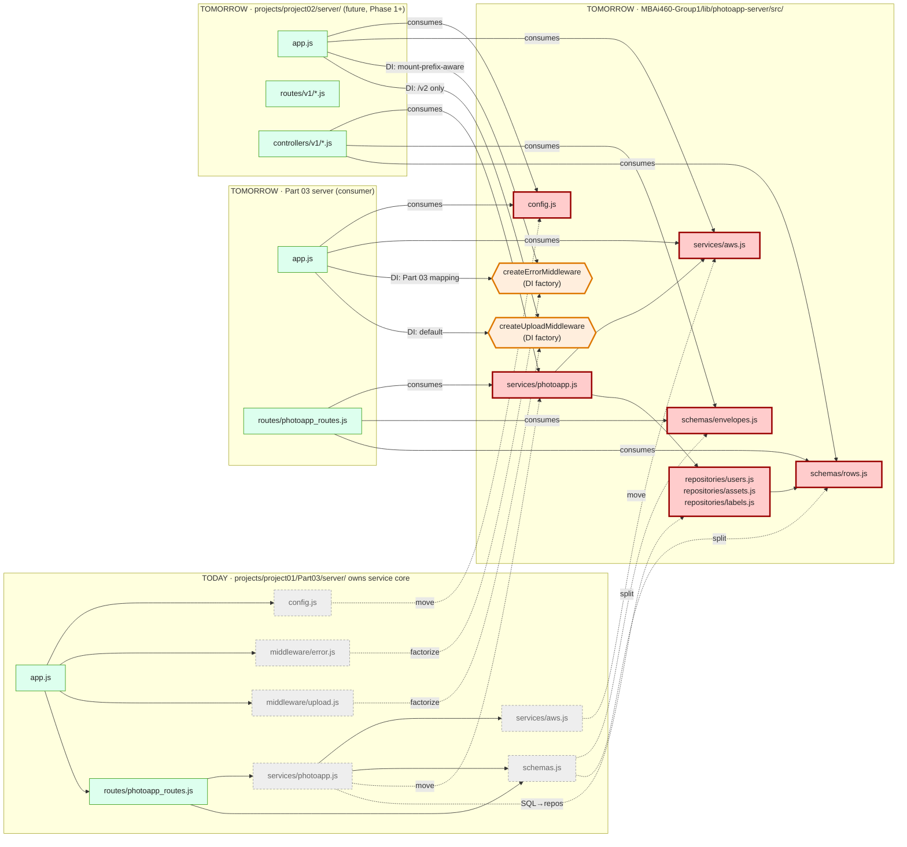

# Target State — `@mbai460/photoapp-server` Library Extraction (v1)

> **Status:** Proposed (Phase 0 of Project 02 Part 01 quest, in progress on `feat/lib-extraction`).
> When implementation completes (library 1.0.0 acceptance), rename to `mbai460-photoapp-server-lib-extraction-v1.md` and update README status per `claude-workspace/memory/feedback_visualization_naming.md`.
>
> **Source Approach doc:** `MBAi460-Group1/projects/project02/client/MetaFiles/Approach/00-shared-library-extraction.md`
>
> **Plan reference:** `MBAi460-Group1/projects/project02/client/MetaFiles/Approach/Plan.md` § Phase 0
>
> **Last updated:** 2026-05-02 — initial render at Phase 0 pickup.

---

## Story

**Today:** Project 01 Part 03 owns the service core (`config.js`, `services/aws.js`, `services/photoapp.js`, `middleware/error.js`, `middleware/upload.js`, `schemas.js`) directly under its own server tree. Project 02 doesn't exist yet.

**Tomorrow (after Phase 0):** the service core has been **extracted** into the shared library `@mbai460/photoapp-server` at `MBAi460-Group1/lib/photoapp-server/`. Both Part 03 (now) and Project 02 (Phase 1+) become *consumers* of the library — they own only their surface-specific code (`app.js`, `routes`, controllers, integration tests, surface-specific test layers). The library is buffer-native; surfaces own their transport adapters.

The library is **internals-only** (CL2 from the Approach): it exports services / repositories / middleware (factories) / schemas — never routers. Surfaces own routing because their wire contracts differ.

## Focus (color semantics in the diagram)

- **🔴 Red — Library boundary.** The line between *shared internals* (services / repositories / middleware factories / schemas) and *surface-specific* code (app.js, routes, controllers). This boundary is the architectural decision Phase 0 makes.
- **🟠 Amber — DI seams.** Factories like `createErrorMiddleware({ statusCodeMap, errorShapeFor, logger })` and `createUploadMiddleware({ destDir, sizeLimit })` let the same library satisfy divergent surface needs. Part 03 passes its uniform `{message, data}` envelope mapping; Project 02 passes its mount-prefix-aware status-code mapping.
- **⚪ Grey-dashed — Today's deprecated surface.** Files in Part 03's tree that *move* to the library; they cease to exist at Part 03 after extraction.
- **🟢 Green — Surface modules.** Each consumer's `app.js` / routes / controllers stay in the consumer's tree; surface-specific because their wire contracts diverge.

## Diagram

## Reading the diagram

- **Subgraphs** are trees: TODAY (Part 03 owns service core, leftmost), LIB (extracted shared library, middle — visual fan-in point), P03A (Part 03 after extraction, right-upper), P02 (future Project 02 server, right-lower).
- **Solid arrows within a tree** are normal `require()` dependencies.
- **Solid `consumes`-labeled arrows crossing the library boundary** are import-from-library statements (e.g., `const { services } = require('@mbai460/photoapp-server')`). These exist *after* Phase 0 lands.
- **Dashed arrows from TODAY → LIB** are the **extraction movements** (Phase 0.2 mechanically pure + Phase 0.3 SQL-into-repositories CL9 reconciliation):
  - `move`: file relocation with import-path updates only.
  - `factorize`: file moves AND becomes a factory (CL3 — config via construction not env). Default args reproduce Part 03's current behaviour exactly.
  - `split`: `schemas.js` splits into `envelopes.js` + `rows.js` for clean separation.
  - `SQL→repos`: SQL extracted from `services/photoapp.js` into `repositories/{users,assets,labels}.js`. **The only behaviour-affecting refactor in Phase 0** (CL9 bounded reconciliation; Part 03 tests stay green throughout).
- **DI labels on consumer→factory arrows** show that **same library code** (the factory) **+ different DI config** (passed at consumer's `app.js`) **= divergent surface needs**. This is the architectural keystone — what makes the shared library work for both Part 03's `{message, data}` uniform envelope and Project 02's variadic per-route shapes.

## Why this matters

1. **No parallel duplication.** Without extraction, Part 03 and Project 02 would maintain two parallel copies of services / middleware / schemas. CL9 explicitly forbids that pattern after the pressure test surfaced it as deliberate debt.
2. **DI seams resolve divergent needs.** Part 03 and Project 02 have different status-code maps (Part 03 uniform; Project 02 mount-prefix-aware), different envelope shapes (Part 03 `{message, data}`; Project 02 variadic). Same library code; different DI config; **zero duplicated source**.
3. **Service-layer tests run once.** Library tests cover services / repositories / middleware / schemas; surface-specific tests (contract, integration, live) stay per-consumer.
4. **Phase 0 is the keystone.** Everything downstream (Phases 1–4) depends on this extraction. Delaying it ("we'll consolidate after both ship") would mean every adapt-and-keep-in-sync moment costs twice.

## Cross-references

- **Architectural decisions:** `MBAi460-Group1/projects/project02/client/MetaFiles/Approach/00-overview-and-conventions.md` § Design Decisions D5, D13
- **Library design constraints (CL1–CL12):** `MBAi460-Group1/projects/project02/client/MetaFiles/Approach/00-shared-library-extraction.md` § Design Decisions
- **Library-touching governance (CL9 bounded reconciliation; CL12 `lib:photoapp-server` GitHub label):** Plan.md § Cross-Cutting Threads — Thread D
- **Project 02 inheritance map (Phase 1 layer):** `Target-State-project02-inheritance-map-v1.md` (forthcoming, Phase 1)
- **Foundation architecture overview:** `Target-State-project02-foundation-architecture-v1.md` (forthcoming, Phase 1)

## Questions worth surfacing during execution

- **Phase 0.2 mechanical-purity discipline:** is each file moved with `git mv` (rename headers in `git status`) rather than retyped? CL9 is strict — if "improving" while extracting, stop and split.
- **Phase 0.3 SQL-byte-identical:** does the optional `sql-characterization.test.js` (Optional Test Step) lock the `ORDER BY` clauses + parameter binding orders? Silent collation drift in `LIKE` queries is a known footgun.
- **Phase 0.4 Gradescope packaging:** does `tools/package-submission.sh` correctly inline the library into the submission tarball? CL8 floating workspace protocol means consumers can't resolve `@mbai460/photoapp-server` from npm — the script must inline.
- **Phase 0.5 fresh-clone smoke:** when `make freshclone-smoke` runs against the documented commands in README/QUICKSTART, does it land at green tests in a clean checkout? CL11 says yes-or-fix-the-docs.
