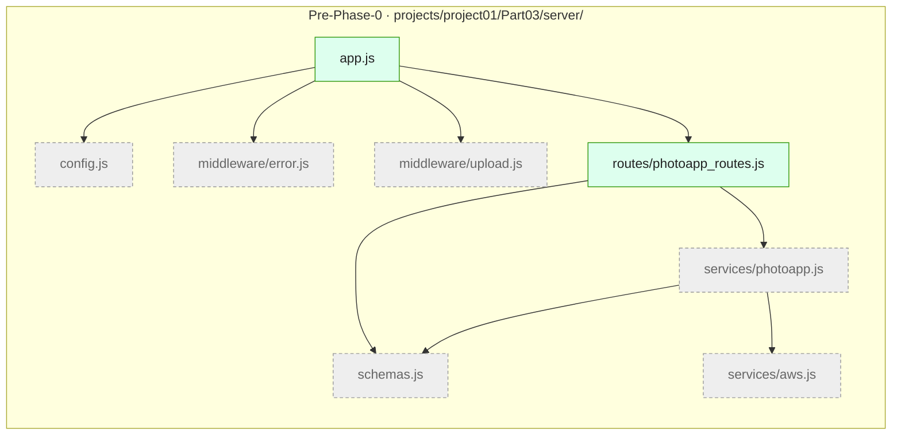
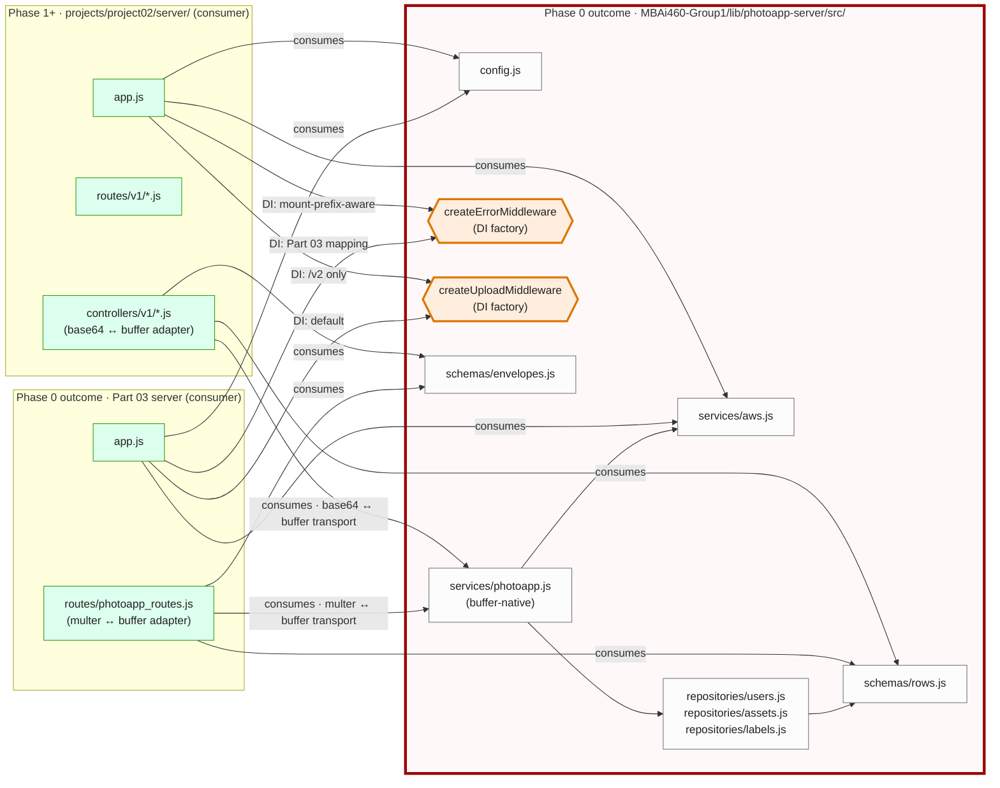

# Target State — `@mbai460/photoapp-server` Library Extraction (v1)

> **Status:** Proposed (Phase 0 of Project 02 Part 01 quest, in progress on `feat/lib-extraction`).
> When implementation completes (library 1.0.0 acceptance), rename to `mbai460-photoapp-server-lib-extraction-v1.md` and update README status per `claude-workspace/memory/feedback_visualization_naming.md`.
>
> **Source Approach doc:** `MBAi460-Group1/projects/project02/client/MetaFiles/Approach/00-shared-library-extraction.md`
>
> **Plan reference:** `MBAi460-Group1/projects/project02/client/MetaFiles/Approach/Plan.md` § Phase 0
>
> **Last updated:** 2026-05-02 — v1 review-pass revisions (round 2): softened subgraph-position claims (Mermaid layout isn't deterministic in `flowchart LR`); added grouping-vs-splitting node convention to Reading section. Round 1 covered: divorced labels from time, corrected Project-02-server-tree framing, red border around library subgraph, "Extracted" classDef, transport-adapter edge labels, descriptive section titles, Pre-Work State split into its own diagram.

---

## Story

**Pre-Phase-0 state:** Project 01 Part 03 owns the service core (`config.js`, `services/aws.js`, `services/photoapp.js`, `middleware/error.js`, `middleware/upload.js`, `schemas.js`) directly under its own server tree. Project 02's server tree implementation doesn't exist yet — only the directory scaffolding (`projects/project02/client/`, `MetaFiles/`, the empty `server/` folder, `Vizualizations/`, `package.json`).

**Phase 0 outcome:** the service core has been **extracted** into the shared library `@mbai460/photoapp-server` at `MBAi460-Group1/lib/photoapp-server/`. Part 03 becomes a *consumer* of the library (no longer the owner of the service core). Project 02's server tree comes online in Phase 1+ as a second consumer. The library is **buffer-native**; consumers own their transport adapters at the route boundary. Same library code; different DI config; **zero duplicated source**.

The library is **internals-only** (CL2 from the Approach): it exports services / repositories / middleware (factories) / schemas — never routers. Consumers own routing because their wire contracts differ.

## Focus (color semantics in the diagrams)

- **🔴 Red border (final-state diagram only) — Library boundary.** A bold red border surrounds the `@mbai460/photoapp-server` subgraph. Internal lib modules render neutral — the boundary is the architectural decision, not the per-module styling.
- **🟠 Amber — DI seams.** Factories like `createErrorMiddleware({ statusCodeMap, errorShapeFor, logger })` and `createUploadMiddleware({ destDir, sizeLimit })` let the same library satisfy divergent surface needs. Part 03 passes its uniform `{message, data}` envelope mapping; Project 02 passes its mount-prefix-aware status-code mapping.
- **⚪ Grey-dashed — Extracted modules (Pre-Work State diagram only).** Files in Part 03's pre-Phase-0 tree that *move out* during Phase 0; they cease to exist at Part 03 after extraction (their content lives in the library).
- **🟢 Green — Surface modules (consumer-owned).** Each consumer's `app.js` / routes / controllers stay in the consumer's tree — surface-specific because their wire contracts diverge.

---

## Pre-Work State

The starting state — what Phase 0 transforms.

**Reading:** the grey-dashed modules (`config.js`, `services/aws.js`, `services/photoapp.js`, `middleware/error.js`, `middleware/upload.js`, `schemas.js`) are the service core being **extracted** out of Part 03's server tree. The green modules (`app.js`, `routes/photoapp_routes.js`) stay — they become the Part 03 consumer in the final architecture.

`projects/project02/server/` does not appear here because it doesn't exist yet — Phase 1+ creates it.

---

## Library extraction architecture: shared internals, surface-specific DI

The Phase-0 outcome — the architecture Part 03 + Project 02 share once extraction lands.

**Reading:**

- **Subgraphs** are trees: `LIB` (the extracted shared library; red border denotes the architectural boundary), `P03A` (Part 03 after extraction), `P02` (Project 02 server; comes online in Phase 1+). Mermaid auto-arranges subgraph layout in `flowchart LR` based on edge weights, node order, and the renderer's algorithm; relative positions may vary across renderers — don't rely on left/middle/right being deterministic.
- **Solid arrows within a tree** are normal `require()` dependencies.
- **Solid `consumes`-labeled arrows crossing the library boundary** are import-from-library statements (e.g., `const { services } = require('@mbai460/photoapp-server')`).
- **Transport-adapter labels on consumer → library edges** show where the buffer-native library meets each surface's wire contract:
  - Part 03's `routes/photoapp_routes.js` does **multer ↔ buffer** transport at the route boundary (multer-temp-file → buffer for upload; buffer → `Readable.from(buffer).pipe(res)` native streaming for download).
  - Project 02's `controllers/v1/*.js` does **base64 ↔ buffer** transport at the route boundary (`Buffer.from(req.body.data, 'base64')` for upload; `dataBuffer.toString('base64')` for download into a JSON envelope).
- **DI labels on consumer → factory arrows** show that *same library code* (the factory) **+ different DI config** (passed at consumer's `app.js`) **= divergent surface needs**. This is the architectural keystone — what makes the shared library work for both Part 03's `{message, data}` uniform envelope and Project 02's variadic per-route shapes.
- The library is **buffer-native** (`L_PHOTO` annotation) — it does not know or care which transport produced the buffer. Surfaces own transport.
- **Grouping vs. splitting node convention:** library modules that represent parallel files of *one* architectural move appear as a single grouped node — e.g., `repositories/users.js · assets.js · labels.js` is three files but one move (extracting SQL out of `services/photoapp.js` into a repositories layer; CL9 reconciliation). Library modules where the *split itself was the architectural decision* appear as separate nodes — e.g., `schemas/envelopes.js` + `schemas/rows.js` are two nodes because the splitting *is* the move (pre-Phase-0 these were one file `schemas.js`; the split into envelope helpers vs row converters is the architectural decision worth visualizing).

**Where do the extracted Part 03 modules go?** Per Phase 0.2 of `Approach/00-shared-library-extraction.md`:
- `T_CFG → L_CFG`, `T_AWS → L_AWS`, `T_PHOTO → L_PHOTO` — moved (`git mv`); import paths updated.
- `T_ERR → L_ERRf`, `T_UPL → L_UPLf` — factorized (still moved, but now a constructor that takes DI config; default args reproduce Part 03's pre-extraction behaviour exactly).
- `T_SCH → L_ENV + L_ROW` — split into envelopes + row converters.
- `T_PHOTO`'s inline SQL → `L_REPOS` (the repositories layer; CL9 bounded reconciliation in Phase 0.3 — the only behaviour-affecting refactor in Phase 0).

## Why this matters

1. **No parallel duplication.** Without extraction, Part 03 and Project 02 would maintain two parallel copies of services / middleware / schemas. CL9 explicitly forbids that pattern after the pressure test surfaced it as deliberate debt.
2. **DI seams resolve divergent needs.** Part 03 and Project 02 have different status-code maps (Part 03 uniform; Project 02 mount-prefix-aware), different envelope shapes (Part 03 `{message, data}`; Project 02 variadic). Same library code; different DI config; **zero duplicated source**.
3. **Service-layer tests run once.** Library tests cover services / repositories / middleware / schemas; surface-specific tests (contract, integration, live) stay per-consumer.
4. **Phase 0 is the keystone.** Everything downstream (Phases 1–4) depends on this extraction. Delaying it would mean every adapt-and-keep-in-sync moment costs twice.

## Cross-references

- **Architectural decisions:** `MBAi460-Group1/projects/project02/client/MetaFiles/Approach/00-overview-and-conventions.md` § Design Decisions D5, D13
- **Library design constraints (CL1–CL12):** `MBAi460-Group1/projects/project02/client/MetaFiles/Approach/00-shared-library-extraction.md` § Design Decisions
- **Library-touching governance (CL9 bounded reconciliation; CL12 `lib:photoapp-server` GitHub label):** `Approach/Plan.md` § Cross-Cutting Threads — Thread D
- **Transport-adapter detail:** `Approach/00-overview-and-conventions.md` § *Inherited Assets — From Project 01 Part 03* (the buffer-native library + per-surface transport adapter pattern)
- **Project 02 inheritance map (Phase 1 layer):** `Target-State-project02-inheritance-map-v1.md` (forthcoming, Phase 1)
- **Foundation architecture overview:** `Target-State-project02-foundation-architecture-v1.md` (forthcoming, Phase 1)

## Questions worth surfacing during execution

- **Phase 0.2 mechanical-purity discipline:** is each file moved with `git mv` (rename headers in `git status`) rather than retyped? CL9 is strict — if "improving" while extracting, stop and split.
- **Phase 0.3 SQL-byte-identical:** does the optional `sql-characterization.test.js` (Optional Test Step) lock the `ORDER BY` clauses + parameter binding orders? Silent collation drift in `LIKE` queries is a known footgun.
- **Phase 0.4 Gradescope packaging:** does `tools/package-submission.sh` correctly inline the library into the submission tarball? CL8 floating workspace protocol means consumers can't resolve `@mbai460/photoapp-server` from npm — the script must inline.
- **Phase 0.5 fresh-clone smoke:** when `make freshclone-smoke` runs against the documented commands in README/QUICKSTART, does it land at green tests in a clean checkout? CL11 says yes-or-fix-the-docs.
- **Transport adapters (Phase 1+):** when Project 02's controllers go in, does the base64 ↔ buffer round-trip preserve byte identity for all asset sizes (the `base64_buffer_roundtrip.test.js` Optional Test Step locks this)? Bit-flip in encoding is silent; only a property-style test catches it.
