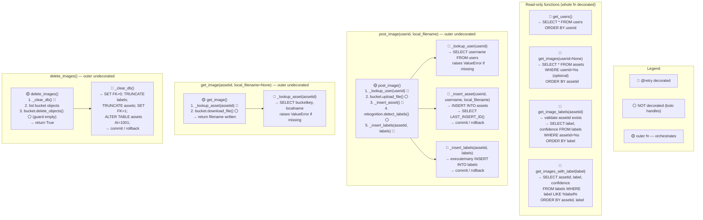

# Project 01 Part 02 — API Function Structure

**Generated:** 2026-04-20
**Scope:** photoapp.py API layer — decorator placement, inner fn pattern, resource boundaries
**Status:** 🟡 PROPOSED — not yet implemented
**Related diagrams:** `project01-part02-iam-target-v1.md`, `lab-database-schema-v3.md`

---

## Decorator + Inner Function Pattern

The key structural invariant: `@retry` goes on any function that **only** touches MySQL.
It must NOT wrap S3 or Rekognition calls (boto already retries; re-wrapping would re-upload
the same image multiple times on failure).



---

## Return Shapes (contract — grader checks these)

| Function | Returns | Order |
|---|---|---|
| `get_users()` | `list[tuple[int, str, str, str]]` | ASC userid |
| `get_images(userid=None)` | `list[tuple[int, int, str, str]]` | ASC assetid |
| `post_image(userid, local_filename)` | `int` (new assetid) | — |
| `get_image(assetid, local_filename=None)` | `str` (filename written) | — |
| `delete_images()` | `True` | — |
| `get_image_labels(assetid)` | `list[tuple[str, int]]` | ASC label |
| `get_images_with_label(label)` | `list[tuple[int, str, int]]` | ASC assetid, then label |

---

## Error Contracts (verbatim strings — likely grader-compared)

```python
raise ValueError("no such userid")    # post_image — invalid userid
raise ValueError("no such assetid")   # get_image, get_image_labels — invalid assetid
```

---

## bucketkey Format (non-negotiable)

```python
unique_part = str(uuid.uuid4())
bucketkey = username + "/" + unique_part + "-" + local_filename
# e.g. "p_sarkar/3f2a1b4c-...-01degu.jpg"
```

---

## Operation Ordering (data safety)

| Function | First | Second | Rationale |
|---|---|---|---|
| `post_image` | S3 upload | DB insert | Orphaned S3 obj is harmless (unique UUID); broken DB ref is not |
| `delete_images` | DB truncate | S3 delete | If DB fails → nothing deleted. If S3 fails after DB → leftovers, but keys are unique |

---

## Retry Decorator Template

```python
from tenacity import retry, stop_after_attempt, wait_exponential

@retry(
    stop=stop_after_attempt(3),
    wait=wait_exponential(multiplier=1, min=2, max=30),
    reraise=True,   # without this, tenacity wraps exception in RetryError
)
```
