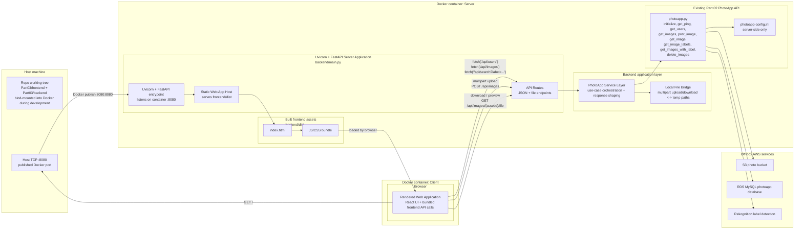
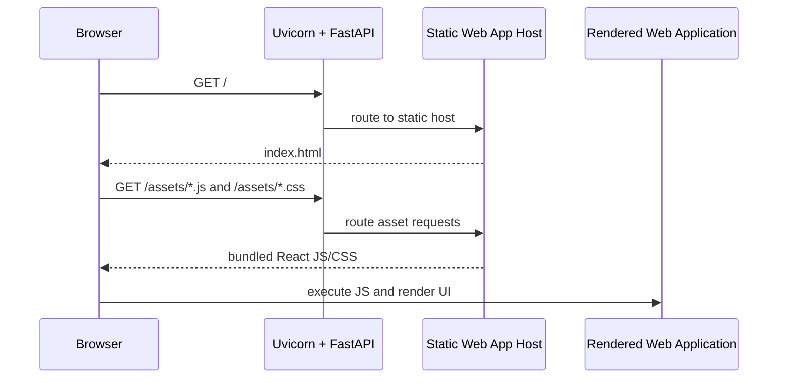
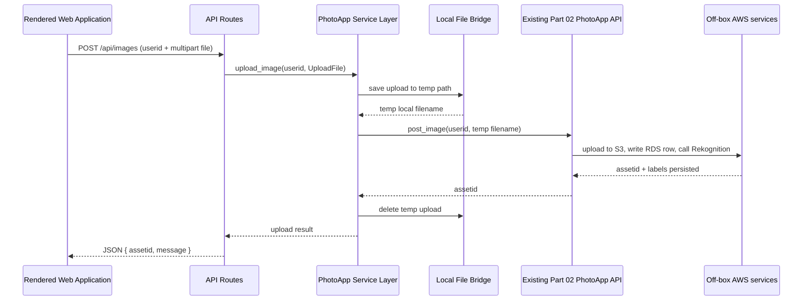
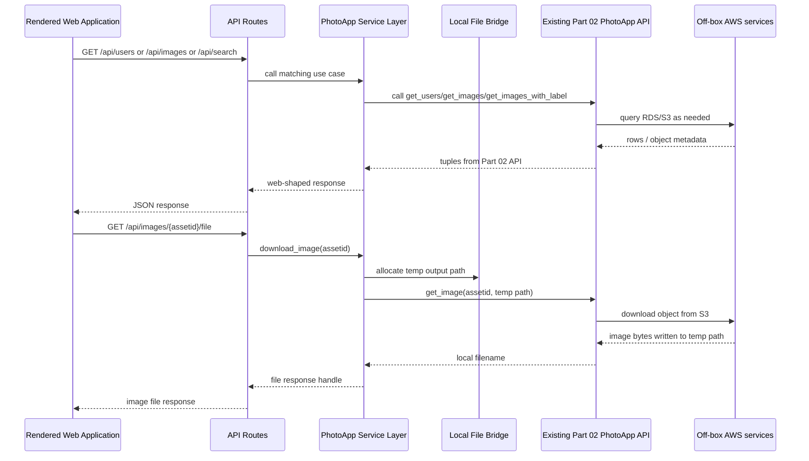

# Target State - Project 01 Part 03 PhotoApp Local Architecture

**Generated:** 2026-04-25  
**Scope:** Project 01 Part 03 local web application architecture  
**Status:** PROPOSED - architecture discussion artifact  
**Related diagrams:** `docker-environment-v1.md`, `project01-part02-api-flow-v1.md`

---

## Human Summary

Target state for Part 03 is a local, framework-based web app:

- **React + Vite frontend** owns layout, interaction state, upload forms, image gallery, label display, and search UI.
- **Uvicorn + FastAPI backend** owns HTTP API routes, static serving for the built frontend, upload/download handling, error translation, and initialization of the existing PhotoApp API.
- **PhotoApp Service Layer** coordinates Part 03 use cases so frontend code never imports Python modules directly and never sees credentials or environment details.
- **Docker containers** provide the reproducible local runtime. The rendered web app runs in the client-side browser context, and requests flow to the FastAPI server container.
- **Off-box AWS services** are still called by the imported Part 02 `photoapp.py` module; the web server itself remains local.

---

## Layered Request Flow



## Local Runtime Shape

```mermaid
flowchart LR
  subgraph client_container["Docker container: Client"]
    direction TB
    subgraph browser["Browser"]
      direction TB
      webapp["Rendered Web Application\nReact UI + bundled frontend API calls\nHTML + JS + CSS"]
    end
  end

  subgraph server_container["Docker container: Server"]
    direction TB
    subgraph fastapi_app["Uvicorn + FastAPI Server Application\nbackend/main.py"]
      direction TB
      ingress["Uvicorn + FastAPI entrypoint\nlistens on container :8080"]
      subgraph fastapi_handlers["FastAPI request handlers"]
        direction LR
        static["Static Web App Host\nserves frontend/dist\nGET / and /assets/*"]
        api["API Routes\nbackend/routes/photoapp_routes.py\n/api/ping, /api/users, /api/images, /api/search"]
      end
    end
    service["PhotoApp Service Layer\nbackend/services/photoapp_service.py\nuse-case orchestration + response shaping"]
    files["Local File Bridge\nbackend/services/file_bridge.py\nmultipart upload/download <-> temp paths"]
    photoapp_api["Existing Part 02 PhotoApp API\nproject01/client/photoapp.py\nimported Python module, not a separate service"]
    config["Server-side config\nphotoapp-config.ini"]
  end

  subgraph aws["Off-box AWS services"]
    direction TB
    s3["S3 photo bucket"]
    rds["RDS MySQL photoapp database"]
    rekognition["Rekognition label detection"]
  end

  webapp -->|"GET http://server:8080/"| ingress
  ingress -->|"serve app shell + static assets"| static
  static -->|"HTML + JS + CSS loaded in browser"| webapp

  webapp -->|"HTTP JSON + multipart requests\nhttp://server:8080/api/*"| ingress
  ingress --> api
  api -->|"via Python module import"| service
  service --> files
  service -->|"calls imported Python functions"| photoapp_api
  photoapp_api --> config
  photoapp_api -->|"boto3 / pymysql calls"| s3
  photoapp_api -->|"pymysql queries"| rds
  photoapp_api -->|"boto3 detect_labels"| rekognition

  subgraph spacer[" "]
    blank[" "]
  end

  subgraph legend["Flow color legend"]
    direction LR
    serving_legend["Serving the website"]
    api_legend["API request flow"]
  end

  rekognition ~~~ blank
  blank ~~~ serving_legend

  linkStyle 0,1,2 stroke:#16a34a,stroke-width:3px
  linkStyle 3,4,5,6,7,9,10,11 stroke:#ea580c,stroke-width:3px
  linkStyle 8 stroke:#6b7280,stroke-width:3px
  linkStyle 12,13 stroke:transparent
  style serving_legend fill:#dcfce7,stroke:#16a34a,stroke-width:2px
  style api_legend fill:#ffedd5,stroke:#ea580c,stroke-width:2px
  style blank fill:transparent,stroke:transparent
  style spacer fill:transparent,stroke:transparent
```



---

## Boundary Rules

| Boundary | Rule |
|---|---|
| Browser to backend | Browser only uses HTTP. No direct Python imports, config reads, or credentials. |
| Frontend to API | Frontend calls `/api/*` and receives JSON or file responses. |
| API to service | FastAPI routes stay thin: request parsing, status codes, response shapes. |
| Service to Part 02 API | Service facade translates web concepts such as uploaded files into adapter-backed `photoapp.py` calls. |
| Docker to host | Host browser reaches the app through a published local port, typically `8080:8080`. |
| Off-box AWS services | Server runs locally, but imported `photoapp.py` still calls S3, RDS, and Rekognition over the network. |

---

## Directory Structure Target

```text
projects/project01/Part03/
  backend/
    main.py                         # creates FastAPI app, mounts static files, includes API router
    routes/
      photoapp_routes.py            # /api/* endpoints; HTTP request/response concerns
    services/
      photoapp_service.py           # PhotoApp use cases: list, upload, download, labels, search, delete
      file_bridge.py                # temp-file bridge for browser uploads/downloads
    adapters/
      part02_photoapp.py            # imports and initializes project01/client/photoapp.py
    schemas.py                      # Pydantic request/response models where useful

  frontend/
    src/
      api/
        photoappApi.js              # browser fetch wrappers for /api/*
      components/
        UserSelector.jsx
        UploadPanel.jsx
        ImageGallery.jsx
        LabelSearch.jsx
      App.jsx
      main.jsx
    index.html
    package.json
    dist/                           # Vite build output; served by FastAPI

  README.md                         # run instructions + demo notes

projects/project01/client/
  photoapp.py                       # existing Part 02 implementation reused by adapter
  photoapp-config.ini               # server-side config; never loaded by browser
```

---

## Request Lifecycle Examples

### Website Load



### Image Upload



### Read/Search/Download API Calls



---

## Temporary TODOs For Architecture Discussion

- [ ] Consider a future stream-through upload path that avoids writing browser uploads to local disk. Current Part 03 target keeps the `Local File Bridge` because the existing Part 02 `photoapp.post_image(userid, local_filename)` API expects a local filename. A future refactor could add a stream-oriented function such as `post_image_stream(userid, original_filename, fileobj)` so FastAPI can pass the uploaded file stream directly toward S3 without a temporary file. Keep the public web API as `POST /api/images` either way so the frontend contract does not change.

