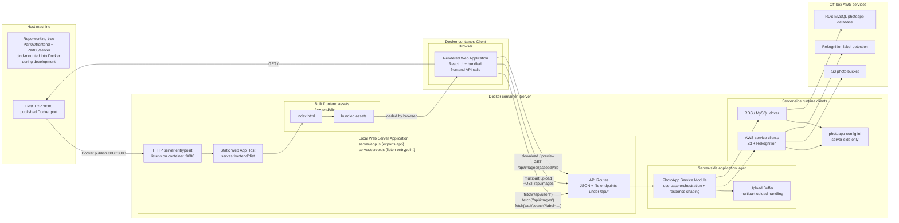
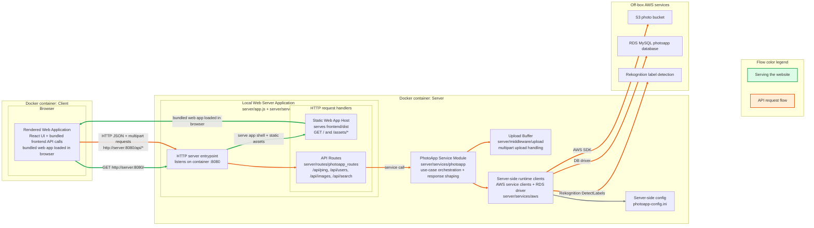
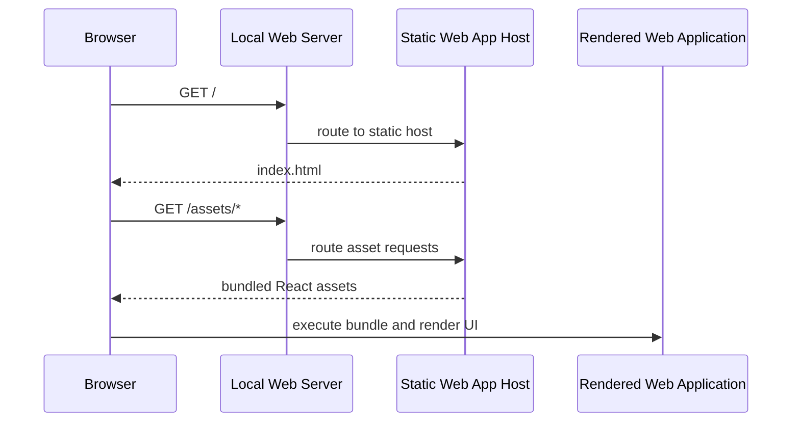
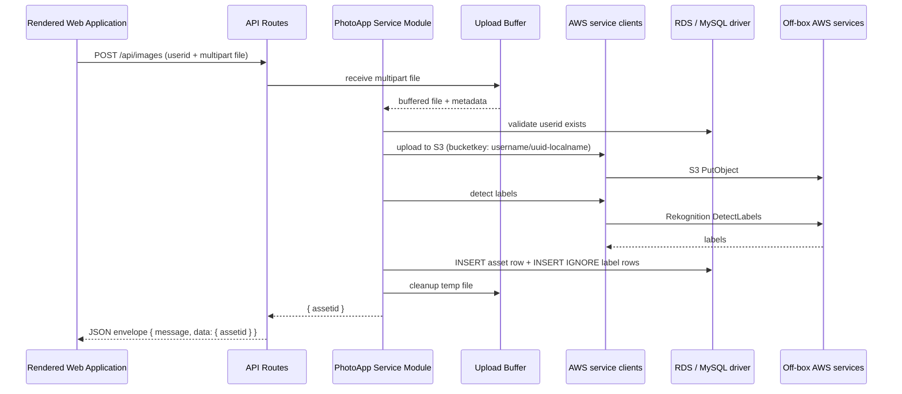
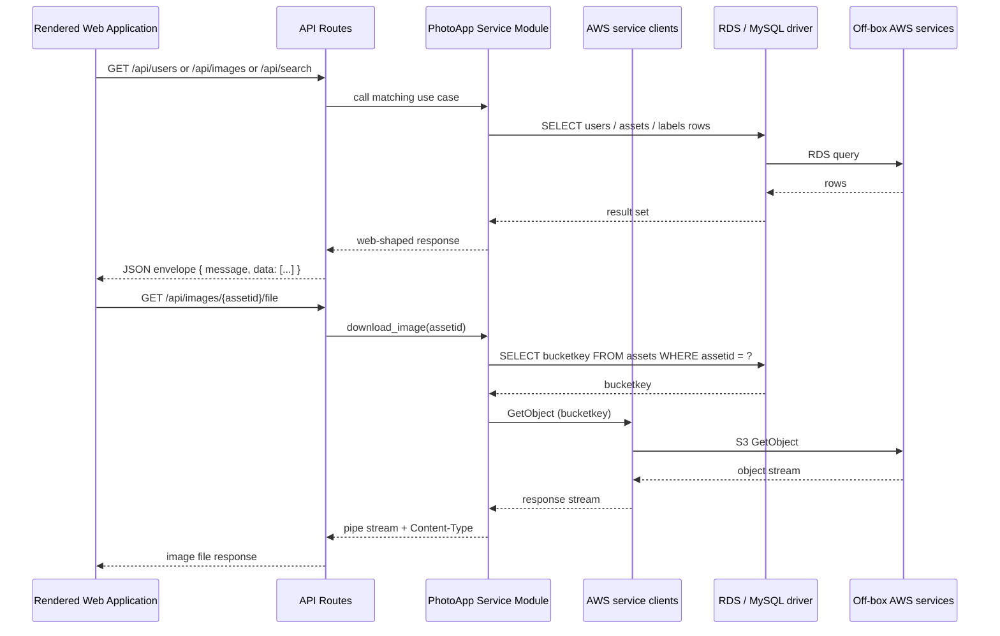

# Target State - Project 01 Part 03 PhotoApp Local Architecture

**Generated:** 2026-04-25  
**Updated:** 2026-04-26 — language/implementation-agnostic pass following the Express direction confirmation. Awaiting design-agent review.  
**Scope:** Project 01 Part 03 local web application architecture  
**Status:** PROPOSED - architecture discussion artifact  
**Related diagrams:** `docker-environment-v1.md`, `project01-part02-api-flow-v1.md`

---

## Human Summary

Target state for Part 03 is a local, framework-based web app:

- **React + Vite frontend** owns layout, interaction state, upload forms, image gallery, label display, and search UI.
- **Local web server** owns HTTP API routes, static serving for the built frontend, upload/download handling, error translation, and the PhotoApp service module.
- **PhotoApp Service Module** coordinates Part 03 use cases (S3, RDS, and Rekognition orchestration) so frontend code never accesses credentials, AWS SDKs, or database drivers directly.
- **Docker containers** provide the reproducible local runtime. The rendered web app runs in the client-side browser context, and requests flow to the server container.
- **Off-box AWS services** are called by the server's PhotoApp Service Module; the web server itself remains local.

---

## Layered Request Flow



## Local Runtime Shape



---

## Boundary Rules

| Boundary | Rule |
|---|---|
| Browser to server | Browser only uses HTTP. No direct credential or AWS SDK access from frontend code. |
| Frontend to API | Frontend calls `/api/*` and receives JSON or file responses. |
| API to service | HTTP routes stay thin: request parsing, status codes, response shapes. Business logic lives in the service module. |
| Service to AWS / RDS | Service module orchestrates AWS SDK and RDS driver calls; converts row results into web-shaped objects; never exposes credentials. |
| Docker to host | Host browser reaches the app through a published local port, typically `8080:8080`. |
| Off-box AWS services | Server runs locally; AWS service clients call S3, RDS, and Rekognition over the network. |

---

## Directory Structure Target

```text
projects/project01/Part03/
  server/
    app.js                          # creates server app, mounts static files, mounts /api router
    server.js                       # listen() entrypoint
    config.js                       # web service config (port, config file path)
    routes/
      photoapp_routes.js            # /api/* endpoints; HTTP request/response concerns
    services/
      photoapp.js                   # PhotoApp use cases: list, upload, download, labels, search, delete
      aws.js                        # AWS service clients + RDS driver factories
    middleware/
      upload.js                     # multipart upload handling
      error.js                      # JSON error mapping
    schemas.js                      # row-to-object converters; envelope helpers
    tests/

  frontend/
    src/
      api/
        photoappApi.js              # browser fetch wrappers for /api/*
      components/
        UserSelector.jsx
        UploadPanel.jsx
        ImageGallery.jsx
        LabelSearch.jsx
      App.jsx
      main.jsx
    index.html
    package.json
    dist/                           # Vite build output; served by the local web server

  package.json                      # server-side runtime + test deps
  README.md                         # run instructions + demo notes

projects/project01/client/
  photoapp.py                       # Part 02 reference (NOT imported by Part 03 server)
  photoapp-config.ini               # server-side config; never loaded by browser
```

---

## Request Lifecycle Examples

### Website Load



### Image Upload



### Read/Search/Download API Calls



---

## Temporary TODOs For Architecture Discussion

- [ ] Consider a future stream-through upload path that pipes the multipart upload directly to S3 without buffering to a temp file. Initial Part 03 target uses temp-file buffering (via the upload middleware) for parity with the original assignment's local-file expectations and to keep the service module simple. A future refactor could thread the upload stream end-to-end. Keep the public web API as `POST /api/images` either way so the frontend contract does not change.
