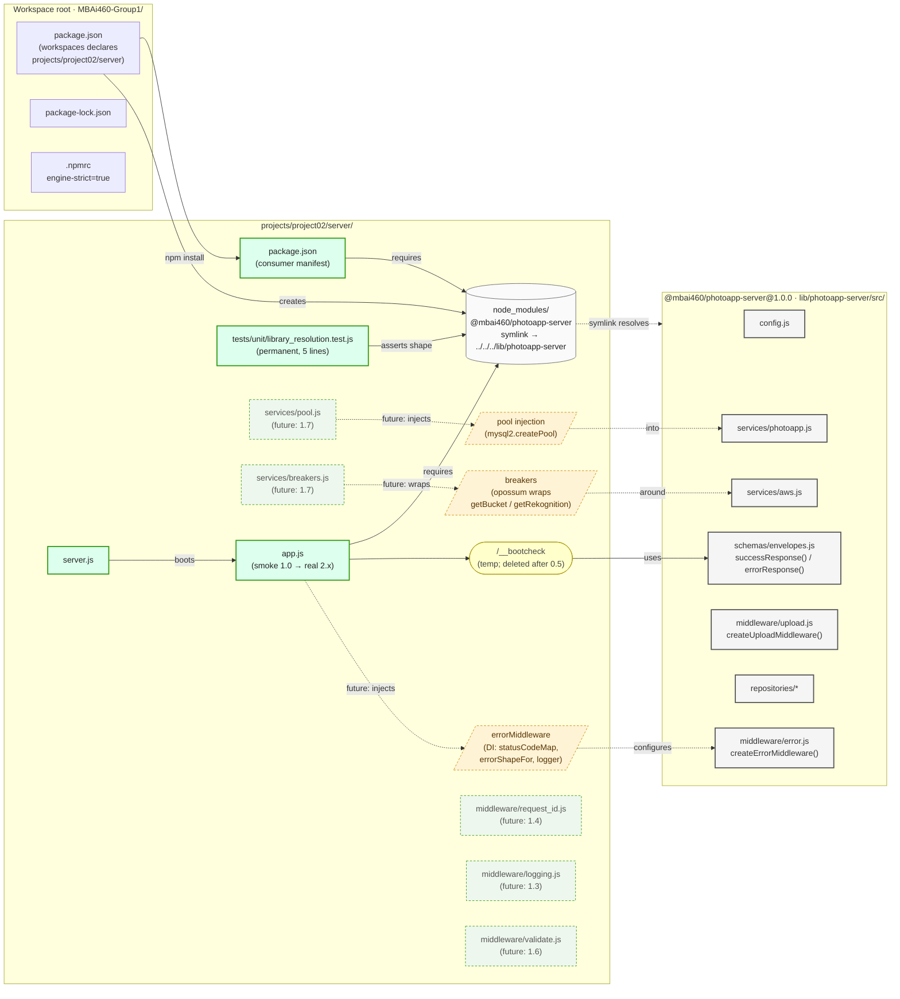

# Target State — Project 02 Foundation Consumer Bootstrap (v1)

> **Status:** Proposed (sub-phase 1.0 of Project 02 Part 01 quest, in progress on `feat/p02-foundation`).
> When sub-phase 1.0 closes, rename to `project02-foundation-consumer-bootstrap-v1.md` per `claude-workspace/memory/feedback_visualization_naming.md`.
>
> **Source Approach doc:** `MBAi460-Group1/projects/project02/client/MetaFiles/Approach/01-foundation.md` § Phase 0
>
> **Plan reference:** `MBAi460-Group1/projects/project02/client/MetaFiles/Approach/Plan.md` § Phase 1.0
>
> **Builds on:** `Target-State-mbai460-photoapp-server-lib-extraction-v1.md` (Phase 0 of the quest landed the library; this viz shows Project 02 wiring up as the second consumer).
>
> **Last updated:** 2026-05-04 — v1 authored.

---

## Story

`@mbai460/photoapp-server@1.0.0` already sits at `MBAi460-Group1/lib/photoapp-server/` with Part 03 as its first consumer. Sub-phase 1.0 brings Project 02 online as the **second consumer**:

1. **Workspace root** declares `projects/project02/server` as a workspace.
2. **`npm install`** from the root resolves the library through a **node_modules symlink**, not an npm registry pull.
3. **Project 02's smoke `app.js`** `requires` the library and exercises one re-export (`schemas.envelopes.successResponse`) via a temporary `/__bootcheck` route to prove the symlink end-to-end.
4. The **DI seams** Project 02 will inject in subsequent sub-phases (1.5 errorMiddleware, 1.7 pool, 1.7 breakers) are signposted here as future work; sub-phase 1.0 wires only the smoke import.

**Sub-phase 1.0 outcome:** Project 02 boots, prints "listening on :8080", `/__bootcheck` returns the library's success-envelope shape, the route is deleted, and a permanent 5-line `library_resolution.test.js` keeps the symlink under CI watch.

## Focus (color semantics)

- **⚫ Gray-bordered subgraph — Library boundary** (`@mbai460/photoapp-server`). Do not modify here in any consumer workstream; library changes go through the library's own PR cycle (CL2 + CL12).
- **🟠 Amber — DI seams.** Factories the consumer constructs: `createErrorMiddleware({...})` (Phase 1.5), `pool` injection into `services/photoapp` (Phase 1.7), `opossum` breakers wrapping `getBucket()` / `getRekognition()` (Phase 1.7). All three are *future* work in sub-phase 1.0; shown dashed-amber as forward references.
- **🟢 Green — Project 02 net-new files.** Files this sub-phase or later sub-phases of Phase 1 add under `projects/project02/server/`. The smoke `app.js` + `server.js` are solid green (1.0); the rest are dashed-green (forward references to 1.3–1.7).
- **🟡 Yellow — Smoke artifacts.** `/__bootcheck` route + the library exports check; both are temporary or permanent-but-tiny.

---

## Consumer bootstrap architecture

**Reading:**

- The **gray library subgraph** is internals-only and immutable from a consumer's vantage point. Project 02 reaches it only through the symlinked `node_modules/@mbai460/photoapp-server`.
- **Solid green** (`package.json`, `app.js`, `server.js`, `library_resolution.test.js`) lands in sub-phase 1.0.
- **Dashed green** (`pool.js`, `breakers.js`, `request_id.js`, `logging.js`, `validate.js`) is forward-referenced from the Approach's later sub-phases (1.3–1.7) so the architecture is legible; sub-phase 1.0 does not create these.
- **Amber trapezoids** are the **DI seams** — the configuration points where Project 02's wiring will diverge from Part 03's. Dashed because they aren't constructed yet; solid in v2 once Phase 1 closes.
- **Yellow `/__bootcheck`** is the temporary route that proves the import path. Acceptance criterion: the route round-trips `{"message":"success","ok":true}`, then the route is deleted; the 5-line `library_resolution.test.js` (permanent) replaces its CI value.

---

## Reading the bootstrap flow

1. `npm install` from `MBAi460-Group1/` reads root `package.json`'s `workspaces` array, then resolves Project 02's `package.json` deps.
2. Because `@mbai460/photoapp-server` matches the workspace package, npm creates a **symlink** at `projects/project02/server/node_modules/@mbai460/photoapp-server` → `../../../lib/photoapp-server` (or hoists to root `node_modules/`).
3. Project 02's `app.js` calls `require('@mbai460/photoapp-server')`; Node resolves through the symlink and returns the library's exports object.
4. `server.js` boots `app.listen(8080)`; `curl /__bootcheck` returns the success envelope from `schemas.envelopes.successResponse({ ok: true })`.
5. `tests/unit/library_resolution.test.js` asserts the same exports shape from a unit-test vantage point — permanent CI guard for the symlink.

---

## What this viz does NOT show (intentional scope cut)

- **Routing.** No `/v1` / `/v2` / `/healthz` / `/readyz` mounts — those land in Phases 2–4 of the Approach (sub-phases 1.x of the Plan).
- **Observability.** No `pino` / `pino-http` / OTel — those land in Approach Phase 3 (Plan sub-phase 1.3).
- **Pool / breakers / Rekognition transactions.** Forward-referenced as dashed nodes; constructed in Approach Phase 7 (Plan sub-phase 1.7).
- **docker-compose / Terraform.** Approach Phases 10 + 12 (Plan sub-phases 1.1 + 1.2/1.12).
- **OpenAPI 3.1 contract.** Approach Phase 9 (Plan sub-phase 1.8).

The Plan's `02-web-service.md` will need a different viz (`Target-State-project02-v1-layered-flow-v1.md`) once Phase 2 opens.
