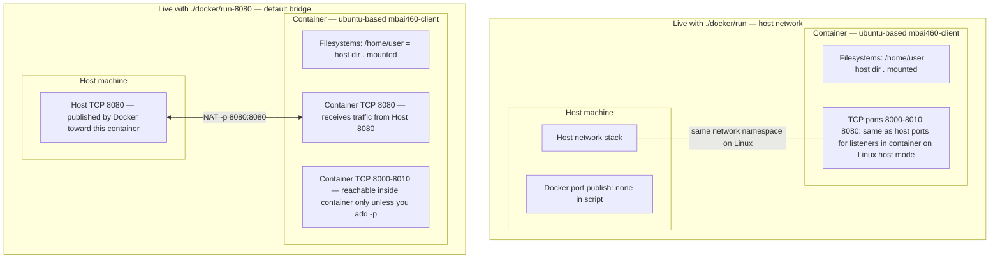

# Docker environment visualization

This document describes the Docker setup defined by the static files under `./docker/`. No Docker commands were run to produce it.

---

## 1. Human Summary

- **Image built:** A single image tagged **`mbai460-client`** (from [`docker/_image-name.txt`](docker/_image-name.txt)), produced by [`docker/build.bash`](docker/build.bash) with `docker build --no-cache -t … ./docker`, using [`docker/Dockerfile`](docker/Dockerfile) (`FROM ubuntu:latest`, plus packages, Python deps, `cloudflared`, a PyInstaller-built artifact under `/gradescope`, and user `user`). There is **no** `CMD` or `ENTRYPOINT` in the Dockerfile; the process is supplied at run time.
- **How the container is run:** [`docker/run.bash`](docker/run.bash) or [`docker/run-8080.bash`](docker/run-8080.bash) invoke `docker run` with **interactive TTY** (`-it`), as **`-u user`**, working directory **`-w /home/user`**, and **`bash`** as the container command. Documentation and these scripts’ echo paths refer to **`./docker/run`** and **`./docker/run-8080`**; the committed shell sources are the `.bash` files—whether those names are wrappers or symlinks is **not** specified in the files listed for this task.
- **Volumes:** A **bind mount** maps the host’s **current directory** **`.`** to **`/home/user`** in the container (`-v .:/home/user`). The mounted host path is whatever directory the user is in when they execute the run script (often the repo root, but not guaranteed by the script).
- **Declared vs published ports:** The Dockerfile **`EXPOSE`s** TCP **8000–8010** and **8080**; that only documents intent and default `docker run` behavior for linking—it does **not** publish ports by itself. **[`run.bash`](docker/run.bash)** does **not** use **`-p`**. **[`run-8080.bash`](docker/run-8080.bash)** **publishes** **`8080:8080`** (host port 8080 → container port 8080). No other `-p` flags appear in these run scripts.
- **Networking:** **`./docker/run`** uses **`--network host`**. **`./docker/run-8080`** omits `--network`, so Docker’s **default bridge** network applies for that invocation, along with **`-p 8080:8080`**.
- **Lifecycle:** Both run scripts pass **`--rm`**, so the container is **removed when it exits** (ephemeral container). The **image** persists on the host until removed (build script attempts to `docker rmi` the previous tag before rebuilding).

---

## 2. Mermaid Diagram (live environment)

Static picture of **what exists while a container is running**: two machines (host OS vs Linux container), shared files, and **which port surfaces matter**. There is no build/run procedural flow here—only layout.

**Note:** Ports are **not** open in the sense of “something is listening” until you start a process; the Dockerfile only **documents** 8000–8010 and 8080 as typical application ports.

---

## 3. Annotation of Interfaces

| Kind | Where defined | This setup |
|------|----------------|------------|
| **Declared ports** (image metadata) | [`docker/Dockerfile`](docker/Dockerfile) `EXPOSE` | **8000–8010** and **8080** documented on the image. Does not open firewall or map host ports by itself. |
| **Published ports** | `docker run -p` | **Only** in [`docker/run-8080.bash`](docker/run-8080.bash): **`8080:8080`**. [`docker/run.bash`](docker/run.bash) has **no** `-p`. |
| **Bind mounts** | `docker run -v` | **`.`** (host cwd) **→** **`/home/user`** in the container (both run scripts). |
| **Network mode** | `docker run --network` | **`host`** in [`docker/run.bash`](docker/run.bash). **Default bridge** (no `--network`) in [`docker/run-8080.bash`](docker/run-8080.bash). |

**Published vs declared (8080, bridge path):** With **`-p 8080:8080`**, traffic to **Host :8080** is forwarded to **Container :8080** for processes bound inside the container on that port. The Dockerfile’s `EXPOSE 8080` aligns with that but is not what performs the publish—the **`-p`** flag is.

**Host network path:** With **`--network host`**, the container shares the host’s network stack on **Linux**. In that mode the run script does not use `-p`; processes in the container that listen on a port use the host’s interfaces directly **on platforms where host networking is fully supported** (see confidence notes).

---

## 4. Confidence Notes

**Known from static files only**

- Image name, build flags (`--no-cache`, context `./docker`), Dockerfile base image, installed components at a high level, `EXPOSE` ranges, Linux user `user`, working directory and user for `docker run`, bind mount syntax, `--rm`, `--network host` vs default + `-p 8080:8080`, and that the container command is **`bash`**.
- Build script behavior: conditional removal of the existing tag via `docker manifest inspect` / `docker rmi`, and `docker image prune -f` before build.

**Inferred (reasonable, not literally spelled out in every file)**

- **`./docker/run`** and **`./docker/run-8080`** are the entrypoints described in [`docker/build.bash`](docker/build.bash) messages and typical repo layout; the repository contains **`run.bash`** and **`run-8080.bash`** with the `docker run` logic—the exact relationship between `./docker/run` and `run.bash` is not defined in the five files you listed.
- **Default bridge** for [`docker/run-8080.bash`](docker/run-8080.bash) follows Docker’s default when `--network` is omitted.
- Bind mount **`.`** is usually the project root if the user runs the script from there; the scripts do not `cd` to a fixed path.

**Only confirmed at runtime (not assumed here)**

- Whether **host networking** behaves like native Linux when using **Docker Desktop on macOS or Windows** (VM / proxy layers can differ from Linux host mode).
- Whether any process inside the container actually **listens** on 8000–8010 or 8080 during a session (the setup only installs tooling and exposes metadata; nothing in these files starts a server automatically).
- **File permissions and user ID mapping** for `user` and the bind-mounted volume on the host.
- Exact **image size**, layer hashes, and success/failure of each `RUN` during `docker build`.

---
