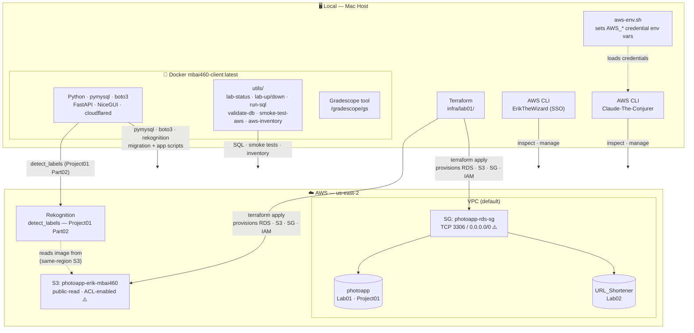

# Lab Architecture — v2

**Generated:** 2026-04-16
**Last Updated:** 2026-04-20 (added Rekognition — Project01 Part02)
**Scope:** Platform infrastructure — all components shared across labs and projects
**Status:** Current — approved
**Note:** This is a living document. Update as new labs/services/agents are added.
         Per-project Gradescope flows live in their own architecture files.
**Related:** `lab-database-schema-v2.md` · `lab01-iam-design-v1.md` · `Target-State-project01-part02-iam-v1.md`

---

---

## Infrastructure Inventory

| Component | Resource | Notes |
|-----------|----------|-------|
| RDS | `photoapp-db.c5q4s860smqq.us-east-2.rds.amazonaws.com` | MySQL 8.0 · db.t3.micro · publicly accessible |
| S3 | `photoapp-erik-mbai460` | public-read · ACL-enabled |
| Security Group | `photoapp-rds-sg` | 3306/0.0.0.0/0 inbound — lab only |
| Docker image | `mbai460-client:latest` | Ubuntu · Python stack |
| Rekognition | `us-east-2` | detect_labels — Project01 Part02 |
| IaC | `infra/terraform/` | Terraform-managed |
| Region | `us-east-2` | Course requirement — do not change |

## IAM
See `lab01-iam-design-v1.md` for current identity model.
See `Target-State-project01-part02-iam-v1.md` for Part02 target state (s3readonly, s3readwrite).
- Erik: SSO (`ErikTheWizard`) — AdministratorAccess
- Agent: `Claude-Conjurer` — PowerUserAccess (no IAM)
- App users (Part02 Phase 1, pending): `s3readonly`, `s3readwrite`

## Known Tech Debt (intentional — lab contract)
- S3 public access — TODO: lock down with CloudFront
- RDS publicly accessible — TODO: whitelist, move to private subnet
- SG open to 0.0.0.0/0 — TODO: scope to known IPs
- RDS automated backups disabled — TODO: enable before prod

## Database Inventory
See `lab-database-schema-v2.md` for full schema and user details.

| Database | Lab / Project | Status |
|----------|--------------|--------|
| `photoapp` | Lab01 · Project01 | ✅ Live |
| `URL_Shortener` | Lab02 | ✅ Live |
