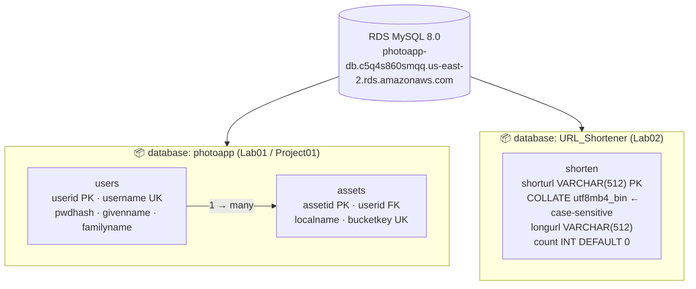
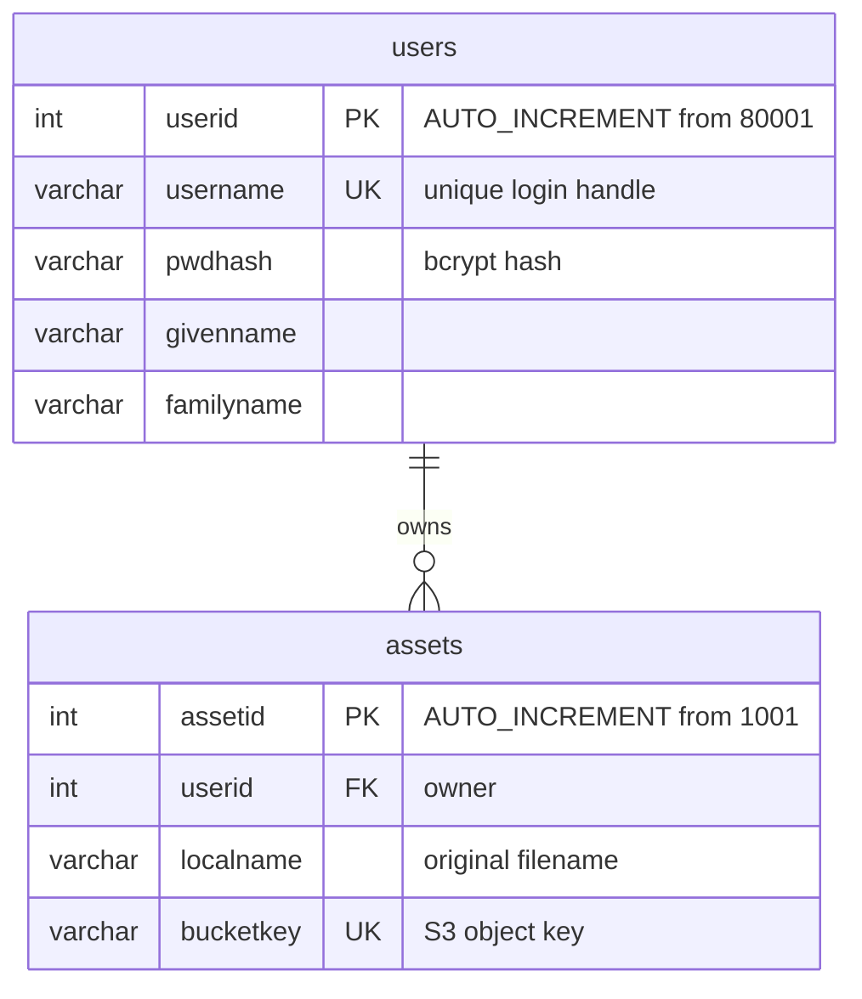
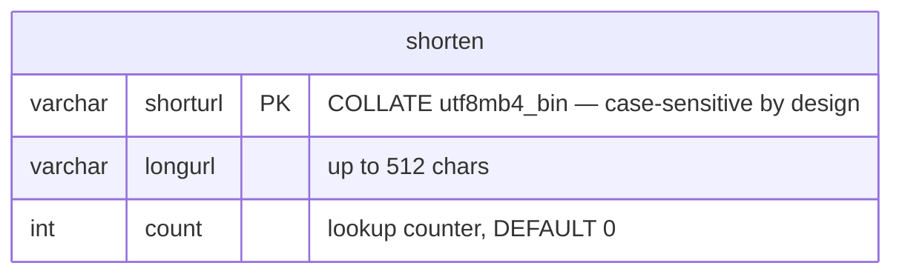
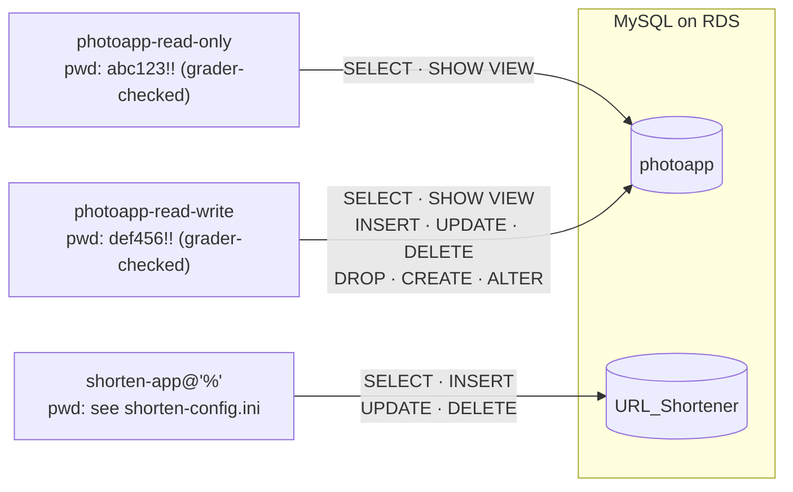

# Lab Database Schema — v2

**Generated:** 2026-04-16
**Scope:** All databases on the shared RDS MySQL 8.0 instance — Lab01 (photoapp) + Lab02 (URL_Shortener)
**Status:** Current — approved
**Related diagrams:** `lab-architecture-v2.md`

---

## RDS Instance — Database Inventory

---

## photoapp — Entity-Relationship Detail

### Seed Data (3 rows — exact values required by Gradescope)

| userid | username | givenname | familyname |
|--------|----------|-----------|------------|
| 80001 | p_sarkar | Pooja | Sarkar |
| 80002 | e_ricci | Emanuele | Ricci |
| 80003 | l_chen | Li | Chen |

---

## URL_Shortener — Entity-Relationship Detail

**Design notes:**
- `shorturl` is the natural PK — it is the lookup key; no surrogate ID needed
- `utf8mb4_bin` collation enforces case-sensitivity: `/Abc` ≠ `/abc`
- No foreign keys — standalone mapping table

---

## MySQL Application Users — All Databases

| User | Host | Database | Permissions | Source |
|------|------|----------|-------------|--------|
| `photoapp-read-only` | `%` | `photoapp` | SELECT, SHOW VIEW | `create-photoapp.sql` |
| `photoapp-read-write` | `%` | `photoapp` | SELECT, SHOW VIEW, INSERT, UPDATE, DELETE, DROP, CREATE, ALTER | `create-photoapp.sql` |
| `shorten-app` | `%` | `URL_Shortener` | SELECT, INSERT, UPDATE, DELETE | `create-shorten.sql` |
| `admin` | RDS master | all | full | RDS provisioned via Terraform |

**Note on `@'%'`:** All app users specify `@'%'` (any host) explicitly. Source IP is unpredictable
when connecting through Docker `--network host` via NAT to RDS public endpoint.

---

## Provisioning Notes

- `photoapp` DB: created via `projects/project01/create-photoapp.sql` → `utils/run-sql`
- `URL_Shortener` DB: created via `labs/lab02/create-shorten.sql` → `utils/run-sql`
- `FLUSH PRIVILEGES` is **not used** — `CREATE USER` + `GRANT` are self-effecting in MySQL 8
- Verification: connect as each app user and confirm table access before submitting
