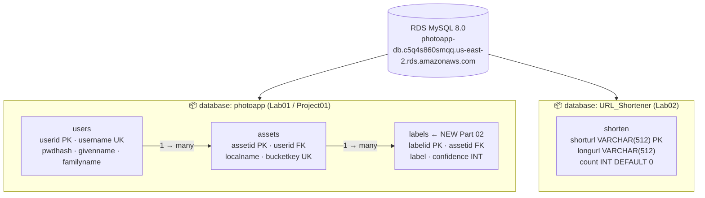
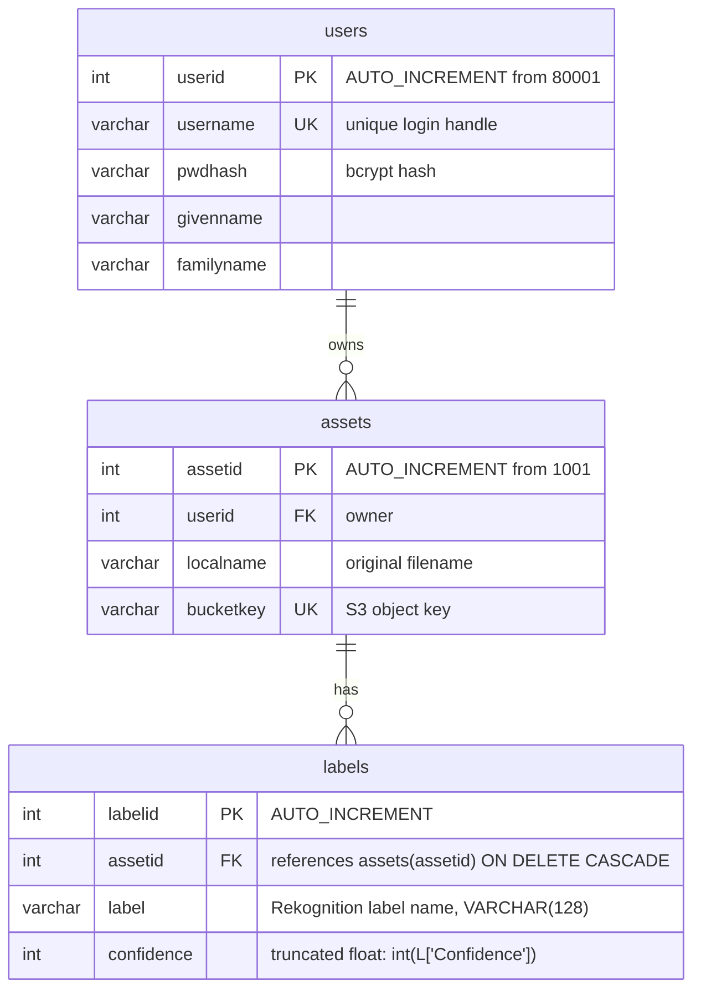
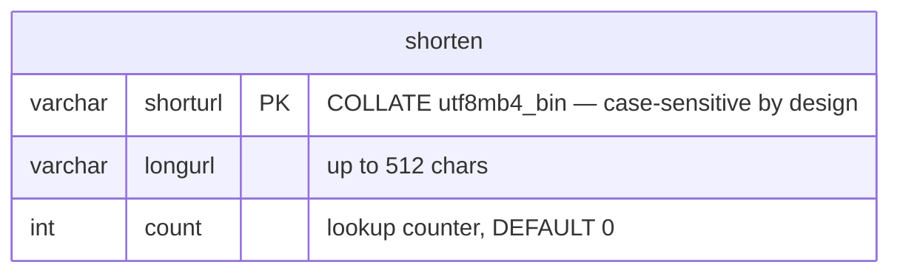

# Lab Database Schema — v3

**Generated:** 2026-04-20
**Scope:** All databases — photoapp (with Part 02 labels table) + URL_Shortener
**Status:** ✅ APPLIED — labels table created in RDS (2026-04-20)
**Supersedes:** `lab-database-schema-v2.md`
**Related diagrams:** `lab-architecture-v2.md`, `project01-part02-iam-v1.md`

---

## RDS Instance — Database Inventory



---

## photoapp — Entity-Relationship Detail



### Indexes on labels
- `INDEX idx_labels_assetid (assetid)` — fast `get_image_labels(assetid)` lookup
- `INDEX idx_labels_label (label)` — fast `get_images_with_label(label)` LIKE search

### Seed Data (users — unchanged)

| userid | username | givenname | familyname |
|--------|----------|-----------|------------|
| 80001 | p_sarkar | Pooja | Sarkar |
| 80002 | e_ricci | Emanuele | Ricci |
| 80003 | l_chen | Li | Chen |

---

## delete_images() truncation order (FK-safe)

```sql
SET foreign_key_checks = 0;
TRUNCATE TABLE labels;
TRUNCATE TABLE assets;
SET foreign_key_checks = 1;
ALTER TABLE assets AUTO_INCREMENT = 1001;
```

`ON DELETE CASCADE` on `labels.assetid` is belt-and-suspenders — truncation above is explicit,
so cascades never fire in practice. Preserves the correct behaviour if someone later writes a
per-asset delete.

---

## URL_Shortener — unchanged



---

## MySQL Application Users

| User | Database | Permissions | Source |
|------|----------|-------------|--------|
| `photoapp-read-only` | `photoapp` | SELECT, SHOW VIEW | `create-photoapp.sql` |
| `photoapp-read-write` | `photoapp` | SELECT, SHOW VIEW, INSERT, UPDATE, DELETE, DROP, CREATE, ALTER | `create-photoapp.sql` |
| `shorten-app` | `URL_Shortener` | SELECT, INSERT, UPDATE, DELETE | `create-shorten.sql` |
| `admin` | all | full | RDS master (Terraform) |

---

## Provisioning Notes

- `photoapp` base schema: `projects/project01/create-photoapp.sql` → `utils/run-sql`
- `labels` schema extension: `projects/project01/create-photoapp-labels.sql` → `utils/run-sql` ← NEW
- `URL_Shortener`: `labs/lab02/create-shorten.sql` → `utils/run-sql`
