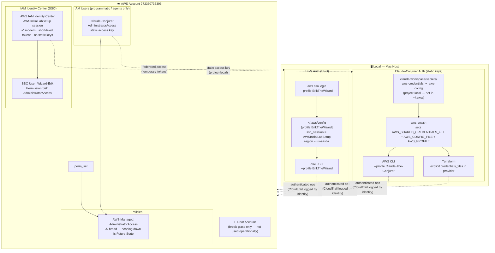

# Lab01 IAM Design — v1

**Generated:** 2026-04-13
**Last Updated:** 2026-04-14
**Scope:** Lab01 identity model — who has access, via what, to what
**Status:** Updated to reflect actual setup
**Related diagrams:** `lab01-target-architecture-v1.md`

---

---

## Identity Summary

| Actor | Identity Type | AWS Identity | CLI Profile | Credentials | Runs Terraform |
|-------|--------------|--------------|-------------|-------------|----------------|
| Erik (Wizard) | SSO User | `Wizard-Erik` in IAM Identity Center | `ErikTheWizard` | `~/.aws/config` SSO session — no static keys on disk | No — reviews + approves |
| Claude Code | IAM User | `Claude-Conjurer` | `Claude-The-Conjurer` | `claude-workspace/secrets/` (project-local static key) | Yes |

**Note on Erik's setup:** Erik's AWS access is entirely through IAM Identity Center (SSO) — SSO username `Wizard-Erik`, permission set `AdministratorAccess`. No traditional IAM user with static keys. This is the recommended modern approach: credentials are short-lived, rotate automatically, and no secrets live on disk. `Claude-Conjurer` is the only traditional IAM user in the account (programmatic/agent access).

## Future State (from Future-State-Ideal-Lab.md)
- [ ] Scope `Claude-Conjurer` down from AdministratorAccess to task-specific policies
- [ ] IAM Groups for policy management as agent roster grows
- [ ] MFA on SSO / root
- [ ] Separate `agent-read-only` vs `agent-mutate` identities
- [ ] Replace static keys with IAM Role + OIDC for agent auth (production pattern)
- [ ] Periodic Access Advisor review
