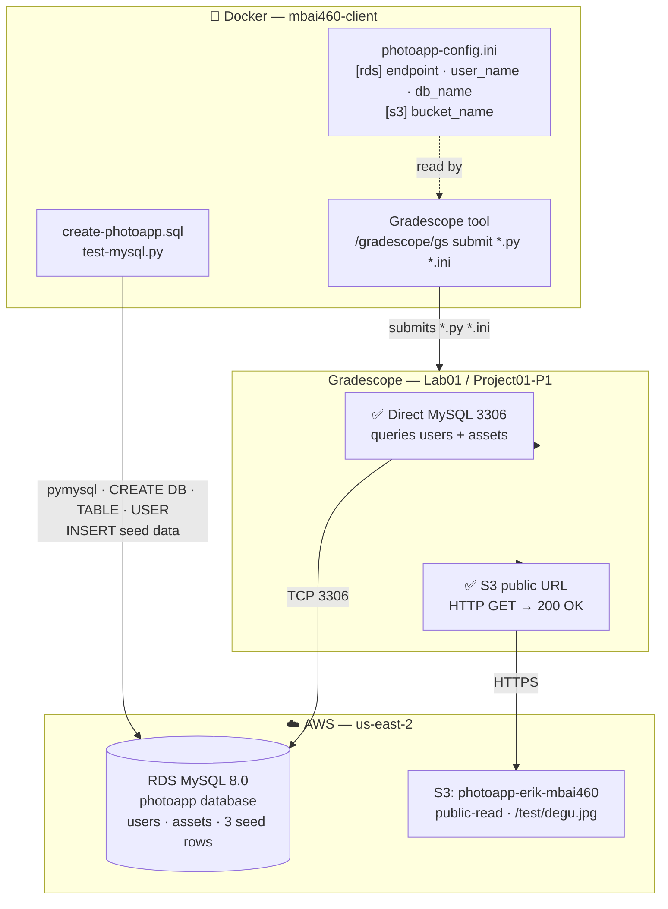

# Lab01 / Project01-Part01 — Architecture

**Generated:** 2026-04-16
**Scope:** Lab01 Part01 — PhotoApp setup, submission flow, and Gradescope grader pattern
**Status:** COMPLETE — 10/10 ✅ (frozen — future work does not modify this file)
**Platform:** See `lab-architecture-v2.md` for infrastructure details
**Related:** `lab-database-schema-v2.md` · `lab01-iam-design-v1.md`

---

---

## Submission Details

| Item | Value |
|------|-------|
| Submit command (from labs/lab01/ inside Docker) | `/gradescope/gs submit 1288073 7972436 *.py *.ini` |
| Key submitted file | `photoapp-config.ini` — live RDS endpoint + S3 bucket name |
| Grader pattern | **Direct infrastructure check** — hits RDS MySQL 3306 + S3 public URL |
| Result | **10/10** ✅ |

## Key Design Decisions

| Decision | Choice |
|----------|--------|
| DB provisioning | `create-photoapp.sql` via `utils/run-sql` (not manual console) |
| IaC | Terraform (`infra/lab01/`) — provisions RDS + S3 + SG |
| Config bridge | TF outputs → `photoapp-config.ini` → submitted to Gradescope |
