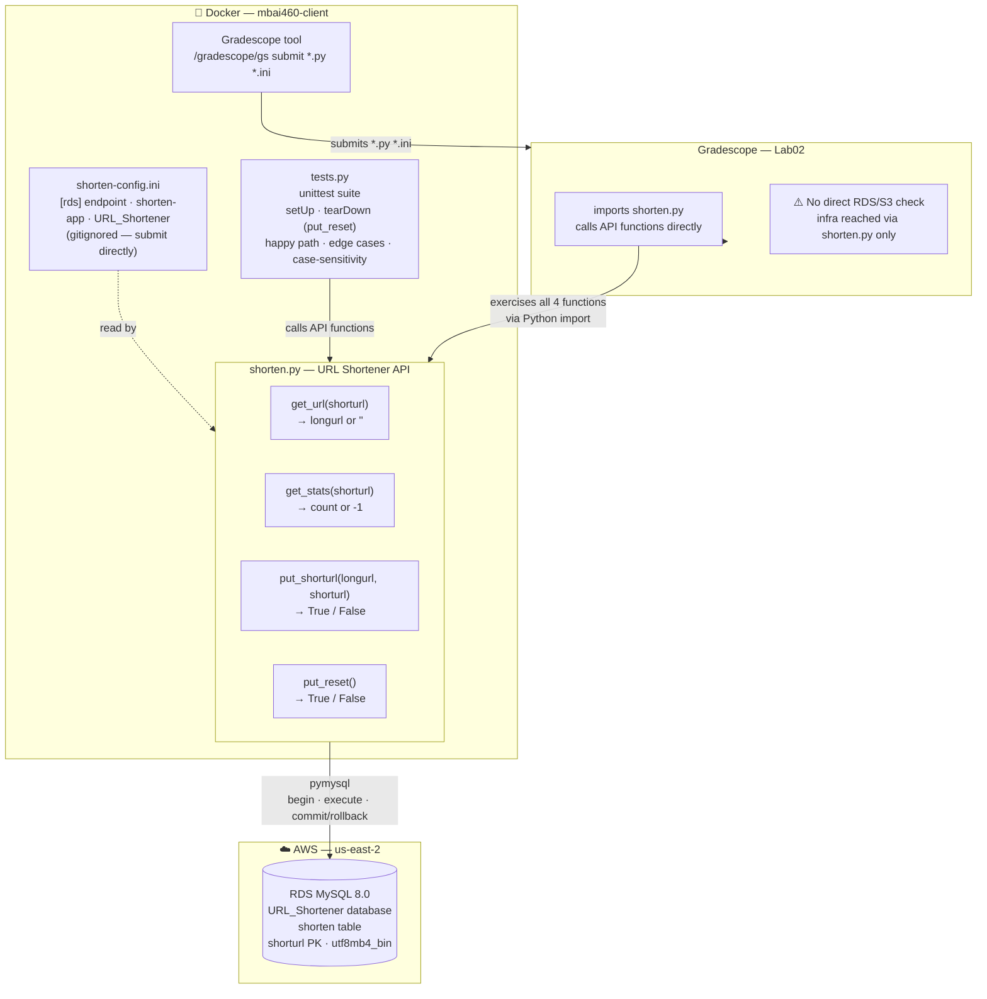

# Lab02 — Architecture

**Generated:** 2026-04-16
**Scope:** Lab02 — URL Shortener API, submission flow, and Gradescope grader pattern
**Status:** Current — approved (frozen)
**Platform:** See `lab-architecture-v2.md` for infrastructure details
**Related:** `lab-database-schema-v2.md`

---

---

## Grader Pattern — Critical Distinction vs Lab01

| Dimension | Lab01 / Project01-P1 | Lab02 |
|-----------|---------------------|-------|
| How grader tests | Direct MySQL 3306 + S3 HTTPS | Imports `shorten.py`, calls functions |
| Infrastructure dependency | Grader hits AWS directly | Grader hits AWS *through* our code |
| What must be correct | Live infra + config values | Python logic + live infra + config |
| Failure mode | Wrong endpoint/bucket → fail | Wrong logic OR wrong infra → fail |

## Submission Details

| Item | Value |
|------|-------|
| Submit command (from labs/lab02/ inside Docker) | `/gradescope/gs submit 1288073 7972436 *.py *.ini` |
| Files submitted | `shorten.py` · `tests.py` · `shorten-config.ini` |
| Config note | `shorten-config.ini` is gitignored — submit directly, do not rely on git |
| Result | **100/100** ✅ |
| Autograder results | Human check only — `gs` tool has no `results` command |

## Transaction Model

| Function | Transaction? | Pattern |
|----------|-------------|---------|
| `get_stats` | No | Read-only SELECT |
| `get_url` | Yes | `begin` → UPDATE count+1 → SELECT longurl → `commit` |
| `put_reset` | Yes | `begin` → DELETE FROM shorten → `commit` |
| `put_shorturl` | Yes | `begin` → SELECT → INSERT or no-op → `commit` / `rollback` |

## Key Design Decisions

| Decision | Choice |
|----------|--------|
| Table name | `shorten` — follows instructor example (autograder safety) |
| Collation | `utf8mb4_bin` on `shorturl` — case-sensitive by design |
| DB user | `shorten-app@'%'` — least privilege, SELECT/INSERT/UPDATE/DELETE only |
| Test isolation | `setUp` + `tearDown` both call `put_reset()` — start AND end clean |
