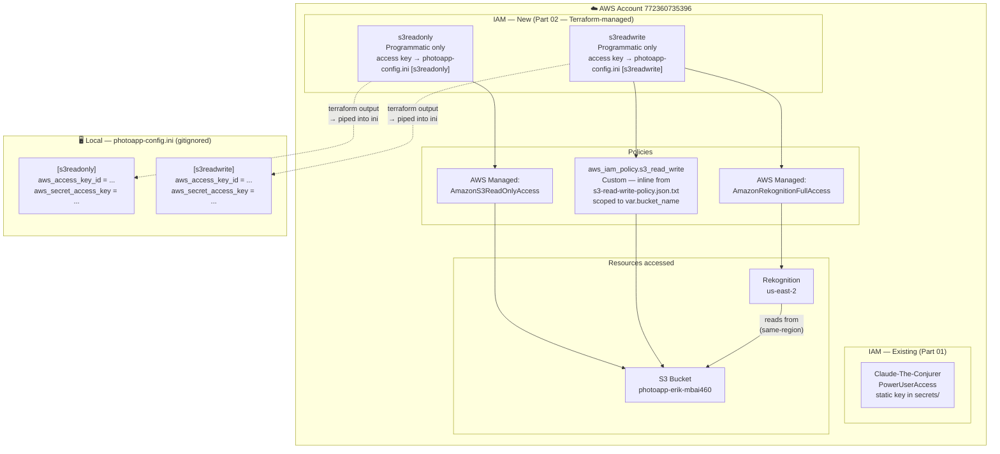

# Project 01 Part 02 — IAM Target State

**Generated:** 2026-04-20
**Scope:** IAM identity model after Part 02 Phase 1 Terraform apply
**Status:** ✅ APPLIED — Phase 1 terraform apply complete (2026-04-20)
**Related diagrams:** `lab01-iam-design-v1.md`, `lab-architecture-v2.md`
**Filename:** `project01-part02-iam-v1.md`

---

## Target IAM State (post-apply)



---

## Access Key Flow

`initialize(config_file, s3_profile, mysql_user)` sets:
```
os.environ['AWS_SHARED_CREDENTIALS_FILE'] = config_file
boto3.setup_default_session(profile_name=s3_profile)
```

`photoapp-config.ini` doubles as **both** app config and AWS credentials file.
The `[s3readonly]` and `[s3readwrite]` sections are read as if they were `~/.aws/credentials` entries.

| `s3_profile` arg | INI section used | IAM user | Permissions |
|---|---|---|---|
| `'s3readonly'` | `[s3readonly]` | s3readonly | S3 list + get only |
| `'s3readwrite'` | `[s3readwrite]` | s3readwrite | S3 full + Rekognition |

The grader calls `initialize(..., 's3readwrite', 'photoapp-read-write')`.

---

## Terraform resources added (Phase 1)

```hcl
aws_iam_user.s3readonly
aws_iam_user_policy_attachment.s3readonly_managed     # AmazonS3ReadOnlyAccess
aws_iam_access_key.s3readonly                         # output: sensitive = true

aws_iam_policy.s3_read_write                          # templatefile() over s3-read-write-policy.json.txt
aws_iam_user.s3readwrite
aws_iam_user_policy_attachment.s3readwrite_custom     # custom s3 policy
aws_iam_user_policy_attachment.s3readwrite_rekognition # AmazonRekognitionFullAccess
aws_iam_access_key.s3readwrite                        # output: sensitive = true
```

---

## What does NOT change

- `photoapp-read-only` / `photoapp-read-write` MySQL users — unchanged
- `Claude-The-Conjurer` — unchanged (runs terraform)
- RDS, S3 bucket, security group — unchanged
